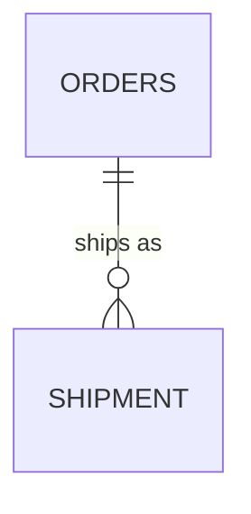
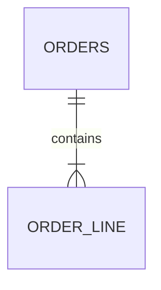
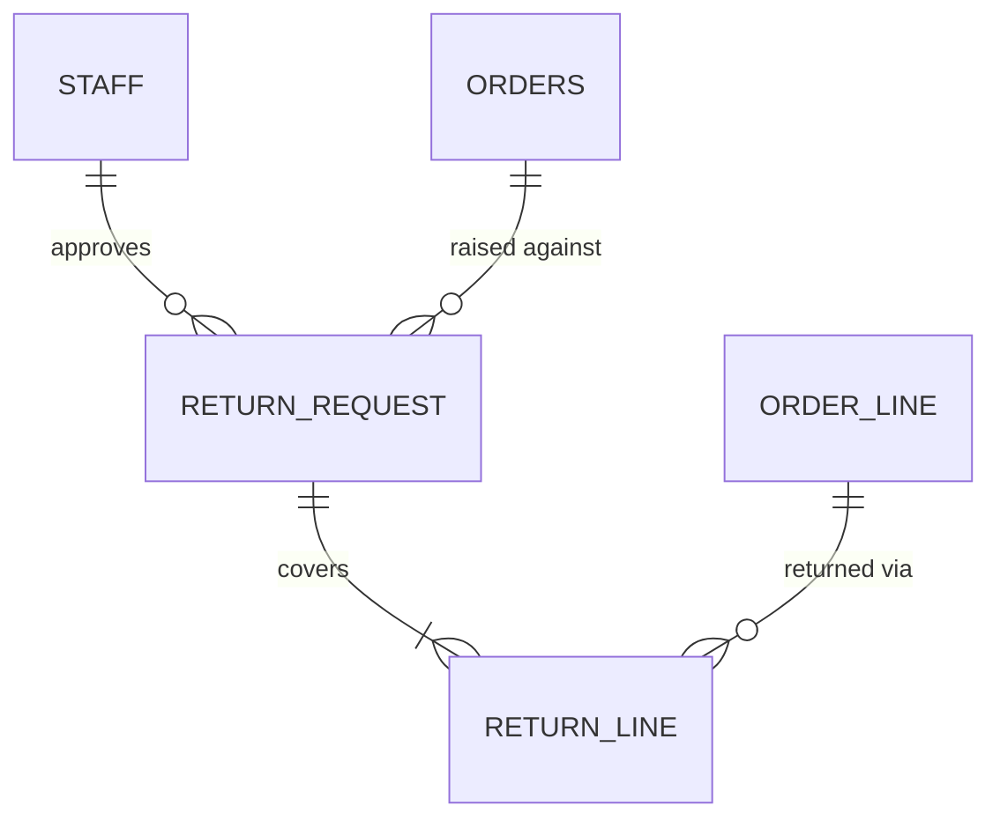

# Entity-Relationship Modelling

> Session 1 · PostgreSQL 16 · See [Database Foundations — Study Guide](index.md).

Unit 1 is three notes, read in this order. Each one is about a different model, and the
order is not arbitrary — you cannot normalize a diagram, only a set of tables.

| Note | Model | Question it answers |
|---|---|---|
| **Entity-Relationship Modelling** (you are here) | Entity-relationship | What exists in the domain, and how is it related? |
| [The Relational Model](relational-model.md) | Relational | What tables, columns and keys represent that? |
| [Normalization](normalization.md) | Relational | Does any table store one fact in two places? |

## 1. Objectives

By the end of this note you will be able to:

- Identify entities, attributes and relationships in a written domain description.
- Read and write cardinality, and say what each end of a relationship means in the domain.
- Find the entity hiding inside a many-to-many relationship.
- State an entity's identifier, and recognise an entity that has none of its own.
- Produce an ERD from a domain brief and justify every relationship on it.

## 2. What a Model Is For

A data model is a set of decisions about what may exist. Every decision you make removes a
class of wrong data from the realm of the possible; every decision you skip leaves that
wrongness available to whoever writes the next feature.

That is the whole discipline. Not "how do I store this", but "what should it be impossible
to store".

Take one sentence from the OrderDesk notes:

> An order can ship in several shipments.

Two people will model that sentence differently, and one of them will be wrong:

```text
Model A: ORDERS(order_id, ..., tracking_number, dispatched_at)
Model B: ORDERS(order_id, ...)  and  SHIPMENT(shipment_id, order_id, tracking_number, dispatched_at)
```

Model A can hold exactly one shipment per order. The moment a real order ships in two boxes,
somebody overwrites `tracking_number` and the first parcel becomes untraceable. No amount of
careful application code fixes that, because the place to put the second value does not exist.

> **Note.** The test for a model is not "can it store today's data". It is "can it store
> tomorrow's data without a lie". Model A forces a lie.

## 3. Entities, Attributes and Relationships

An **entity** is a thing the domain talks about as a unit and needs to identify individually.
An **attribute** is a fact about one entity. A **relationship** is a fact that involves two.

The reliable way to find them in prose is grammatical, and it is worth doing literally the
first few times:

| In the sentence | Usually becomes |
|---|---|
| A noun the domain counts, lists, or looks up | An entity |
| A noun that only ever describes one other noun | An attribute |
| A verb connecting two entity-nouns | A relationship |
| An adjective phrase with a fixed set of values | An attribute with a `CHECK` |

Applied to OrderDesk:

> A refunds clerk approves a return request, giving a reason. A return request covers one
> or more lines of an order.

- `clerk` — counted and looked up → entity (`STAFF`)
- `return request` — counted → entity
- `reason` — describes exactly one return request → attribute
- `approves`, `covers` → relationships

## 4. Cardinality

Cardinality is the pair of answers to two questions, asked in both directions. Ask them out
loud; the phrasing matters more than the notation.

> For one `ORDERS`, how many `SHIPMENT`? *Zero or more* — an order that has not dispatched
> has none.
> For one `SHIPMENT`, how many `ORDERS`? *Exactly one* — a parcel belongs to one order.

That gives one-to-many, drawn with crow's foot notation:



Written down, that relationship is `ORDERS 1 — 0..n SHIPMENT`. The number beside each entity
says how many of *that* entity take part, and this note writes cardinality that way
throughout, because `0..n` and `1..n` are different claims and plain "one-to-many" cannot
tell them apart.

| Written as | Reads as |
|---|---|
| `1` | exactly one |
| `0..1` | zero or one |
| `0..n` | zero or more |
| `1..n` | one or more |

Diagrams are another matter. Crow's foot is what every ERD tool draws, Mermaid included, so
you need to recognise it even though you will rarely type it. The symbol sits next to the
entity it counts:

| Written as | Mermaid symbol | Drawn as |
|---|---|---|
| `1` | `\|\|` | two bars |
| `0..1` | `o\|` | a circle and a bar |
| `0..n` | `}o` | a crow's foot and a circle |
| `1..n` | `}\|` | a crow's foot and a bar |

So `ORDERS 1 — 0..n SHIPMENT` is typed into Mermaid as `ORDERS ||--o{ SHIPMENT`, and the
circle is the "zero or".

The difference between `0..n` and `1..n` is a real design decision, not decoration.
`ORDERS 1 — 1..n ORDER_LINE` says an order must have at least one line — an order of nothing
is not an order. That claim has to be true, and the database cannot enforce it with a foreign
key alone, so writing it down commits you to enforcing it another way.

## 5. Many-to-Many Hides an Entity

Two entities related many-to-many always have a third entity hiding between them, and it
almost always has attributes of its own.

```text
Wrong — a relationship you cannot store
ORDERS 0..n — 0..n PRODUCT

Right — the junction is an entity, and it has a quantity and a price
ORDERS 1 — 1..n ORDER_LINE 0..n — 1 PRODUCT
```

The giveaway is that you cannot answer "how many, and at what price?" without somewhere to
put the answer. `ORDER_LINE` is that somewhere.

> **Real-world use.** `ORDER_LINE.unit_price` is not redundant with `PRODUCT.price`. The
> product's price is what it costs *now*; the order line's is what it cost *then*. Copying
> it is the correct decision, and [Normalization](normalization.md#when-copying-a-value-is-right)
> explains why that is not a normalization failure.

## 6. Identifiers and Weak Entities

Every entity needs a way to tell one instance from another. In the ER model that is the
**identifier**: the attribute, or the smallest group of attributes, whose value differs for
every instance of the entity.

- `PRODUCT` is identified by its SKU. Two products never share one.
- `CUSTOMER` is identified by email address, in a domain where the business insists on it.
- `ORDERS` is identified by the order number printed on the invoice.

An identifier is a claim about the domain, and it is worth writing down beside the entity,
because the next note has to decide whether to trust it as a key.

### Weak entities

Some things cannot be identified on their own at all. An order line is numbered *within* its
order: line 2 means nothing until you say which order. An entity like that is **weak**, and
the entity it hangs from is its **owner**.



Written out, that is `ORDERS 1 — 1..n ORDER_LINE`. Two things together mark a weak entity:

- Its identifier is unique only inside the owner — a *partial* identifier.
- It cannot exist without the owner, so participation at that end is mandatory.

`SHIPMENT` is not weak, even though it always belongs to an order. A tracking number
identifies a parcel on its own, anywhere in the world. The test is not "does it depend on
something else" but "can I name this instance without naming its owner".

> **Note.** Weak is a statement about identification, not about importance. `ORDER_LINE`
> carries the quantity and the price; the order itself carries almost nothing.

## 7. Worked Example — Returns, End to End

The remaining OrderDesk rule:

> A refunds clerk must approve a refund and must give a reason. A return covers one or more
> lines of an order, and a partly shipped order can still be returned.

Reading it out:

- `RETURN_REQUEST` is counted and looked up → entity.
- `reason` describes one return request → attribute, and it is `NOT NULL` because "must give
  a reason" is a rule, not a preference.
- The approving clerk is `STAFF`, related one-to-many.
- "covers one or more lines" is many-to-many between the request and `ORDER_LINE`, so there
  is a junction — and it has a quantity, because you can return one of the two keyboards.



Note what is *not* here. There is no `orders.is_returned` flag. Whether an order has been
returned is a question, answered by a query. Storing it would create a second copy of a fact
that `RETURN_REQUEST` already holds, and the two would eventually disagree.

The same reasoning kills `orders.can_be_cancelled`. The cancellation window closes at first
dispatch, so the answer is "does a shipment exist for this order" — derivable, therefore not
stored.

> **Note.** "Derivable, therefore not stored" is a default, not a law. It is broken
> deliberately, with a measurement, when a derivation gets too expensive. Breaking it by
> accident on day one is what this note is guarding against.

## 8. Common Problems

### An attribute that is really an entity

`ORDERS.warehouse_name` looks like an attribute until somebody asks for the warehouse's
address, and then its opening hours. Each of those is a new column on `ORDERS`, repeated on
every order that warehouse ever shipped. If the domain counts the thing, looks it up, or
knows more than one fact about it, it is an entity.

### A many-to-many left on the diagram

Two entities joined many-to-many with a verb on the line is a diagram that cannot become a
schema. Find the entity hiding between them and name it before the diagram leaves the
whiteboard — and if it seems to have no attributes, ask what a row of it would mean.

### Cardinality written without the "zero or"

"An order has shipments" is not cardinality. It does not say whether an order with no
shipment yet is legal, and that is precisely the half the schema will have to enforce. Ask
both directions and write down both answers.

## 9. Practical Guidelines

- Write the cardinality sentence out loud in both directions before drawing the line.
- If the domain counts it, looks it up, or knows two facts about it, it is an entity.
- State each entity's identifier as you draw it, even when it looks obvious.
- Name a junction entity for what it *is* — `ORDER_LINE`, not `ORDER_PRODUCT`.
- If a fact is derivable from other entities, derive it. Store it only with a measurement.

## 10. Knowledge Check

1. `ORDERS 1 — 1..n ORDER_LINE` and `ORDERS 1 — 0..n SHIPMENT` differ at one end. What does
   that difference claim about the domain, and how would you enforce it?
2. Both `ORDER_LINE` and `SHIPMENT` always belong to an order. Why is only one of them a weak
   entity?
3. A colleague draws `ORDERS 0..n — 0..n PRODUCT` with the label "contains". What is missing,
   and which two questions about the domain prove it?
4. A sentence in the brief reads "a refunds clerk approves a return request, giving a reason".
   List the entities, the attributes and the relationships it contains.
5. Name one fact in the OrderDesk domain that should be derived rather than stored, and say
   what would go wrong if it were stored.

## 11. Further Reading

- [Mermaid: Entity Relationship Diagrams](https://mermaid.js.org/syntax/entityRelationshipDiagram.html)

---

Next: [The Relational Model](relational-model.md).
