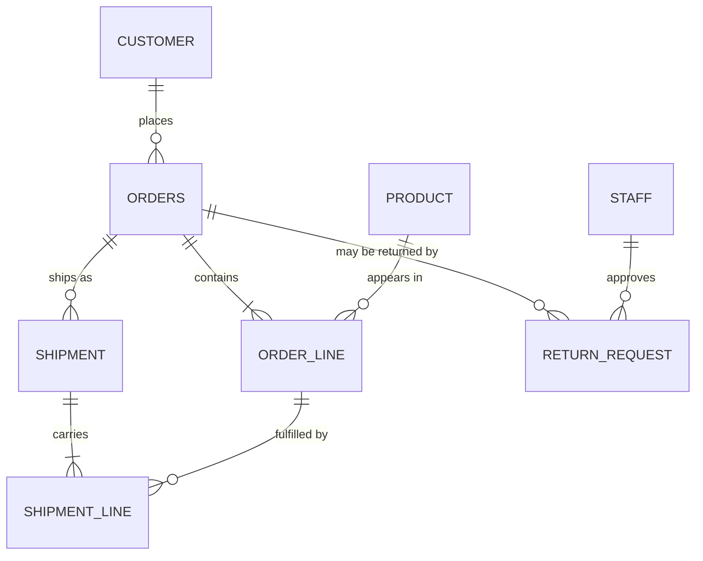

# Database Foundations — Study Guide

This module is about the layer everything else in the programme sits on. Nothing here is
about Java, Spring or React. It is about deciding what the data *is*, writing that decision
down as constraints a database will enforce for you, and asking questions of it in SQL.

The modules that follow assume you already model this way. When Java Core maps objects onto
tables, it maps them onto the tables you learn to design here.

## 1. Module Map

| # | Note | Covers | Lab |
|---|---|---|---|
| 01 | [Relational Modelling & Normalization](relational-modelling.md) | entities, relationships, cardinality, keys, functional dependency, normalization to 3NF | [Lab 01 — Model the OrderDesk returns domain](lab-01.md) |
| 02 | [DDL, Constraints & Data Integrity](ddl-and-constraints.md) | data types, `PRIMARY KEY`, `FOREIGN KEY`, `NOT NULL`, `UNIQUE`, `CHECK`, `DEFAULT`, referential actions | [Lab 02 — Implement the model as runnable DDL](lab-02.md) |
| 03 | [SQL Querying, Plans & Transactions](querying-plans-and-transactions.md) | CRUD, joins, grouping, aggregation, subqueries, read a query plan, one index, commit and rollback | [Lab 03 — Query, index and transact](lab-03.md) |

[Database Foundations — Appendix](appendix.md) maps the syllabus outline onto these notes and lists the
primary sources.

## 2. The Running Domain — OrderDesk

OrderDesk is the same internal back office you wrote user stories about in the Foundations
module. There, it was a source of requirements. Here it becomes a schema.



The rules you wrote acceptance criteria for in Foundations are the rules this schema has to
enforce. Each one costs a specific design decision:

| Rule from the domain | What it forces in the model |
|---|---|
| An order can ship in several shipments | `SHIPMENT` cannot be an attribute of `ORDERS`; it is its own entity |
| A shipment carries some of the order's lines, partly | `SHIPMENT_LINE` needs its own quantity, separate from `ORDER_LINE.quantity` |
| The cancellation window closes at first dispatch | A derived question, answered by a query, not stored as a flag |
| A refund needs an approving clerk and a reason | `RETURN_REQUEST` has a foreign key to `STAFF` and a `CHECK` that an approved return carries a reason |
| Two staff can reserve the same unit | A uniqueness constraint, not application code, decides who wins |

> **Note.** You will hear "the database should not contain business logic". That is about
> stored procedures, not constraints. A constraint is the business rule, written where it
> cannot be bypassed by a second application connecting to the same data.

## 3. How to Use This Handbook

Read this page once before session 1, then return to sections 4 and 5 when your environment
misbehaves or a term stops making sense.

Each unit is a note plus a lab:

1. Read the note, or follow it in the session.
2. Work the lab. It is guided and checkable, so you can tell when it is done.
3. Keep chipping at the long assignment — you get it in session 1 and build it all week.
4. Take the quiz that closes units 1 and 3.

The long assignment is not a homework you start on the last day. Its brief is issued in
session 1 deliberately, because every lab produces a piece of it.

## 4. Environment Setup

You need a relational database engine, a client to run SQL against it, and a way to render
diagrams. The notes are written against **PostgreSQL 18**, and every statement in them is
standard SQL except where a section says otherwise.

```bash
# Check what you have. Any of these being missing is a setup problem, not a you problem.
psql --version          # expect psql (PostgreSQL) 18.x
git --version
```

Create the OrderDesk order database from the supplied scripts, and get used to throwing it
away. Copy `labs/dbf/orderdesk-schema` out of the labs repository first:

```bash
cd orderdesk-schema
./rebuild.sh                               # dropdb, createdb, schema.sql, seed.sql
psql orderdesk -c "SELECT count(*) FROM orders;"

# What rebuild.sh does. A script that cannot survive this is not finished.
dropdb --if-exists orderdesk && createdb orderdesk && psql orderdesk -f schema.sql
```

> **Tip.** Put that drop-create-load line in a file called `rebuild.sh` on day one. Every
> assessment in this module is checked from a clean database, so make the clean database the
> thing you develop against.

## 5. How to Study This Module

SQL punishes reading and rewards running. A query you have read is a query you do not know.

- **Type the examples.** Every snippet in these notes runs against the OrderDesk order schema
  — `customer`, `product`, `orders`, `order_line`, `shipment`, `return_request` — which is
  supplied ready-made in
  [`labs/dbf/orderdesk-schema`](https://github.com/phuongbv00/fsa-fr-java-jsks/tree/main/labs/dbf/orderdesk-schema)
  and is the database the Java modules build on. The labs model a *second* slice of the domain,
  stock and suppliers, so that you design one schema yourself while reading another. Change a
  value and predict the result before you press enter.
- **Prove your claims.** "This index helps" is not a claim you can make in this module
  without a plan captured before and after. Neither is "the constraint works" without the
  failed `INSERT` that proves it.
- **Break things deliberately.** Delete a customer who has orders. Insert a duplicate. The
  error messages are the syllabus.
- **Keep the scripts in Git.** The assignment is accepted by running your scripts from
  nothing, in order.

## 6. Glossary

| Term | Meaning here |
|---|---|
| **Relation** | A table. The formal word, used when the distinction from a *result set* matters |
| **Tuple** | A row |
| **Candidate key** | Any minimal set of columns that uniquely identifies a row |
| **Primary key** | The candidate key you chose |
| **Surrogate key** | A meaningless generated identifier used as the primary key |
| **Natural key** | A key made of real-world data, like an email address or an ISBN |
| **Functional dependency** | `A → B`: knowing `A` tells you exactly one `B` |
| **Normalization** | Removing redundancy so one fact is stored in exactly one place |
| **Referential integrity** | The guarantee that a foreign key points at a row that exists |
| **Query plan** | The engine's chosen strategy for executing a statement |
| **Transaction** | A group of statements that all take effect, or none do |
| **Anomaly** | A wrong result or lost update caused by redundancy or concurrency |

---

Start with [Relational Modelling & Normalization](relational-modelling.md).
