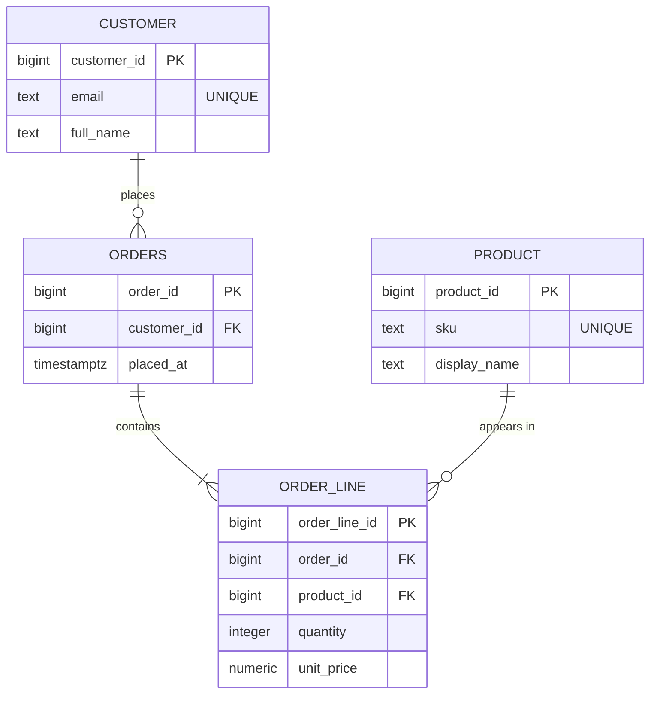

# Normalization

> Session 1 · PostgreSQL 16 · See [Database Foundations — Study Guide](index.md).

Unit 1 is three notes, read in this order. Each one is about a different model, and the
order is not arbitrary — you cannot normalize a diagram, only a set of tables.

| Note | Model | Question it answers |
|---|---|---|
| [Entity-Relationship Modelling](er-modelling.md) | Entity-relationship | What exists in the domain, and how is it related? |
| [The Relational Model](relational-model.md) | Relational | What tables, columns and keys represent that? |
| **Normalization** (you are here) | Relational | Does any table store one fact in two places? |

## 1. Objectives

By the end of this note you will be able to:

- State the functional dependencies that hold in a table.
- Name the update, insertion and deletion anomaly a redundant table permits, with a concrete
  row.
- Normalize a set of tables to third normal form and say what each step removed.
- Tell a genuine second fact apart from a normalization failure that looks like one.

## 2. Functional Dependency

Everything in normalization follows from one idea, so it is worth getting exactly.

`A → B` ("A determines B") means: any two rows agreeing on `A` must agree on `B`. It is a
statement about the domain, not about the data you happen to have today.

Look at this table, which is what an OrderDesk model looks like before anyone normalizes it:

```text
order_line_id | order_id | customer_email    | customer_name | sku    | product_name | qty
--------------+----------+-------------------+---------------+--------+--------------+----
1             | 5001     | mai@example.com   | Mai Tran      | KB-01  | Keyboard     | 2
2             | 5001     | mai@example.com   | Mai Tran      | MS-04  | Mouse        | 1
3             | 5002     | mai@example.com   | Mai Tran      | KB-01  | Keyboard     | 1
```

The dependencies are:

```text
order_line_id  →  order_id, sku, qty        (the whole row, from the key)
order_id       →  customer_email            (an order belongs to one customer)
customer_email →  customer_name             (an email identifies one customer)
sku            →  product_name              (a SKU names one product)
```

## 3. The Three Anomalies

Of the four dependencies in section 2, only the first has the primary key on its left. The
other three are the problem, and each one is a specific class of bug:

- **Update anomaly.** Mai corrects her name. It appears in three rows. Update two and the
  third disagrees; there is now no answer to "what is her name".
- **Insertion anomaly.** A new product arrives that nobody has ordered. There is nowhere to
  put it — a row here requires an order line.
- **Deletion anomaly.** The last line referencing `MS-04` is deleted. The fact that a Mouse
  exists, and what it is called, is gone.

> **Note.** These are not hypothetical. Every one of them is a support ticket somebody has
> written. "The customer's name is different on two invoices" is an update anomaly with a
> customer attached.

## 4. Normalization to Third Normal Form

The three forms are one rule applied three times: every fact belongs where its determinant
lives.

### First normal form — one value per cell

No repeating groups, no lists in a column.

```text
Wrong — the skus column holds a list
order_id | skus
5001     | KB-01, MS-04

Right — one row per line
order_id | sku
5001     | KB-01
5001     | MS-04
```

The wrong form breaks the moment you ask "how many orders included KB-01?", because that
question becomes string matching, and string matching finds `KB-011` too.

### Second normal form — no partial dependency on a composite key

Applies only when the primary key has more than one column. If part of the key determines a
non-key column, that column belongs in another table.

```text
Key is (order_id, sku)
order_id | sku   | qty | product_name
                        ^^^^^^^^^^^^ depends on sku alone, not on the whole key
```

`product_name` moves to `PRODUCT`.

### Third normal form — no dependency between non-key columns

If a non-key column determines another non-key column, that pair belongs in its own table.

In the table above, `customer_email → customer_name` is exactly this: neither is the key.
Both move to `CUSTOMER`, and the order keeps a foreign key.

The result:



Every fact now has one home. Mai's name is in one row; correcting it corrects it everywhere.

### When copying a value is right

`ORDER_LINE.unit_price` looks like a violation and is not. Test it with the dependency:
does `product_id → unit_price` hold? No — two order lines for the same product, placed a
month apart, may legitimately differ. The price on the line is not the product's price; it
is a different fact that happens to have been equal once.

> **Tip.** Before "denormalizing for performance", check whether you have actually found a
> second fact, as here. That is not denormalization, it is modelling. Real denormalization is
> a measured trade, and this module does not need it.

## 5. Common Problems

### Third normal form claimed without the dependencies written down

"It is in 3NF" is not something a reviewer can check by looking at a diagram. Write the
dependencies first. The normal form is then a property anyone can read off them, and a
disagreement becomes a disagreement about one specific arrow.

### A lookup table for a column with five values

`status text NOT NULL CHECK (status IN (…))` is not a normalization failure. Replacing it
with `ORDER_STATUS(status_id, name)` adds a join to every query that reads an order and buys
nothing — unless the set changes while the system is running, or a status acquires
attributes of its own.

### Splitting a table that was already normalized

Two tables in a strict one-to-one, neither side optional, are one table that somebody split.
Normalization removes redundancy; it gives no credit for having more tables.

### Normalizing the copy instead of the fact

A column that duplicates another is only a violation if the dependency holds. Test it before
you move it — `ORDER_LINE.unit_price` survives the test, and a team that "normalizes" it into
a join to `PRODUCT` has silently rewritten every historical order's total.

## 6. Practical Guidelines

- State the functional dependencies before claiming a table is in any normal form.
- Test a suspicious duplicate with the dependency, not with how duplicated it looks.
- Name the anomaly each step removed; if you cannot name one, the step may not be needed.
- If a fact is derivable from other rows, derive it. Store it only with a measurement.
- Before "denormalizing for performance", check whether you have found a second fact.

## 7. Knowledge Check

1. Given `customer_email → customer_name` in a table whose key is `order_line_id`, which
   normal form is violated, and which anomaly does it permit? Give a concrete pair of rows.
2. A table keyed by `(order_id, sku)` holds `product_name`, which depends on `sku` alone.
   Which normal form does that break, and what is the fix?
3. Why is `ORDER_LINE.unit_price` not a 3NF violation, when `ORDER_LINE.product_name` would be?
4. Name the anomaly that each of 1NF, 2NF and 3NF removes from the denormalized order-line
   table in section 2, using a concrete row for one of them.
5. A reviewer says a table is in 3NF because every column depends on the primary key. What
   has the statement left out?

## 8. Further Reading

- [PostgreSQL: Data Definition](https://www.postgresql.org/docs/16/ddl.html)
- [PostgreSQL: Constraints](https://www.postgresql.org/docs/16/ddl-constraints.html)

---

Next: [Lab 01 — Model the OrderDesk returns domain](lab-01.md), then [DDL, Constraints & Data Integrity](ddl-and-constraints.md).
