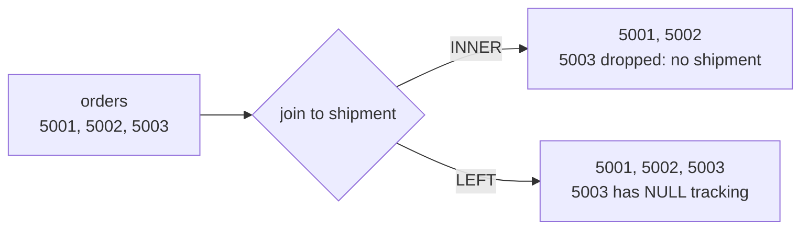

# SQL Querying, Plans & Transactions

> Objectives: DBF-K2, DBF-K3 · Session 3 · PostgreSQL 16 · See [Database Foundations — Study Guide](index.md).

## 1. Objectives

After this unit, learners can:

- Write `SELECT`, `INSERT`, `UPDATE` and `DELETE` statements that affect exactly the intended rows.
- Choose between inner and outer joins and explain what each includes and excludes.
- Group and aggregate data, and place a condition in `WHERE` or `HAVING` correctly.
- Read a query plan, and justify one index with plan evidence captured before and after.
- Use `COMMIT` and `ROLLBACK`, and explain one concurrency anomaly they observed.

## 2. Reading and Changing Rows

The four statements, on the OrderDesk schema from unit 2:

```sql
SELECT order_id, placed_at, status
FROM   orders
WHERE  status = 'dispatched'
ORDER  BY placed_at DESC
LIMIT  20;

INSERT INTO customer (email, full_name)
VALUES ('mai@example.com', 'Mai Tran')
RETURNING customer_id;          -- read back what the database generated

UPDATE orders
SET    status = 'dispatched'
WHERE  order_id = 5001;

DELETE FROM return_request
WHERE  return_request_id = 42;
```

`RETURNING` matters more than it looks. Without it you insert a row and then guess its
identity, usually by selecting on a column you *hope* is unique.

The single most expensive habit in this unit is an `UPDATE` or `DELETE` whose `WHERE` is wrong.
It cannot be undone outside a transaction, and it reports success.

```sql
-- Wrong — no WHERE. Every order in the table is now dispatched.
UPDATE orders SET status = 'dispatched';

-- Right — check the blast radius first with the same predicate...
SELECT count(*) FROM orders WHERE order_id = 5001;   -- 1
UPDATE orders SET status = 'dispatched' WHERE order_id = 5001;
```

> **Tip.** Write the `SELECT` first, look at the rows, then change the verb. In this module,
> do it inside a transaction as well — section 7 shows why that turns a mistake into a
> non-event.

### `NULL` in predicates

```sql
-- Wrong — matches nothing, ever. NULL = NULL is not true.
SELECT * FROM shipment WHERE delivered_at = NULL;

-- Right
SELECT * FROM shipment WHERE delivered_at IS NULL;
```

The same trap appears in negation. `WHERE status <> 'cancelled'` silently drops rows where
`status` is `NULL`, because the comparison is unknown rather than true.

## 3. Joins

A join answers a question that spans entities. Which one you use is decided by what you want
to happen to rows with no match.

```sql
-- INNER: orders that have at least one shipment. Unshipped orders vanish.
SELECT o.order_id, s.tracking_number
FROM   orders o
JOIN   shipment s ON s.order_id = o.order_id;

-- LEFT: every order, with shipment columns NULL where there is none.
SELECT o.order_id, s.tracking_number
FROM   orders o
LEFT JOIN shipment s ON s.order_id = o.order_id;
```



The classic bug is filtering an outer join in `WHERE`, which quietly turns it back into an
inner join:

```sql
-- Wrong — "orders never dispatched" returns nothing.
-- The WHERE runs after the join and discards the NULL rows it was meant to keep.
SELECT o.order_id
FROM   orders o
LEFT JOIN shipment s ON s.order_id = o.order_id
WHERE  s.dispatched_at IS NULL AND s.tracking_number <> '';

-- Right — conditions on the outer table go in ON; the NULL test stays in WHERE.
SELECT o.order_id
FROM   orders o
LEFT JOIN shipment s ON s.order_id = o.order_id
WHERE  s.shipment_id IS NULL;
```

> **Note.** "Anti-join": `LEFT JOIN` then `WHERE child.pk IS NULL` is the idiom for *rows with
> no match*. Recognise it; you will write it constantly.

### Fan-out

Joining one order to its many lines multiplies the order's rows. Aggregate afterwards and the
order total is counted once per line.

```sql
-- Wrong — an order with 3 lines and 2 shipments produces 6 rows,
-- so quantity is summed three times over.
SELECT o.order_id, sum(ol.quantity)
FROM   orders o
JOIN   order_line ol ON ol.order_id = o.order_id
JOIN   shipment  s   ON s.order_id  = o.order_id
GROUP  BY o.order_id;

-- Right — aggregate each branch independently.
SELECT o.order_id,
       (SELECT sum(ol.quantity) FROM order_line ol WHERE ol.order_id = o.order_id) AS units,
       (SELECT count(*)         FROM shipment  s  WHERE s.order_id  = o.order_id) AS shipments
FROM   orders o;
```

## 4. Grouping and Aggregation

`GROUP BY` collapses rows sharing a value into one; aggregates summarise each group.

```sql
SELECT c.customer_id,
       c.full_name,
       count(DISTINCT o.order_id)          AS order_count,
       sum(ol.quantity * ol.unit_price)    AS lifetime_value
FROM   customer c
JOIN   orders o     ON o.customer_id = c.customer_id
JOIN   order_line ol ON ol.order_id  = o.order_id
WHERE  o.status <> 'cancelled'
GROUP  BY c.customer_id, c.full_name
HAVING sum(ol.quantity * ol.unit_price) > 1000
ORDER  BY lifetime_value DESC;
```

The rule people get wrong is where a condition goes:

- **`WHERE`** filters rows *before* grouping. Use it for facts about a row.
- **`HAVING`** filters groups *after*. Use it for facts about an aggregate.

```sql
-- Wrong — count(*) does not exist yet at WHERE time.
WHERE count(*) > 3

-- Right
HAVING count(*) > 3
```

Note `count(DISTINCT o.order_id)` above. Because the join to `order_line` fans out, a plain
`count(o.order_id)` would count lines, not orders.

> **Note.** `count(*)` counts rows; `count(col)` counts rows where `col` is not null. The
> difference is a real reporting bug when the column is nullable.

## 5. Subqueries

Three shapes, each with a job:

```sql
-- Scalar: one value, used inline.
SELECT order_id,
       (SELECT count(*) FROM order_line ol WHERE ol.order_id = o.order_id) AS line_count
FROM   orders o;

-- IN: membership.
SELECT * FROM orders
WHERE  customer_id IN (SELECT customer_id FROM customer WHERE email LIKE '%@example.com');

-- EXISTS: "is there at least one", and it stops at the first hit.
SELECT o.order_id
FROM   orders o
WHERE  EXISTS (SELECT 1 FROM shipment s WHERE s.order_id = o.order_id);
```

`NOT IN` has a trap worth knowing before it costs you an afternoon: if the subquery returns
any `NULL`, `NOT IN` returns no rows at all.

```sql
-- Wrong — returns nothing if any return_request.order_id is NULL
SELECT * FROM orders WHERE order_id NOT IN (SELECT order_id FROM return_request);

-- Right
SELECT o.* FROM orders o
WHERE NOT EXISTS (SELECT 1 FROM return_request r WHERE r.order_id = o.order_id);
```

A common-table expression names a step and makes a long query readable:

```sql
WITH order_totals AS (
    SELECT order_id, sum(quantity * unit_price) AS total
    FROM   order_line
    GROUP  BY order_id
)
SELECT o.order_id, t.total
FROM   orders o
JOIN   order_totals t ON t.order_id = o.order_id
WHERE  t.total > 500;
```

## 6. Query Plans and One Index

The engine decides *how* to run your query. `EXPLAIN` shows the decision; `EXPLAIN ANALYZE`
runs it and shows what actually happened.

```sql
EXPLAIN ANALYZE
SELECT * FROM order_line WHERE order_id = 5001;
```

```text
Seq Scan on order_line  (cost=0.00..1943.00 rows=12 width=44)
                        (actual time=0.021..8.912 rows=3 loops=1)
  Filter: (order_id = 5001)
  Rows Removed by Filter: 99997
Planning Time: 0.104 ms
Execution Time: 8.940 ms
```

Read it from the inside out. The useful parts:

| Field | Means |
|---|---|
| `Seq Scan` | Every row was read |
| `Index Scan` | The index found the rows directly |
| `cost=` | The planner's estimate, in arbitrary units |
| `rows=` (in `cost`) | Rows the planner *expected* |
| `actual ... rows=` | Rows it actually got |
| `Rows Removed by Filter` | Work that was wasted |

`Rows Removed by Filter: 99997` is the finding: the engine read a hundred thousand rows to
return three. That is what an index fixes.

```sql
CREATE INDEX idx_order_line_order_id ON order_line (order_id);
ANALYZE order_line;          -- refresh statistics so the planner sees the change
```

```text
Index Scan using idx_order_line_order_id on order_line
                        (cost=0.29..8.44 rows=3 width=44)
                        (actual time=0.018..0.021 rows=3 loops=1)
  Index Cond: (order_id = 5001)
Planning Time: 0.121 ms
Execution Time: 0.038 ms
```

Same rows, `Seq Scan` became `Index Scan`, and `Rows Removed by Filter` is gone. **That pair
of plans is the evidence.** In this module, "I added an index and it is faster" is not an
acceptable claim; the two plans are.

An index is not free — it consumes space and must be maintained on every write — so index in
response to a plan, not in anticipation of one.

> **Note.** A large planner estimate that disagrees wildly with `actual` usually means stale
> statistics. Run `ANALYZE` before concluding the planner is wrong.

## 7. Transactions

A transaction groups statements so that all of them take effect or none do.

```sql
BEGIN;

INSERT INTO shipment (order_id, tracking_number) VALUES (5001, 'TRK-100');
UPDATE orders SET status = 'dispatched' WHERE order_id = 5001;

COMMIT;      -- both, or...
```

```sql
BEGIN;
UPDATE orders SET status = 'cancelled';    -- no WHERE. Every row.
SELECT count(*) FROM orders WHERE status = 'cancelled';   -- 100000. Wrong.
ROLLBACK;    -- ...neither.
```

That second block is the practical reason to type `BEGIN` before any `UPDATE` or `DELETE` you
have not run before.

The properties, briefly: **atomicity** (all or nothing), **consistency** (constraints hold at
commit), **isolation** (concurrent transactions do not see each other's uncommitted work),
**durability** (a commit survives a crash).

### A demonstrated anomaly

Isolation is a spectrum, and the default is not the strictest. Two `psql` sessions, side by
side, on PostgreSQL's default `READ COMMITTED`:

```sql
-- Session A                          -- Session B
BEGIN;
SELECT quantity FROM order_line
  WHERE order_line_id = 1;   -- 10
                                      BEGIN;
                                      UPDATE order_line SET quantity = 3
                                        WHERE order_line_id = 1;
                                      COMMIT;
SELECT quantity FROM order_line
  WHERE order_line_id = 1;   -- 3     <-- changed inside one transaction
COMMIT;
```

Session A read `10`, then `3`, without changing anything. That is a **non-repeatable read**.
If A had computed a total from the first read and written it back, it would have written a
total that was never true.

```mermaid
sequenceDiagram
    participant A as Session A
    participant DB as Database
    participant B as Session B
    A->>DB: BEGIN; SELECT quantity → 10
    B->>DB: BEGIN; UPDATE quantity = 3; COMMIT
    A->>DB: SELECT quantity → 3
    Note over A: same transaction, different answer
```

The fix is to ask for more isolation, and pay for it:

```sql
BEGIN ISOLATION LEVEL REPEATABLE READ;
-- A now sees 10 for its whole life, and a conflicting write fails at commit
-- with: ERROR: could not serialize access due to concurrent update
```

> **Real-world use.** This is the "two staff reserve the same unit" rule from the OrderDesk
> domain. Application code that reads stock, decides, then writes has this race. A `UNIQUE`
> constraint on the reservation, or a stricter isolation level, resolves it; a comment saying
> "should not happen" does not.

## 8. Common Problems

### The `UPDATE` changed more rows than expected

Run the `SELECT` with the same `WHERE` first, inside `BEGIN`. `psql` reports `UPDATE 4000`;
read that number before you `COMMIT`.

### `ERROR: column "c.full_name" must appear in the GROUP BY clause`

Every selected column must either be grouped or aggregated. Add it to `GROUP BY`.

### The `LEFT JOIN` behaves like an inner join

A condition on the right-hand table sits in `WHERE`. Move it into `ON`, or test for `IS NULL`.

### `NOT IN` returns nothing at all

The subquery produced a `NULL`. Use `NOT EXISTS`.

### The index made no difference

Three usual causes: the query does not filter on the indexed column; the table is small enough
that a scan is genuinely cheaper; or `ANALYZE` has not run since the index was created.

### `ERROR: current transaction is aborted, commands ignored until end of transaction block`

A statement failed inside a transaction. The block will accept nothing further — `ROLLBACK`,
fix, retry.

## 9. Practical Guidelines

- Write the `SELECT` before the `UPDATE`, and wrap both in `BEGIN` until you have seen the count.
- Use `IS NULL`, never `= NULL`; prefer `NOT EXISTS` over `NOT IN`.
- Put conditions on an outer-joined table in `ON`, not `WHERE`.
- Aggregate each branch separately when a query joins two one-to-many relationships.
- Capture `EXPLAIN ANALYZE` before and after every index you add, and keep both.
- Run `ANALYZE` after bulk changes, before judging a plan.

## 10. Knowledge Check

1. Rewrite "orders that have never shipped" as an anti-join, and say why the `WHERE`-filtered
   `LEFT JOIN` version returns the wrong rows.
2. A query joins `orders` to both `order_line` and `shipment`, then sums `quantity`. The total
   is too large. Explain the mechanism and give a correct rewrite.
3. In a plan, what does `Rows Removed by Filter: 99997` tell you, and what would you do next?
4. Give a `WHERE` clause that silently drops rows because a column is nullable, and fix it.
5. Describe the non-repeatable read above and name two different ways to prevent it.

## 11. Further Reading

- [PostgreSQL: Queries](https://www.postgresql.org/docs/16/queries.html)
- [PostgreSQL: Using EXPLAIN](https://www.postgresql.org/docs/16/using-explain.html)
- [PostgreSQL: Transaction Isolation](https://www.postgresql.org/docs/16/transaction-iso.html)

---

Next: [Lab 03 — Query, index and transact](lab-03.md), then [Database Foundations — Appendix](appendix.md).
