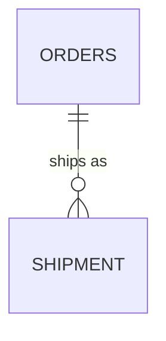
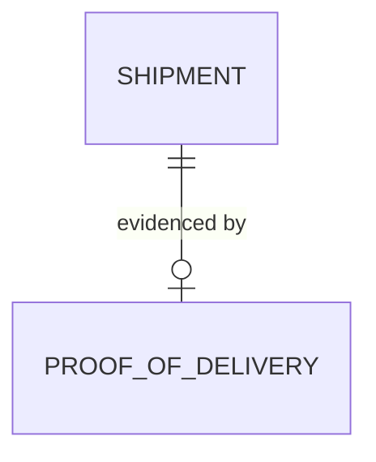

# The Relational Model

> Session 1 · PostgreSQL 16 · See [Database Foundations — Study Guide](index.md).

Unit 1 is three notes, read in this order. Each one is about a different model, and the
order is not arbitrary — you cannot normalize a diagram, only a set of tables.

| Note | Model | Question it answers |
|---|---|---|
| [Entity-Relationship Modelling](er-modelling.md) | Entity-relationship | What exists in the domain, and how is it related? |
| **The Relational Model** (you are here) | Relational | What tables, columns and keys represent that? |
| [Normalization](normalization.md) | Relational | Does any table store one fact in two places? |

## 1. Objectives

By the end of this note you will be able to:

- Say what a relation is, and how it differs from an ER diagram and from a result set.
- Choose a primary key and justify the choice against the alternatives.
- Map an ER model onto tables, choosing the side each foreign key belongs on.
- Map multivalued attributes, weak entities and many-to-many relationships correctly.
- Enforce the participation an ER diagram claims, and name the end a foreign key cannot
  enforce.

## 2. What a Relation Is

The relational model has exactly one structure in it, and its name causes enough confusion to
be worth clearing up immediately. A **relation** is a table. It is not a relationship.
`ORDERS` is a relation; "an order contains lines" is a relationship, and in this model it
will be stored as a column, not as a structure of its own.

A relation is a set of rows over a fixed, typed heading:

```text
PRODUCT                                  ← the relation name
product_id | sku    | display_name       ← the heading: column names and their types
-----------+--------+--------------
         1 | KB-01  | Keyboard           ← a tuple; informally, a row
         2 | MS-04  | Mouse
```

Three properties follow from the words "set of rows", and each one catches people out:

| Property | Consequence |
|---|---|
| Rows are unordered | There is no "first row". A query with no `ORDER BY` may return rows in any order, and that order may change between runs |
| Rows are distinct | A relation cannot hold the same row twice — which is why every table in this module gets a key |
| Cells hold one value | No lists and no nested tables, the rule you will meet again as first normal form |

There is a fourth thing, less a property than a permanent nuisance: a cell may hold `NULL`,
meaning "no value here". `NULL` is not zero, not the empty string, and not equal to anything
at all — including another `NULL`. Most of the `NOT NULL`s in this note are an attempt to
have fewer of them.

> **Note.** Keep *schema* and *instance* apart. The schema is the heading — column names,
> types, and the constraints on them. The instance is the set of rows in it right now. You
> design a schema once and change it deliberately; the instance changes every second.

## 3. Keys

A **candidate key** is a minimal set of columns that uniquely identifies a row. Minimal
matters: if `(order_id)` is unique then `(order_id, created_at)` is also unique, but it is
not a candidate key, because you can drop a column and still identify the row.

The **primary key** is the candidate key you picked. You will usually be choosing between:

```sql
-- Natural key: made of real data
CREATE TABLE product (
    sku          text PRIMARY KEY,
    display_name text NOT NULL
);

-- Surrogate key: a generated identifier that means nothing
CREATE TABLE product (
    product_id bigint GENERATED ALWAYS AS IDENTITY PRIMARY KEY,
    sku        text NOT NULL UNIQUE,
    display_name text NOT NULL
);
```

The second form is the default in this module, for one reason worth stating plainly: **natural
keys change.** A SKU gets restructured, an email address is corrected, a national id is
re-issued. When a natural key changes you must update it in every table that references it,
and any row that got missed is now silently pointing at nothing.

Notice that the surrogate version does not throw the natural key away — `sku` is still there,
still `UNIQUE`. You keep the business rule and stop it from being load-bearing for identity.

> **Note.** `UNIQUE` and `PRIMARY KEY` differ in exactly two ways: a table has one primary
> key but many unique constraints, and a primary key implies `NOT NULL`. Everything else you
> may have heard is engine folklore.

## 4. Foreign Keys

A foreign key says: the value in this column must exist as a key in that table. It is the
single most valuable line of SQL you will write, because it makes an entire category of bug
impossible rather than unlikely.

```sql
CREATE TABLE shipment (
    shipment_id bigint GENERATED ALWAYS AS IDENTITY PRIMARY KEY,
    order_id    bigint NOT NULL REFERENCES orders (order_id),
    dispatched_at timestamptz
);
```

Without that `REFERENCES`, an `order_id` of `99999` inserts happily and you have a parcel
belonging to an order that does not exist. Nothing will tell you. It will surface months
later as a report whose totals do not add up.

## 5. From the ER Model to the Relational Model

The diagram you have just drawn is not a schema. It is a model of the domain: the things
that exist, the facts about them, and how they relate. A relational model is something
narrower — tables, typed columns, and keys. Getting from one to the other is a mechanical
translation, and the rules fit on a page.

Do the step deliberately, because everything after it is defined on the result. A functional
dependency holds between the columns of a relation; a normal form is a property of a
relation. There is no such thing as an ERD in third normal form. You normalize the tables
the mapping gave you.

### The rules

| In the ER model | Becomes in the relational model |
|---|---|
| Entity type — the box on the diagram | A table |
| Entity instance — one of those things | A row in that table |
| Attribute | A typed column |
| Attribute value | One cell |
| Identifier | The primary key |
| One-to-many relationship | A foreign key on the many side |
| One-to-one relationship | A foreign key with `UNIQUE`, on the side that must exist |
| Many-to-many relationship | A new table carrying both foreign keys |
| Multivalued attribute | A new table, one row per value |
| Weak entity | A table whose key includes the owner's foreign key |
| Mandatory participation | `NOT NULL` on the foreign key |
| Optional participation | A nullable foreign key |

The first two rows are the pair people run together. `CUSTOMER` the box becomes `customer`
the table; Mai Tran becomes one row in it. You design the first and the application produces
the second, which is why the mapping is about types and the schema never mentions Mai at all.

Notice what has no entry. A relationship never becomes a column on *both* sides, and it
never becomes a list. Those are the two ways this translation goes wrong.

### One-to-many — the foreign key goes on the many side



One order, many shipments. The foreign key goes on `SHIPMENT`, because that is the side
where there is exactly one of the other thing to point at:

```sql
CREATE TABLE shipment (
    shipment_id   bigint GENERATED ALWAYS AS IDENTITY PRIMARY KEY,
    order_id      bigint NOT NULL REFERENCES orders (order_id),
    dispatched_at timestamptz
);
```

Putting it on the other side is the commonest mapping error, and it is worth seeing why
concretely. `orders.shipment_id` holds exactly one value; an order with three shipments
needs three. So somebody adds `shipment_id_2`, or a comma-separated list, or overwrites the
one that is there. It is Model A from [Entity-Relationship Modelling](er-modelling.md#2-what-a-model-is-for)
again, arriving by a different route: a
column with one slot on the side that needs many.

> **Tip.** The foreign key lives where the crow's foot is. Say the cardinality out loud in
> the direction that ends in "exactly one" — "one shipment belongs to exactly one order" —
> and the table you named first is the one that gets the column.

### One-to-one — the foreign key goes on the side that must exist

One-to-one is rarer than people expect, and most apparent instances are really an optional
group of attributes. OrderDesk has one: a delivered shipment has exactly one proof of
delivery, and an undelivered shipment has none.



Both directions are "at most one", so either table could carry the key. The side that
*must* exist takes it — a proof of delivery cannot exist without its shipment — and
`UNIQUE` is what makes the result one-to-one rather than one-to-many:

```sql
CREATE TABLE proof_of_delivery (
    pod_id      bigint GENERATED ALWAYS AS IDENTITY PRIMARY KEY,
    shipment_id bigint NOT NULL UNIQUE REFERENCES shipment (shipment_id),
    signed_by   text        NOT NULL,
    signed_at   timestamptz NOT NULL
);
```

Drop the `UNIQUE` and you have silently mapped a one-to-many; a second proof of delivery for
the same parcel will insert without complaint. Put the column on `SHIPMENT` instead and
every shipment still in transit carries a `NULL` — a column that is empty most of the time
is the signal that you picked the wrong side.

> **Note.** Before mapping a one-to-one at all, ask whether the two entities are really one
> entity. If they can never be separated and the second is not optional, the columns belong
> in the same table and the relationship disappears.

### Many-to-many — the relationship becomes a table

A column has one slot, so a many-to-many cannot map to a column at all. It maps to a table
of its own, keyed by the pair of foreign keys.
[Entity-Relationship Modelling](er-modelling.md#5-many-to-many-hides-an-entity) made this point in
modelling terms;
this is the same claim written as SQL:

```sql
CREATE TABLE shipment_line (
    shipment_id   bigint  NOT NULL REFERENCES shipment (shipment_id),
    order_line_id bigint  NOT NULL REFERENCES order_line (order_line_id),
    quantity      integer NOT NULL CHECK (quantity > 0),
    PRIMARY KEY (shipment_id, order_line_id)
);
```

The composite primary key is doing real work: it says one order line appears at most once in
one shipment. Without it the same pair inserts twice and the parcel now claims two separate
entries for the same goods.

`quantity` is there because the relationship carries a fact of its own — how many of that
line this particular parcel holds. A relationship with attributes is precisely what you
cannot express without giving it a table.

> **Tip.** When a junction acquires an identity of its own — a third table references it, or
> it needs its own surrogate key — it has stopped being a junction and become an entity that
> deserves a name. `ORDER_LINE` is that: it began as the junction between `ORDERS` and
> `PRODUCT`.

### Multivalued attributes become tables

A customer may have several phone numbers. In the ER model that is one attribute that
happens to take several values. In the relational model there is no such thing.

```text
Wrong — one column pretending to hold a set
CUSTOMER(customer_id, email, phone_numbers)        '0900000001, 0910000002'

Wrong — a fixed number of slots
CUSTOMER(customer_id, email, phone_1, phone_2, phone_3)

Right
CUSTOMER(customer_id, email)
CUSTOMER_PHONE(customer_phone_id, customer_id, phone_number, label)
```

The second form is worth naming because it looks deliberate. It is not a design: it caps the
domain at three, it turns "which customer owns this number" into a search across three
columns, and it leaves two `NULL`s in almost every row.

You will meet this rule again in [Normalization](normalization.md) as first normal
form. That is not a
coincidence — a faithful mapping of a correct ER model lands in 1NF on its own.

### Weak entities keep the owner's key

A weak entity has no identity of its own; it is identified only inside its owner. Order
lines are often numbered within their order, and line 2 means nothing without the order:

```sql
CREATE TABLE order_line (
    order_id   bigint  NOT NULL REFERENCES orders (order_id),
    line_no    integer NOT NULL,
    product_id bigint  NOT NULL REFERENCES product (product_id),
    quantity   integer NOT NULL CHECK (quantity > 0),
    unit_price numeric(12,2) NOT NULL,
    PRIMARY KEY (order_id, line_no)
);
```

The key is the owner's key plus the local discriminator. This module usually prefers a
surrogate `order_line_id` instead, because `SHIPMENT_LINE` has to reference it — but then
keep the weak-entity rule as `UNIQUE (order_id, line_no)`. A rule the domain states does not
stop being true because you chose a different primary key.

### Participation becomes NOT NULL, in one direction only

The "zero or" you were careful about in the cardinality notation maps to exactly one thing —
the nullability of the foreign key:

| The domain says | The mapping produces |
|---|---|
| A shipment must belong to an order | `order_id bigint NOT NULL` |
| A refund must have an approving clerk | `approved_by bigint NOT NULL` |

Both OrderDesk examples are mandatory, so it is worth seeing the other case. Had the centre
instead allowed a request to be raised now and approved later, nothing about the relationship
would change — the *participation* would, and `approved_by` would be nullable. The column is
the same column; the "zero or" is what decides its nullability.

The other end does not map. `ORDERS 1 — 1..n ORDER_LINE` claims every order has at least one
line, and nothing in `ORDER_LINE` can require that, because the claim is about the *absence*
of rows in a different table. [Entity-Relationship Modelling](er-modelling.md#4-cardinality) flagged
this as a commitment; the mapping is where
it becomes concrete. You enforce it in the transaction that creates the order, and you write
down that you did.

### The whole map, applied

OrderDesk taken through the rules in order:

| ER fact | Rule applied | Result |
|---|---|---|
| `CUSTOMER`, `PRODUCT`, `ORDERS`, `SHIPMENT`, `STAFF` are entities | entity → table | Five tables, each with a surrogate key and its natural key kept `UNIQUE` |
| A customer places zero or more orders | 1:N → FK on the many side | `orders.customer_id NOT NULL` |
| An order contains one or more lines, each with a quantity and a price | M:N with attributes → table | `order_line`; the "one or more" enforced outside the foreign key |
| A line is for exactly one product | 1:N → FK on the many side | `order_line.product_id NOT NULL` |
| A shipment carries part of some lines | M:N with a quantity → table | `shipment_line`, composite primary key |
| A clerk approves a return request, and a refund must have one | 1:N, mandatory at the clerk end | `return_request.approved_by NOT NULL` |
| A refund must give a reason | attribute, mandatory | `return_request.reason text NOT NULL` |

What comes out is a set of relations. Whether those relations are any *good* — whether one
of them stores a single fact in two places — is the question
[Normalization](normalization.md) answers.

## 6. Common Problems

### Every table has a `status` column and nobody can list the values

`status text` accepts `'shipped'`, `'Shipped'`, `'SHIPPED'` and `'shpped'`. Constrain it:

```sql
-- Wrong — the set of valid values lives only in someone's memory
status text NOT NULL

-- Right — the set is written down and enforced
status text NOT NULL
    CHECK (status IN ('placed', 'picking', 'dispatched', 'delivered', 'cancelled'))
```

### The model has a table per report

A table called `monthly_sales_summary` sitting beside `ORDER_LINE` is a query that somebody
saved as a table. It will drift from the rows it summarises. Write the query.

### `ERROR: insert or update on table "shipment" violates foreign key constraint`

The `order_id` you inserted does not exist in `orders`. Nearly always one of: you inserted
the child before the parent, you used the wrong id, or you assumed an id the database
generated rather than reading it back.

### Choosing a natural key because it "will never change"

Email addresses change. Phone numbers get reassigned. Postcodes are redrawn. The cost of a
surrogate key is one column; the cost of a natural key changing is a migration across every
table that referenced it.

## 7. Practical Guidelines

- Give every table a surrogate primary key, and keep the natural key as `UNIQUE`.
- Put the foreign key where the crow's foot is, then re-read the cardinality to check it.
- Write `NOT NULL` on a foreign key wherever the ER model made participation mandatory.
- Add `UNIQUE` to a one-to-one foreign key, or you have quietly built a one-to-many.
- Write down every rule the foreign key cannot carry, and where you enforce it instead.
- Constrain every enumerated column with `CHECK` on the day you create it.

## 8. Knowledge Check

1. `ORDERS 1 — 0..n SHIPMENT` maps to a column on `SHIPMENT`, not on `ORDERS`. Say why, and
   describe what goes wrong the first time an order ships in two parcels under the other
   choice.
2. A shipment has at most one proof of delivery and a proof of delivery has exactly one
   shipment. Which table carries the foreign key, what extra constraint makes it one-to-one,
   and what goes wrong if you put it on the other table?
3. `CUSTOMER` has a multivalued `phone_numbers` attribute. Give the tables it maps to, and
   say what is wrong with three columns named `phone_1`, `phone_2` and `phone_3`.
4. An order must have at least one line. Can a foreign key enforce that? If not, what can?
5. `(order_id, line_no)` is a candidate key of `ORDER_LINE`, and you choose a surrogate
   `order_line_id` as the primary key instead. What must you add so the domain rule survives?
6. Why can a relation never contain two identical rows, and what does that imply about a
   junction table with no primary key?

## 9. Further Reading

- [PostgreSQL: Data Definition](https://www.postgresql.org/docs/16/ddl.html)
- [PostgreSQL: Constraints](https://www.postgresql.org/docs/16/ddl-constraints.html)

---

Next: [Normalization](normalization.md).
