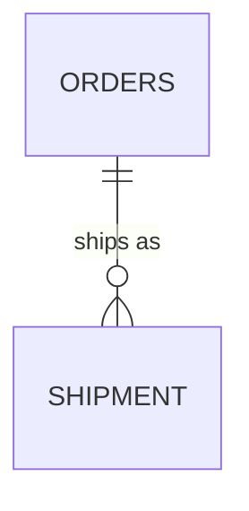
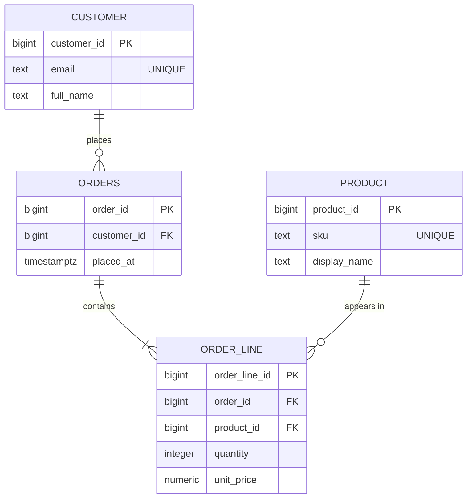
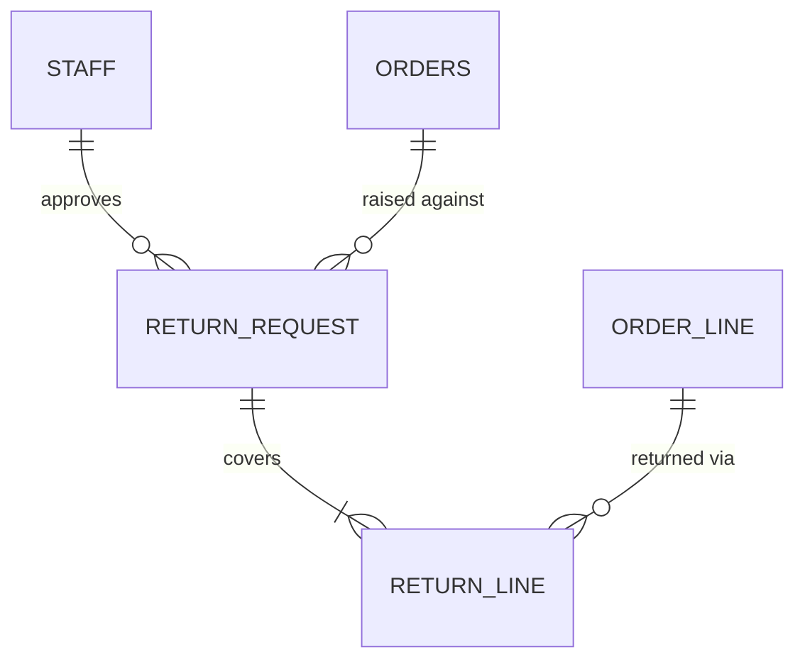

# Relational Modelling & Normalization

> Session 1 · PostgreSQL 16 · See [Database Foundations — Study Guide](index.md).

## 1. Objectives

By the end of this unit you will be able to:

- Identify entities, attributes and relationships in a written domain description.
- Read and write cardinality, and say what each end of a relationship means in the domain.
- Choose a primary key and justify the choice against the alternatives.
- State the functional dependencies in a table and use them to normalize to third normal form.
- Name the update anomaly a denormalized table permits, using a concrete row.

## 2. What a Model Is For

A data model is a set of decisions about what may exist. Every decision you make removes a
class of wrong data from the realm of the possible; every decision you skip leaves that
wrongness available to whoever writes the next feature.

That is the whole discipline. Not "how do I store this", but "what should it be impossible
to store".

Take one sentence from the OrderDesk notes:

> An order can ship in several shipments.

Two people will model that sentence differently, and one of them will be wrong:

```text
Model A: ORDERS(order_id, ..., tracking_number, dispatched_at)
Model B: ORDERS(order_id, ...)  and  SHIPMENT(shipment_id, order_id, tracking_number, dispatched_at)
```

Model A can hold exactly one shipment per order. The moment a real order ships in two boxes,
somebody overwrites `tracking_number` and the first parcel becomes untraceable. No amount of
careful application code fixes that, because the place to put the second value does not exist.

> **Note.** The test for a model is not "can it store today's data". It is "can it store
> tomorrow's data without a lie". Model A forces a lie.

## 3. Entities, Attributes and Relationships

An **entity** is a thing the domain talks about as a unit and needs to identify individually.
An **attribute** is a fact about one entity. A **relationship** is a fact that involves two.

The reliable way to find them in prose is grammatical, and it is worth doing literally the
first few times:

| In the sentence | Usually becomes |
|---|---|
| A noun the domain counts, lists, or looks up | An entity |
| A noun that only ever describes one other noun | An attribute |
| A verb connecting two entity-nouns | A relationship |
| An adjective phrase with a fixed set of values | An attribute with a `CHECK` |

Applied to OrderDesk:

> A refunds clerk approves a return request, giving a reason. A return request covers one
> or more lines of an order.

- `clerk` — counted and looked up → entity (`STAFF`)
- `return request` — counted → entity
- `reason` — describes exactly one return request → attribute
- `approves`, `covers` → relationships

### Cardinality

Cardinality is the pair of answers to two questions, asked in both directions. Ask them out
loud; the phrasing matters more than the notation.

> For one `ORDERS`, how many `SHIPMENT`? *Zero or more* — an order that has not dispatched
> has none.
> For one `SHIPMENT`, how many `ORDERS`? *Exactly one* — a parcel belongs to one order.

That gives one-to-many, drawn with crow's foot notation:



The symbols are worth learning properly, because they carry the "zero or" that people skip:

| Notation | Reads as |
|---|---|
| `\|\|` | exactly one |
| `o\|` | zero or one |
| `}o` | zero or more |
| `}\|` | one or more |

The difference between `o{` and `\|{` is a real design decision, not decoration. `ORDERS ||--|{ ORDER_LINE` says an order must have at least one line — an order of nothing is not an
order. That claim has to be true, and the database cannot enforce it with a foreign key
alone, so writing it down commits you to enforcing it another way.

### Many-to-many is never really many-to-many

Two entities related many-to-many always have a third entity hiding between them, and it
almost always has attributes of its own.

```text
Wrong — a relationship you cannot store
ORDERS }o--o{ PRODUCT

Right — the junction is an entity, and it has a quantity and a price
ORDERS ||--|{ ORDER_LINE }o--|| PRODUCT
```

The giveaway is that you cannot answer "how many, and at what price?" without somewhere to
put the answer. `ORDER_LINE` is that somewhere.

> **Real-world use.** `ORDER_LINE.unit_price` is not redundant with `PRODUCT.price`. The
> product's price is what it costs *now*; the order line's is what it cost *then*. Copying
> it is the correct decision, and section 6 explains why that is not a normalization failure.

## 4. Keys

A **candidate key** is a minimal set of columns that uniquely identifies a row. Minimal
matters: if `(order_id)` is unique then `(order_id, created_at)` is also unique, but it is
not a candidate key, because you can drop a column and still identify the row.

The **primary key** is the candidate key you picked. You will usually be choosing between:

```sql
-- Natural key: made of real data
CREATE TABLE product (
    sku          text PRIMARY KEY,
    display_name text NOT NULL
);

-- Surrogate key: a generated identifier that means nothing
CREATE TABLE product (
    product_id bigint GENERATED ALWAYS AS IDENTITY PRIMARY KEY,
    sku        text NOT NULL UNIQUE,
    display_name text NOT NULL
);
```

The second form is the default in this module, for one reason worth stating plainly: **natural
keys change.** A SKU gets restructured, an email address is corrected, a national id is
re-issued. When a natural key changes you must update it in every table that references it,
and any row that got missed is now silently pointing at nothing.

Notice that the surrogate version does not throw the natural key away — `sku` is still there,
still `UNIQUE`. You keep the business rule and stop it from being load-bearing for identity.

> **Note.** `UNIQUE` and `PRIMARY KEY` differ in exactly two ways: a table has one primary
> key but many unique constraints, and a primary key implies `NOT NULL`. Everything else you
> may have heard is engine folklore.

### Foreign keys

A foreign key says: the value in this column must exist as a key in that table. It is the
single most valuable line of SQL you will write, because it makes an entire category of bug
impossible rather than unlikely.

```sql
CREATE TABLE shipment (
    shipment_id bigint GENERATED ALWAYS AS IDENTITY PRIMARY KEY,
    order_id    bigint NOT NULL REFERENCES orders (order_id),
    dispatched_at timestamptz
);
```

Without that `REFERENCES`, an `order_id` of `99999` inserts happily and you have a parcel
belonging to an order that does not exist. Nothing will tell you. It will surface months
later as a report whose totals do not add up.

## 5. Functional Dependency

Everything in normalization follows from one idea, so it is worth getting exactly.

`A → B` ("A determines B") means: any two rows agreeing on `A` must agree on `B`. It is a
statement about the domain, not about the data you happen to have today.

Look at this table, which is what an OrderDesk model looks like before anyone normalizes it:

```text
order_line_id | order_id | customer_email    | customer_name | sku    | product_name | qty
--------------+----------+-------------------+---------------+--------+--------------+----
1             | 5001     | mai@example.com   | Mai Tran      | KB-01  | Keyboard     | 2
2             | 5001     | mai@example.com   | Mai Tran      | MS-04  | Mouse        | 1
3             | 5002     | mai@example.com   | Mai Tran      | KB-01  | Keyboard     | 1
```

The dependencies are:

```text
order_line_id  →  order_id, sku, qty        (the whole row, from the key)
order_id       →  customer_email            (an order belongs to one customer)
customer_email →  customer_name             (an email identifies one customer)
sku            →  product_name              (a SKU names one product)
```

Only the first has the primary key on the left. The other three are the problem, and each
one is a specific class of bug:

- **Update anomaly.** Mai corrects her name. It appears in three rows. Update two and the
  third disagrees; there is now no answer to "what is her name".
- **Insertion anomaly.** A new product arrives that nobody has ordered. There is nowhere to
  put it — a row here requires an order line.
- **Deletion anomaly.** The last line referencing `MS-04` is deleted. The fact that a Mouse
  exists, and what it is called, is gone.

> **Note.** These are not hypothetical. Every one of them is a support ticket somebody has
> written. "The customer's name is different on two invoices" is an update anomaly with a
> customer attached.

## 6. Normalization to Third Normal Form

The three forms are one rule applied three times: every fact belongs where its determinant
lives.

### First normal form — one value per cell

No repeating groups, no lists in a column.

```text
Wrong — the skus column holds a list
order_id | skus
5001     | KB-01, MS-04

Right — one row per line
order_id | sku
5001     | KB-01
5001     | MS-04
```

The wrong form breaks the moment you ask "how many orders included KB-01?", because that
question becomes string matching, and string matching finds `KB-011` too.

### Second normal form — no partial dependency on a composite key

Applies only when the primary key has more than one column. If part of the key determines a
non-key column, that column belongs in another table.

```text
Key is (order_id, sku)
order_id | sku   | qty | product_name
                        ^^^^^^^^^^^^ depends on sku alone, not on the whole key
```

`product_name` moves to `PRODUCT`.

### Third normal form — no dependency between non-key columns

If a non-key column determines another non-key column, that pair belongs in its own table.

In the table above, `customer_email → customer_name` is exactly this: neither is the key.
Both move to `CUSTOMER`, and the order keeps a foreign key.

The result:



Every fact now has one home. Mai's name is in one row; correcting it corrects it everywhere.

### When copying a value is right

`ORDER_LINE.unit_price` looks like a violation and is not. Test it with the dependency:
does `product_id → unit_price` hold? No — two order lines for the same product, placed a
month apart, may legitimately differ. The price on the line is not the product's price; it
is a different fact that happens to have been equal once.

> **Tip.** Before "denormalizing for performance", check whether you have actually found a
> second fact, as here. That is not denormalization, it is modelling. Real denormalization is
> a measured trade, and this module does not need it.

## 7. Worked Example — Returns, End to End

The remaining OrderDesk rule:

> A refunds clerk must approve a refund and must give a reason. A return covers one or more
> lines of an order, and a partly shipped order can still be returned.

Reading it out:

- `RETURN_REQUEST` is counted and looked up → entity.
- `reason` describes one return request → attribute, and it is `NOT NULL` because "must give
  a reason" is a rule, not a preference.
- The approving clerk is `STAFF`, related one-to-many.
- "covers one or more lines" is many-to-many between the request and `ORDER_LINE`, so there
  is a junction — and it has a quantity, because you can return one of the two keyboards.



Note what is *not* here. There is no `orders.is_returned` flag. Whether an order has been
returned is a question, answered by a query. Storing it would create a second copy of a fact
that `RETURN_REQUEST` already holds, and the two would eventually disagree.

The same reasoning kills `orders.can_be_cancelled`. The cancellation window closes at first
dispatch, so the answer is "does a shipment exist for this order" — derivable, therefore not
stored.

> **Note.** "Derivable, therefore not stored" is a default, not a law. It is broken
> deliberately, with a measurement, when a derivation gets too expensive. Breaking it by
> accident on day one is what this note is guarding against.

## 8. Common Problems

### Every table has a `status` column and nobody can list the values

`status text` accepts `'shipped'`, `'Shipped'`, `'SHIPPED'` and `'shpped'`. Constrain it:

```sql
-- Wrong — the set of valid values lives only in someone's memory
status text NOT NULL

-- Right — the set is written down and enforced
status text NOT NULL
    CHECK (status IN ('placed', 'picking', 'dispatched', 'delivered', 'cancelled'))
```

### The model has a table per report

A table called `monthly_sales_summary` sitting beside `ORDER_LINE` is a query that somebody
saved as a table. It will drift from the rows it summarises. Write the query.

### `ERROR: insert or update on table "shipment" violates foreign key constraint`

The `order_id` you inserted does not exist in `orders`. Nearly always one of: you inserted
the child before the parent, you used the wrong id, or you assumed an id the database
generated rather than reading it back.

### Choosing a natural key because it "will never change"

Email addresses change. Phone numbers get reassigned. Postcodes are redrawn. The cost of a
surrogate key is one column; the cost of a natural key changing is a migration across every
table that referenced it.

## 9. Practical Guidelines

- Write the cardinality sentence out loud in both directions before drawing the line.
- Give every table a surrogate primary key, and keep the natural key as `UNIQUE`.
- State the functional dependencies before claiming a table is in 3NF.
- If a fact is derivable from other rows, derive it. Store it only with a measurement.
- Constrain every enumerated column with `CHECK` on the day you create it.
- Name a junction table for what it *is* — `ORDER_LINE`, not `ORDER_PRODUCT`.

## 10. Knowledge Check

1. `ORDERS ||--|{ ORDER_LINE` and `ORDERS ||--o{ SHIPMENT` differ at one end. What does that
   difference claim about the domain, and how would you enforce it?
2. Given `customer_email → customer_name` in a table whose key is `order_line_id`, which
   normal form is violated, and which anomaly does it permit? Give a concrete pair of rows.
3. Why is `ORDER_LINE.unit_price` not a 3NF violation, when `ORDER_LINE.product_name` would be?
4. An order must have at least one line. Can a foreign key enforce that? If not, what can?
5. Name one fact in the OrderDesk domain that should be derived rather than stored, and say
   what would go wrong if it were stored.

## 11. Further Reading

- [PostgreSQL: Data Definition](https://www.postgresql.org/docs/16/ddl.html)
- [PostgreSQL: Constraints](https://www.postgresql.org/docs/16/ddl-constraints.html)
- [Mermaid: Entity Relationship Diagrams](https://mermaid.js.org/syntax/entityRelationshipDiagram.html)

---

Next: [Lab 01 — Model the OrderDesk returns domain](lab-01.md), then [DDL, Constraints & Data Integrity](ddl-and-constraints.md).
