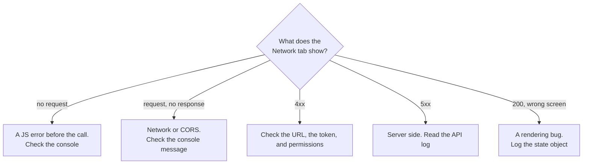

# Frontend Foundations — Appendix

> See [Frontend Foundations — Study Guide](index.md).

## 1. Syllabus Map

| # | Syllabus item | Covered in |
|---|---|---|
| 1 | Semantic HTML & Responsive Layout | [Semantic HTML & Responsive Layout](semantic-html-and-layout.md) |
| 2 | Modern JavaScript, DOM & Events | [Modern JavaScript, the DOM & Events](javascript-dom-and-events.md) |
| 3 | Async JavaScript & Strict TypeScript | [Async JavaScript & Strict TypeScript](async-and-typescript.md) |
| 4 | Long Assignment Completion & Acceptance | Issued separately |
| 5 | Final Assessments | Issued separately |

## 2. Objective Coverage

| Code | Objective | Taught in | Practised in |
|---|---|---|---|
| FEF-K1 | Semantic and responsive interface design | Note 01 | Lab 01 |
| FEF-K2 | Browser programming | Note 02 | Lab 02 |
| FEF-K3 | Type-safe API integration | Note 03 | Lab 03 |

## 3. The Four States

Every screen that loads data must handle all four. This is the module's recurring rule.

| State | Show | If you forget it |
|---|---|---|
| Loading | A message or skeleton | A blank page; users click twice |
| Empty | "No orders match these filters" | An empty table reads as broken |
| Success | The data | — |
| Error | What went wrong and what to do | Stale or absent data, silently |

```typescript
type ViewState<T> =
    | { kind: 'loading' }
    | { kind: 'empty' }
    | { kind: 'success'; data: T }
    | { kind: 'error'; message: string; status?: number };
```

## 4. Accessibility Checklist

- [ ] One `<h1>`; the heading outline skips no levels
- [ ] `<header>`, `<nav>`, `<main>`, `<footer>` landmarks present
- [ ] Every control has a `<label for>`; placeholders are not labels
- [ ] Everything interactive is a `<button>` or an `<a>`, not a `<div>`
- [ ] Tab order matches visual order, with a visible focus ring
- [ ] Tables have `<caption>` and `scope` on headers
- [ ] Status changes announced with `role="status"` and `aria-live="polite"`
- [ ] `lang` is set on `<html>`

## 5. CSS Quick Reference

```css
*, *::before, *::after { box-sizing: border-box; }

.row  { display: flex; align-items: center; gap: 1rem; flex-wrap: wrap; }
.push { margin-left: auto; }

.cards { display: grid; grid-template-columns: repeat(auto-fit, minmax(16rem, 1fr)); gap: 1rem; }

.layout {
    display: grid;
    grid-template-areas: "header header" "sidebar main" "footer footer";
    grid-template-columns: 16rem 1fr;
    min-height: 100dvh;
}

@media (min-width: 48rem) { /* tablet and up */ }
@media (min-width: 75rem) { /* desktop */ }
```

## 6. Fetch Checklist

- [ ] `response.ok` checked on every call
- [ ] The error body read and turned into a usable message
- [ ] 204 handled without calling `json()`
- [ ] A timeout via `AbortController`
- [ ] The token attached in one place, not per call
- [ ] Independent requests issued with `Promise.all`
- [ ] `TypeError: Failed to fetch` recognised as network or CORS

## 7. Diagnosing a Broken Screen



## 8. Primary Sources

- [MDN Web Docs](https://developer.mozilla.org/)
- [HTML Living Standard](https://html.spec.whatwg.org/multipage/)
- [WAI: Web Accessibility Tutorials](https://www.w3.org/WAI/tutorials/)
- [TypeScript Handbook](https://www.typescriptlang.org/docs/handbook/intro.html)
- [Vite guide](https://vite.dev/guide/)

---

Back to [Frontend Foundations — Study Guide](index.md).
