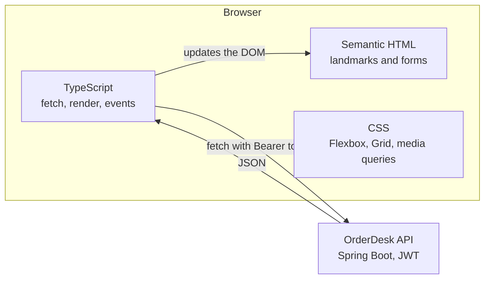

# Frontend Foundations — Study Guide

This module is the browser half of the programme. It is deliberately framework-free: no React,
no build framework beyond a bundler. React arrives next and assumes everything here is already
familiar, because a React component is HTML, CSS and JavaScript with a rendering model on top.

The API you consume is the OrderDesk API you built in Spring Boot API Development.

## 1. Module Map

| # | Note | Covers | Lab |
|---|---|---|---|
| 01 | [Semantic HTML & Responsive Layout](semantic-html-and-layout.md) | landmarks, headings, labelled forms, accessibility, the box model, Flexbox, Grid, responsive layout | [Lab 01 — Build the orders screen, semantic and responsive](lab-01.md) |
| 02 | [Modern JavaScript, the DOM & Events](javascript-dom-and-events.md) | ES modules, array methods, DOM queries and updates, event propagation and delegation, rendering from data | [Lab 02 — Render from data and handle events](lab-02.md) |
| 03 | [Async JavaScript & Strict TypeScript](async-and-typescript.md) | promises, `async`/`await`, `fetch`, core TypeScript types, interfaces, typed API access, the four UI states | [Lab 03 — Typed access to the real API](lab-03.md) |

[Frontend Foundations — Appendix](appendix.md) maps the syllabus outline onto these notes and lists the
primary sources.

## 2. The Running Domain — The OrderDesk Back Office

Same product, now with a screen. Staff need to see orders, filter them and open one.



Every screen in this module has four states, and the module keeps returning to them because
they are what separates a demo from a usable interface:

| State | Shown when | Commonly forgotten |
|---|---|---|
| **Loading** | The request is in flight | Users see a blank page and click twice |
| **Empty** | It succeeded, with no rows | An empty table reads as broken |
| **Success** | It succeeded, with rows | — |
| **Error** | It failed | The page silently shows stale or no data |

> **Note.** "It works" in this module means all four states are handled. Two of the three labs
> mark you on the states you did not write.

## 3. How to Use This Handbook

Read this page before session 1. Each unit is a note plus a lab, and the labs build one
back-office screen incrementally — do not restart each lab.

The long assignment is issued in session 1 and completed in unit 4.

## 4. Environment Setup

```bash
node --version     # expect 20.x or 22.x LTS
npm --version
```

```bash
npm create vite@latest orderdesk-ui -- --template vanilla-ts
cd orderdesk-ui && npm install && npm run dev
```

Vite serves on <http://localhost:5173> with hot reload. That origin is the one your Spring Boot
CORS configuration must allow — if the browser reports a CORS error, the fix is in the API, not
here.

You also need the API running:

```bash
cd ../orderdesk-api && docker compose up -d
curl -s localhost:8080/actuator/health
```

> **Tip.** Keep the browser devtools open, on the Network tab, for this whole module. Most
> questions are answered by looking at the request that was actually sent.

## 5. How to Study This Module

- **Read the rendered page, not the source.** Use the accessibility tree in devtools. If a
  heading is not a heading there, it is not a heading.
- **Check the Network tab before debugging JavaScript.** A wrong URL, a missing header or a 401
  looks exactly like a rendering bug from inside the code.
- **Resize the window constantly.** A layout that only works at one width is not responsive.
- **Turn the mouse off sometimes.** Tab through your page. If you cannot reach a control or
  cannot see where you are, it is broken for a real group of users.
- **Let TypeScript help.** `strict` is on for a reason; `any` throws away the only guarantee the
  language gives you.

## 6. Glossary

| Term | Meaning here |
|---|---|
| **Semantic element** | An element whose tag says what it is: `<nav>`, `<button>`, `<table>` |
| **Landmark** | A region assistive technology can jump to — `<header>`, `<main>`, `<nav>` |
| **Box model** | Content, padding, border, margin |
| **Flexbox** | One-dimensional layout, along a row or a column |
| **Grid** | Two-dimensional layout, rows and columns together |
| **Breakpoint** | A width at which the layout changes |
| **Module** | A file with its own scope, using `import` and `export` |
| **Event delegation** | One listener on an ancestor handling events from many descendants |
| **Promise** | A value that will exist later, or a reason it will not |
| **Structural typing** | TypeScript matching types by shape, not by name |

---

Start with [Semantic HTML & Responsive Layout](semantic-html-and-layout.md).
