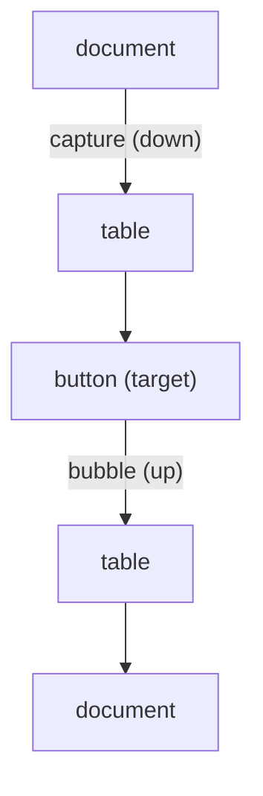

# Modern JavaScript, the DOM & Events

> Objectives: FEF-K2 · Session 2 · ES2023 · See [Frontend Foundations — Study Guide](index.md).

## 1. Objectives

After this unit, learners can:

- Organise code into ES modules with explicit imports and exports.
- Transform data with array methods rather than index loops.
- Query and update the DOM safely, without injecting markup from data.
- Explain event propagation and use delegation for dynamic lists.
- Render a list from an array and re-render when the data changes.

## 2. Modules

A module is a file with its own scope. Nothing is global unless exported.

```javascript
// src/api/orders.js
const BASE = '/api/orders';

export async function fetchOrders(params) { ... }
export async function fetchOrder(orderId) { ... }

// Default export: one per module, for the module's main thing.
export default class OrderStore { ... }
```

```javascript
// src/main.js
import OrderStore, { fetchOrders } from './api/orders.js';
import { renderRows } from './ui/table.js';
```

```html
<!-- type="module" is required: it enables import, and defers execution until the DOM is parsed -->
<script type="module" src="/src/main.js"></script>
```

```javascript
// Wrong — a global, colliding with anything else called `orders`
var orders = [];

// Right — module scope; export it if another module needs it
const orders = [];
```

Modules are deferred by default, so a module script can query the DOM at the top level without
waiting for `DOMContentLoaded`.

## 3. Values and Destructuring

`const` by default, `let` when it must be reassigned, `var` never — `var` is function-scoped and
hoisted, which is a source of bugs with no upside.

```javascript
const { id, status, total } = order;
const [first, ...rest] = orders;

// Defaults for absent values
const { page = 0, size = 20 } = params;

// Optional chaining and nullish coalescing: the difference matters
const currency = order.total?.currency ?? 'VND';

// Wrong — || replaces 0 and '' as well as null
const size = params.size || 20;      // size: 0 becomes 20

// Right — ?? replaces only null and undefined
const size = params.size ?? 20;
```

Template literals for strings:

```javascript
const label = `Order ${order.id} — ${order.status}`;
```

## 4. Array Methods

Describe the transformation rather than the iteration.

```javascript
const active   = orders.filter(o => o.status !== 'CANCELLED');
const ids      = orders.map(o => o.id);
const total    = orders.reduce((sum, o) => sum + o.total, 0);
const anyLate  = orders.some(o => o.isLate);
const allPaid  = orders.every(o => o.paid);
const found    = orders.find(o => o.id === 5001);
const sorted   = [...orders].sort((a, b) => b.placedAt.localeCompare(a.placedAt));

// Group, ES2024
const byStatus = Object.groupBy(orders, o => o.status);
```

```javascript
// Wrong — sort mutates, so the caller's array is reordered too
const sorted = orders.sort(...);

// Right — copy first
const sorted = [...orders].sort(...);
```

```javascript
// Wrong — the default sort compares strings: [1, 10, 2, 20]
[1, 2, 10, 20].sort();

// Right
[1, 2, 10, 20].sort((a, b) => a - b);
```

## 5. The DOM

```javascript
const tbody   = document.querySelector('#order-rows');
const buttons = document.querySelectorAll('[data-action="cancel"]');   // static NodeList
const status  = document.getElementById('status-message');
```

Updating text and structure:

```javascript
// Right for text — cannot inject markup, whatever the data contains
cell.textContent = order.status;

// Dangerous — the data becomes markup
cell.innerHTML = order.customerName;
```

```javascript
// If customerName is  
// then innerHTML executes it. textContent displays it.
```

Build elements rather than concatenating HTML:

```javascript
export function orderRow(order) {
    const tr = document.createElement('tr');
    tr.dataset.orderId = order.id;          // data-order-id, read back via dataset

    for (const value of [order.id, formatDate(order.placedAt), order.status]) {
        const td = document.createElement('td');
        td.textContent = value;             // safe by construction
        tr.append(td);
    }

    const actions = document.createElement('td');
    const cancel = document.createElement('button');
    cancel.type = 'button';
    cancel.textContent = 'Cancel';
    cancel.dataset.action = 'cancel';
    cancel.disabled = order.status !== 'PLACED';
    actions.append(cancel);
    tr.append(actions);

    return tr;
}
```

```javascript
export function renderRows(tbody, orders) {
    tbody.replaceChildren(...orders.map(orderRow));   // clears and fills in one step
}
```

`<template>` is the middle way when the markup is large:

```html
<template id="order-row-template">
  <tr><td class="id"></td><td class="placed"></td><td class="status"></td></tr>
</template>
```

```javascript
const template = document.querySelector('#order-row-template');
const row = template.content.cloneNode(true);
row.querySelector('.id').textContent = order.id;
```

## 6. Events

An event travels down to the target and back up. Handlers normally run on the way up.



That bubbling is what makes **delegation** work: one listener on a container handles events from
children that did not exist when it was attached.

```javascript
// Wrong — a listener per row. Re-render and every one is gone, so you must re-attach.
document.querySelectorAll('[data-action="cancel"]').forEach(btn =>
    btn.addEventListener('click', () => cancelOrder(btn.closest('tr').dataset.orderId)));

// Right — one listener, on the container, that survives every re-render
tbody.addEventListener('click', (event) => {
    const button = event.target.closest('[data-action="cancel"]');
    if (!button || !tbody.contains(button)) return;
    cancelOrder(button.closest('tr').dataset.orderId);
});
```

Forms need their default prevented, or the page reloads:

```javascript
filters.addEventListener('submit', (event) => {
    event.preventDefault();
    const data = new FormData(filters);
    load({ status: data.get('status') || undefined });
});
```

`stopPropagation` is rarely the right tool — it breaks other listeners that had a legitimate
interest, including delegated ones you add later.

## 7. Worked Example — The Orders Table

```javascript
// src/ui/orders-screen.js
import { fetchOrders, cancelOrder } from '../api/orders.js';
import { renderRows } from './table.js';

const tbody   = document.querySelector('#order-rows');
const filters = document.querySelector('#filters');
const message = document.querySelector('#status-message');

// One place holds the state; render is a function of it.
let state = { orders: [], loading: false, error: null };

function render() {
    if (state.loading) {
        message.textContent = 'Loading orders…';
        tbody.replaceChildren();
        return;
    }
    if (state.error) {
        message.textContent = `Could not load orders: ${state.error}`;
        tbody.replaceChildren();
        return;
    }
    if (state.orders.length === 0) {
        message.textContent = 'No orders match these filters.';
        tbody.replaceChildren();
        return;
    }
    message.textContent = `${state.orders.length} orders`;
    renderRows(tbody, state.orders);
}

async function load(params = {}) {
    state = { ...state, loading: true, error: null };
    render();
    try {
        state = { orders: await fetchOrders(params), loading: false, error: null };
    } catch (e) {
        state = { orders: [], loading: false, error: e.message };
    }
    render();
}

filters.addEventListener('submit', (event) => {
    event.preventDefault();
    const data = new FormData(filters);
    load({ status: data.get('status') || undefined });
});

tbody.addEventListener('click', async (event) => {
    const button = event.target.closest('[data-action="cancel"]');
    if (!button) return;

    button.disabled = true;                 // stop the double click immediately
    try {
        await cancelOrder(button.closest('tr').dataset.orderId);
        await load();
    } catch (e) {
        message.textContent = `Cancel failed: ${e.message}`;
        button.disabled = false;
    }
});

load();
```

The shape is worth noticing, because React formalises exactly it: state in one place, `render`
derived from state, events changing state and re-rendering. All four UI states are handled in
`render`, which is why they cannot be forgotten.

## 8. Common Problems

### `Cannot read properties of null (reading 'addEventListener')`

The selector matched nothing — a typo, or the script ran before the element existed. Modules are
deferred, so this is usually the selector.

### Listeners stop working after a re-render

They were attached to elements that have been replaced. Delegate to a container.

### The page reloads when a form is submitted

`event.preventDefault()` is missing.

### `[1, 2, 10].sort()` gives `[1, 10, 2]`

The default sort compares strings. Pass a comparator.

### The original array changed unexpectedly

`sort`, `reverse` and `splice` mutate. Copy first.

### User text appears as markup, or runs

`innerHTML` with data in it. Use `textContent`.

### `this` is undefined inside a handler

An arrow function inherits `this` from its enclosing scope; a `function` gets the element. Use
`event.currentTarget` rather than relying on `this`.

## 9. Practical Guidelines

- `const` by default, `let` when needed, never `var`.
- `textContent` for text; reserve `innerHTML` for markup you wrote yourself.
- Build elements with `createElement`, or clone a `<template>`.
- Delegate events to a stable container rather than to each item.
- Keep state in one object and make `render` a pure function of it.
- Handle loading, empty, success and error in `render`, every time.

## 10. Knowledge Check

1. Why does `size ?? 20` differ from `size || 20`? Give a value where it matters.
2. What is event delegation, and which concrete problem does it solve here?
3. Give a value of `order.customerName` that makes `innerHTML` dangerous and `textContent` safe.
4. Why does `[...orders].sort(...)` differ from `orders.sort(...)`?
5. Name the four states `render` must handle, and what a user sees if you omit each.

## 11. Further Reading

- [MDN: JavaScript modules](https://developer.mozilla.org/en-US/docs/Web/JavaScript/Guide/Modules)
- [MDN: Introduction to events](https://developer.mozilla.org/en-US/docs/Learn/JavaScript/Building_blocks/Events)
- [MDN: Document Object Model](https://developer.mozilla.org/en-US/docs/Web/API/Document_Object_Model)

---

Next: [Lab 02 — Render from data and handle events](lab-02.md), then [Async JavaScript & Strict TypeScript](async-and-typescript.md).
