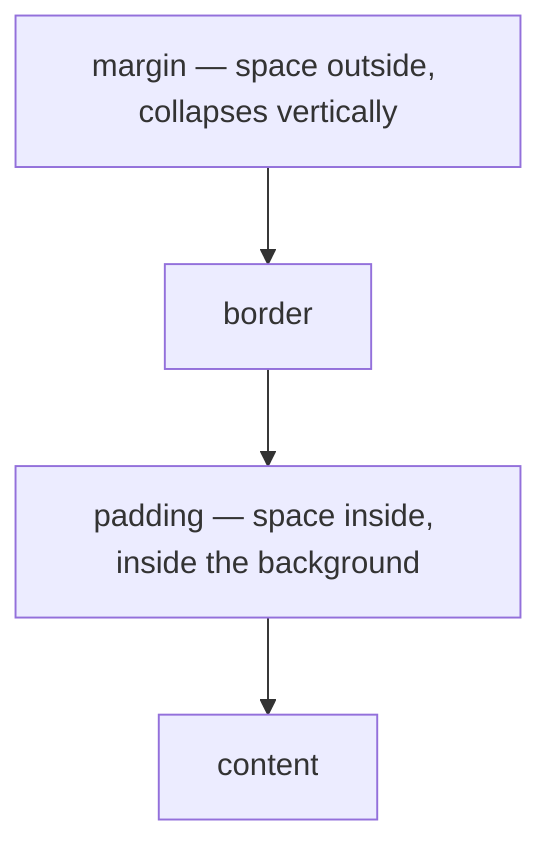

# Semantic HTML & Responsive Layout

> Objectives: FEF-K1 · Session 1 · HTML Living Standard, CSS3 · See [Frontend Foundations — Study Guide](index.md).

## 1. Objectives

After this unit, learners can:

- Choose elements for their meaning and structure a page with landmarks.
- Write a form whose every control is labelled and keyboard-reachable.
- Apply the box model deliberately, including `box-sizing`.
- Lay out a page with Flexbox and Grid, choosing correctly between them.
- Make a layout responsive with a mobile-first media query.

## 2. Elements Mean Things

An element's tag is not styling. It tells the browser, assistive technology and search engines
what the thing *is*.

```html
<!-- Wrong. Not focusable, not announced as a button, does not fire on Enter or Space. -->
<div class="btn" onclick="cancelOrder(5001)">Cancel</div>

<!-- Right. Focusable, announced, keyboard-activated, disabled state for free. -->
<button type="button" onclick="cancelOrder(5001)">Cancel</button>
```

Making the `div` work means adding `tabindex`, `role`, a keydown handler for Enter and Space, an
`aria-disabled` state — all of which `<button>` already has, correctly, everywhere.

| Instead of | Use | Because |
|---|---|---|
| `<div class="header">` | `<header>` | A landmark that can be jumped to |
| `<div class="nav">` | `<nav>` | Announced as navigation |
| `<div class="btn">` | `<button>` | Focusable and keyboard-operable |
| `<div>` grid of rows | `<table>` | Row and column relationships are announced |
| `<span>` for a heading | `<h2>` | Appears in the document outline |
| `<div>` list | `<ul>` / `<li>` | "List, 12 items" is announced |

## 3. Landmarks and Headings

```html
<body>
  <header>
    <h1>OrderDesk</h1>
    <nav aria-label="Main">
      <ul>
        <li><a href="/orders" aria-current="page">Orders</a></li>
        <li><a href="/products">Products</a></li>
      </ul>
    </nav>
  </header>

  <main>
    <h2>Orders</h2>
    <section aria-labelledby="filters-heading">
      <h3 id="filters-heading">Filters</h3>
      <!-- ... -->
    </section>
  </main>

  <footer>
    <p>FPT Software Academy</p>
  </footer>
</body>
```

Headings form an outline. Levels are structure, not size — style with CSS.

```html
<!-- Wrong — the level was chosen because h4 looked right -->
<h1>OrderDesk</h1>
<h4>Orders</h4>

<!-- Right — the level says where it sits; CSS decides how big -->
<h1>OrderDesk</h1>
<h2>Orders</h2>
```

> **Note.** Devtools has an Accessibility pane showing the tree the browser exposes. If your
> "heading" is not there, no screen reader will find it, and neither will a search engine.

## 4. Forms

Every control needs a label, programmatically associated.

```html
<form id="order-filters">
  <div class="field">
    <label for="status">Status</label>
    <select id="status" name="status">
      <option value="">All</option>
      <option value="PLACED">Placed</option>
      <option value="DISPATCHED">Dispatched</option>
    </select>
  </div>

  <div class="field">
    <label for="placed-from">Placed from</label>
    <input type="date" id="placed-from" name="placedFrom">
  </div>

  <fieldset>
    <legend>Include</legend>
    <label><input type="checkbox" name="include" value="cancelled"> Cancelled orders</label>
  </fieldset>

  <button type="submit">Apply</button>
  <button type="reset">Clear</button>
</form>
```

```html
<!-- Wrong — placeholder is not a label. It vanishes on focus and is not announced reliably. -->
<input type="text" placeholder="Status">

<!-- Wrong — visually adjacent but not associated -->
<span>Status</span><input type="text" id="status">

<!-- Right -->
<label for="status">Status</label><input type="text" id="status">
```

`type` earns its keep on mobile: `email`, `tel`, `number` and `date` change the keyboard shown
and give free validation.

## 5. The Box Model

Every element is content, padding, border, margin.



Set `box-sizing` once, globally. The default makes width mean *content* width, so padding and
border are added on top and every layout calculation becomes arithmetic.

```css
/* The one line every stylesheet should start with */
*, *::before, *::after { box-sizing: border-box; }
```

```css
/* With the default content-box, this element is 340px wide, not 300 */
.card { width: 300px; padding: 16px; border: 2px solid; }

/* With border-box, it is 300px, and padding eats into it as you would expect */
```

Vertical margins between siblings **collapse** — 20px below one and 30px above the next gives
30px, not 50. Padding does not collapse, which is one reason to prefer it for spacing inside
components.

## 6. Flexbox and Grid

One dimension or two. That is the whole decision.

```css
/* Flexbox: a row of things, distributed */
.toolbar {
    display: flex;
    align-items: center;      /* cross axis: vertical centring, finally */
    gap: 1rem;                /* use gap, not margins on children */
    flex-wrap: wrap;          /* let it wrap rather than overflow */
}
.toolbar .spacer { margin-left: auto; }   /* push what follows to the right */
```

```css
/* Grid: a page skeleton, rows and columns together */
.layout {
    display: grid;
    grid-template-areas:
        "header header"
        "sidebar main"
        "footer footer";
    grid-template-columns: 16rem 1fr;
    grid-template-rows: auto 1fr auto;
    min-height: 100dvh;
}
header { grid-area: header; }
nav    { grid-area: sidebar; }
main   { grid-area: main; }
footer { grid-area: footer; }
```

A responsive card grid with no media query at all:

```css
.cards {
    display: grid;
    /* As many columns of at least 16rem as fit; they share the leftover space. */
    grid-template-columns: repeat(auto-fit, minmax(16rem, 1fr));
    gap: 1rem;
}
```

```css
/* Wrong — spacing children with margins gives an unwanted edge and fights wrapping */
.toolbar > * { margin-right: 1rem; }

/* Right */
.toolbar { display: flex; gap: 1rem; }
```

## 7. Responsive, Mobile First

Write the narrow layout as the base and add complexity as width allows. `min-width` queries
build up; `max-width` queries pile up exceptions.

```css
/* Base: single column, phone */
.layout {
    display: grid;
    grid-template-areas: "header" "main" "footer";
    grid-template-columns: 1fr;
}
nav { display: none; }

/* Tablet and up */
@media (min-width: 48rem) {
    .layout {
        grid-template-areas: "header header" "sidebar main" "footer footer";
        grid-template-columns: 14rem 1fr;
    }
    nav { display: block; }
}

/* Desktop */
@media (min-width: 75rem) {
    .layout { grid-template-columns: 18rem 1fr; }
}
```

```html
<!-- Without this, a phone renders at 980px and scales down. Every responsive rule is ignored. -->
<meta name="viewport" content="width=device-width, initial-scale=1">
```

Breakpoints belong where the layout breaks, not at device names. Widen the window until it looks
wrong; that is the breakpoint.

A wide table on a narrow screen needs a scroll container, not a broken layout:

```css
.table-wrapper { overflow-x: auto; }
```

> **Tip.** `rem` for breakpoints, not `px`: a user who raises their default font size gets the
> simpler layout sooner, which is what they wanted.

## 8. Worked Example — The Orders Screen

```html
<!DOCTYPE html>
<html lang="en">
<head>
  <meta charset="utf-8">
  <meta name="viewport" content="width=device-width, initial-scale=1">
  <title>Orders — OrderDesk</title>
  <link rel="stylesheet" href="/style.css">
</head>
<body>
  <div class="layout">
    <header>
      <h1>OrderDesk</h1>
    </header>

    <nav aria-label="Main">
      <ul>
        <li><a href="/orders" aria-current="page">Orders</a></li>
        <li><a href="/products">Products</a></li>
      </ul>
    </nav>

    <main>
      <h2>Orders</h2>

      <form class="toolbar" id="filters">
        <div class="field">
          <label for="status">Status</label>
          <select id="status" name="status">
            <option value="">All</option>
            <option value="PLACED">Placed</option>
          </select>
        </div>
        <button type="submit">Apply</button>
      </form>

      <!-- Announces changes without moving focus away from the filters. -->
      <p id="status-message" role="status" aria-live="polite"></p>

      <div class="table-wrapper">
        <table>
          <caption>Orders matching the current filters</caption>
          <thead>
            <tr>
              <th scope="col">Order</th>
              <th scope="col">Placed</th>
              <th scope="col">Status</th>
              <th scope="col">Total</th>
            </tr>
          </thead>
          <tbody id="order-rows"></tbody>
        </table>
      </div>
    </main>

    <footer><p>FPT Software Academy</p></footer>
  </div>
  <script type="module" src="/src/main.ts"></script>
</body>
</html>
```

`role="status"` with `aria-live="polite"` is how "Loading…" and "No orders found" reach a screen
reader user. Without it, the table silently changes and they are told nothing.

## 9. Common Problems

### The layout ignores every media query on a phone

The viewport meta tag is missing.

### An element is 340px wide when `width: 300px`

`box-sizing` is `content-box`. Set `border-box` globally.

### Two margins produce less space than expected

Vertical margin collapsing. Use padding, or `gap`.

### Tab order jumps around

The DOM order does not match the visual order — usually a Grid or `order` rearrangement. The
DOM order is the tab order.

### A clickable thing cannot be reached by keyboard

It is a `div`. Use a `button` or an `a`.

### The table breaks the layout on mobile

Wrap it in an `overflow-x: auto` container.

## 10. Practical Guidelines

- Choose the element for its meaning; reach for `div` only when nothing else fits.
- One `h1`, then a heading outline that does not skip levels.
- Every control has a `<label for>`; placeholders are not labels.
- `box-sizing: border-box` globally, as the first rule.
- Flexbox for one dimension, Grid for two; space with `gap`.
- Mobile-first `min-width` queries, at breakpoints in `rem` where the layout actually breaks.

## 11. Knowledge Check

1. List four things `<button>` gives you that a clickable `<div>` does not.
2. Why is `placeholder` not a substitute for `<label>`?
3. An element with `width: 300px; padding: 16px; border: 2px` renders 340px wide. Why, and what
   is the fix?
4. When is Grid the right choice and when is Flexbox? Give an example of each from this page.
5. What does `role="status"` with `aria-live="polite"` accomplish, and who for?

## 12. Further Reading

- [MDN: HTML elements reference](https://developer.mozilla.org/en-US/docs/Web/HTML/Element)
- [MDN: CSS Flexible Box Layout](https://developer.mozilla.org/en-US/docs/Web/CSS/CSS_flexible_box_layout)
- [MDN: CSS Grid Layout](https://developer.mozilla.org/en-US/docs/Web/CSS/CSS_grid_layout)
- [WAI: Forms tutorial](https://www.w3.org/WAI/tutorials/forms/)

---

Next: [Lab 01 — Build the orders screen, semantic and responsive](lab-01.md), then [Modern JavaScript, the DOM & Events](javascript-dom-and-events.md).
