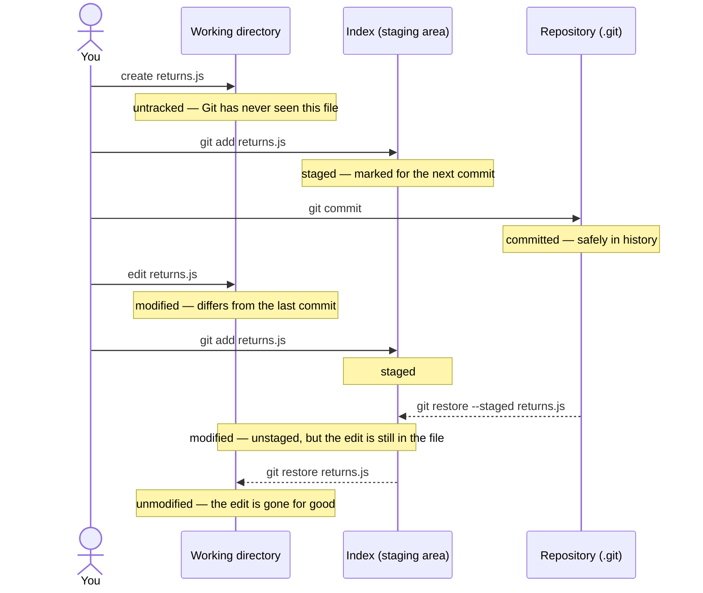
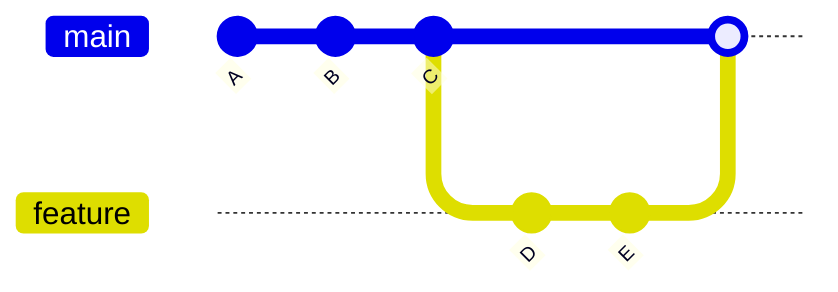
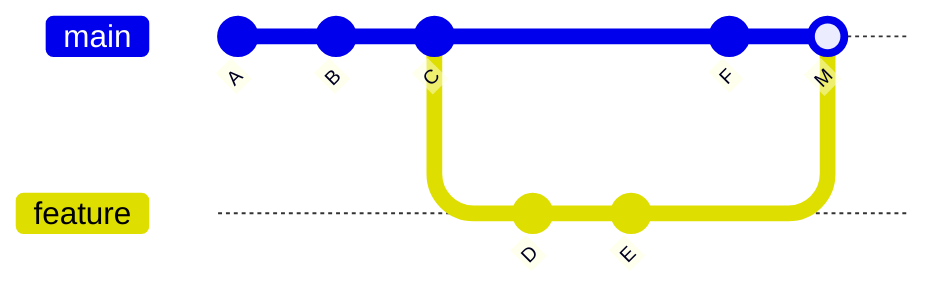

# Git Fundamentals

> Session 2 · Git 2.40+ · See [Agile, Git & AI-Assisted Development Foundations — Study Guide](index.md).

## 1. Objectives

By the end of this unit you will be able to:

- Name the four states a file can be in and say which command moves it between them.
- Stage part of a file's changes and explain why that produces a better commit.
- Write a commit message that explains why the change was made.
- Read history with `git log` and identify what a commit changed.
- Create and merge a branch, and describe the two kinds of merge Git can perform.
- Write ignore rules and diagnose why an ignore rule is not taking effect.
- Recover from a lost commit, a wrong commit message and a bad merge without losing work.

## 2. The Four States

Git is not a folder with backups. Every file you touch is in one of four states, and every
command in this unit moves files between them.

One file's life — created, committed, edited, and walked back out again. The four states are
on the right of each step:



Read the solid arrows left to right: that is the only path into history. The dashed ones are
the way back, and they are the two commands people reach for in a panic and get wrong.

| State | Means | Get out of it with |
|---|---|---|
| Untracked | Git has never seen this file | `git add` |
| Modified | Changed since the last commit, not staged | `git add`, or `git restore` to discard |
| Staged | Marked to go into the next commit | `git commit`, or `git restore --staged` to unstage |
| Committed | Safely in the repository's history | — |

The command that tells you which state everything is in:

```bash
git status
```

> **Tip.** `git status` is the most useful command in this module and the least used.
> Nearly every problem in the next three sessions is announced by output people skip past.
> Read all of it, including the hint lines — they usually name the exact fix.

The staging area is the part that has no equivalent in tools you may have used before. It
exists so that **what you changed** and **what you are recording** can be different. That
gap is the whole point of section 3.

## 3. Focused Commits

A commit is a unit of explanation, not a save point. The question to ask before every
commit is: *can I describe this in one sentence without using the word "and"?*

```bash
# Wrong — everything you happened to touch, in one lump
git add .
git commit -m "updates"
```

That commit cannot be reviewed, cannot be reverted without collateral damage, and tells a
future reader nothing. Compare:

```bash
# Right — stage the change that belongs together, and say why
git add src/order/cancellation.js
git commit -m "Refuse cancellation once the order has shipped

The cancellation window closed at dispatch, but the button stayed enabled,
so staff could cancel an order the courier already had. Refuse it and say
which shipment blocked it."
```

### Staging part of a file

When one file contains two unrelated changes, split them:

```bash
git add -p src/order/cancellation.js
```

Git shows each hunk and asks. The answers worth knowing:

```text
y   stage this hunk
n   skip it
s   split it into smaller hunks
q   stop
?   list every option
```

### Commit messages

The convention this module uses, and the one nearly every project uses:

```text
Refuse cancellation once the order has shipped
<- blank line ->
The cancellation window closed at dispatch, but the button stayed enabled,
so staff could cancel an order the courier already had.
```

- A subject line under about 50 characters, in the imperative — "Add", "Fix", "Refuse",
  as if completing the sentence *"applying this commit will …"*.
- A blank line. Git treats the first line specially and this is what separates it.
- A body explaining **why**, wrapped at about 72 characters. The diff already shows what
  changed; only you know why.

```text
# Wrong — describes the diff, which the reader can already see
"changed the if statement in cancellation.js"

# Right — explains the reason, which the diff cannot show
"Refuse cancellation once the order has shipped"
```

## 4. Reading History

```bash
git log --oneline --graph --decorate -10
```

```text
* 8f3a1c2 (HEAD -> main) Refuse cancellation once the order has shipped
* 1d4e7b9 Show the reserving order number on a reserved line
* 90ab33f Add courier handoff timeout message
```

Useful narrowings:

```bash
git log --oneline -- src/order/          # commits touching one path
git log -p -1                            # the last commit, with its diff
git show 8f3a1c2                         # one commit: message and diff
git diff                                 # working directory vs index
git diff --staged                        # index vs last commit
```

> **Note.** `git diff` with no arguments does *not* show your staged changes. If you have
> run `git add` and `git diff` prints nothing, that is why — you want `--staged`.

## 5. Branches

A branch is a movable name pointing at a commit. Creating one costs nothing, which is why
teams create one per piece of work.

```bash
git switch -c feature/cancellation-window   # create and switch
git switch main                             # switch back
git branch                                  # list, with * on the current one
git branch -d feature/cancellation-window   # delete once merged
```

> **Note.** You will see `git checkout -b` in older material. It does the same thing.
> `git checkout` was split into `git switch` (branches) and `git restore` (files) because
> one command doing two unrelated jobs caused real accidents.

### The two kinds of merge

```bash
git switch main
git merge feature/cancellation-window
```

**Fast-forward** — `main` has not moved since the branch was created, so Git slides the
label forward. No merge commit exists, and the history stays a straight line.



A fast-forward: `main` had not moved, so Git simply advanced the label to `E`.

**Three-way merge** — both branches moved, so Git builds a new commit with two parents.



A true merge: both branches moved, so `M` is a new commit with two parents.

When the two sides changed the same lines, Git stops and asks you to resolve a conflict.
That is unit 3's subject — [Pull Requests & Collaborative Workflow](pull-requests-and-conflicts.md).

## 6. Ignore Rules

`.gitignore` keeps generated files, dependencies and local secrets out of the repository.
It is itself committed, because everyone on the team needs the same rules.

```text
# build output
/dist/
/build/

# dependencies
node_modules/

# local environment — never commit credentials
.env
.env.local

# editor and OS noise
.DS_Store
.idea/
```

> **Real-world use.** The rule that matters most is `.env`. A credential committed once is
> in the history forever, and removing it means rewriting history everybody has already
> pulled. Add the ignore rule before the first commit, not after.

### Why an ignore rule does not work

`.gitignore` only affects **untracked** files. If a file is already tracked, Git keeps
tracking it no matter what you add to the ignore file.

```bash
# The file is already tracked, so the new rule is ignored.
# Stop tracking it, keep it on disk, then commit that.
git rm --cached .env
git commit -m "Stop tracking .env and rely on the ignore rule"
```

To find out which rule is responsible for a file being ignored:

```bash
git check-ignore -v path/to/file
```

## 7. Recovering Safely

Every recovery in this section is safe. The dangerous commands are named at the end so you
recognise them when someone suggests one.

**Fix the last commit message, or add a forgotten file to it:**

```bash
git commit --amend
```

Only amend a commit you have not pushed. Amending replaces the commit, and if others have
pulled it you have given them two versions of the same change.

**Undo a commit but keep the changes in your working directory:**

```bash
git reset --soft HEAD~1     # changes stay staged
git reset HEAD~1            # changes stay, unstaged
```

**Undo a commit that is already shared** — make a new commit that reverses it, so the
history everyone has stays valid:

```bash
git revert 8f3a1c2
```

**Discard a change you have not committed:**

```bash
git restore src/order/cancellation.js       # discard working-directory changes
git restore --staged src/order/cancellation.js  # unstage, keep the changes
```

**Set work aside without committing it:**

```bash
git stash
git stash pop
```

**Find a commit you think you lost.** `git reflog` records every position `HEAD` has held,
including ones no branch points at any more:

```bash
git reflog
```

```text
8f3a1c2 HEAD@{0}: reset: moving to HEAD~1
2c9d114 HEAD@{1}: commit: Add refund reason to the return screen
8f3a1c2 HEAD@{2}: commit: Refuse cancellation once the order has shipped
```

The commit at `HEAD@{1}` is not lost — it just has no name. Give it one:

```bash
git switch -c recovered 2c9d114
```

> **Tip.** Commits are effectively never lost until Git's garbage collection runs, weeks
> later. Before you panic, run `git reflog`.

**The one to be careful with:**

```bash
# Wrong — throws away committed work with no confirmation and no undo path
git reset --hard HEAD~3
```

```bash
# Right — reverse the same three commits, keeping the record that they happened
git revert HEAD~3..HEAD
```

`git reset --hard` has legitimate uses, but it is the command that loses trainees' work in
this module. If you are about to run it, commit or stash first — then the reflog can still
find what you had.

## 8. Common Problems

### `fatal: not a git repository (or any of the parent directories): .git`

You are not inside a repository. Either you are in the wrong directory, or you never ran
`git init` or `git clone`. Check with `pwd` and `ls -a`.

### `nothing added to commit but untracked files present`

You ran `git commit` without staging anything. Git is telling you it can see new files but
you have not said they should be included. Run `git add <file>` first.

### `Your branch is ahead of 'origin/main' by 2 commits`

Not an error. You have committed locally and not pushed. That is unit 3's subject.

### `detached HEAD`

You checked out a commit rather than a branch, so `HEAD` points at a commit directly. New
commits here belong to no branch and will look lost. If you have made commits you want,
give them a branch:

```bash
git switch -c keep-this-work
```

If you have not, just `git switch main`.

### The ignore rule is being ignored

The file was already tracked. See section 6 — `git rm --cached` is the fix.

### The commit contains a file you did not mean to include

You ran `git add .`. If you have not committed yet, unstage it:

```bash
git restore --staged unwanted.log
```

If it is already in the commit and you have not pushed, take it out of the index and amend —
`git restore --staged` does nothing here, because the index already matches the commit:

```bash
git rm --cached unwanted.log
git commit --amend
```

## 9. Review Checklist

Use this on your own commits before session 3, and on a peer's during the review.

- [ ] Every commit does one thing, describable without the word "and".
- [ ] Every subject line is imperative and under about 50 characters.
- [ ] Every commit that is not self-evident has a body saying why.
- [ ] No generated files, dependencies or credentials are committed.
- [ ] `git status` is clean — nothing half-finished is left behind.
- [ ] `git log --oneline` reads as a sequence of decisions someone could follow.

## 10. Knowledge Check

1. Name the four states a file can be in, and the command that moves it out of each.
2. You have run `git add` and `git diff` prints nothing, but you know the file changed.
   What is happening, and which command shows what you want?
3. Why does the staging area exist? Give a concrete case where committing everything you
   changed would produce a worse history.
4. What is the difference between a fast-forward and a three-way merge, and what decides
   which one Git performs?
5. You add `.env` to `.gitignore` and it is still tracked. Why, and what fixes it?
6. A commit has been pushed and shared, and it is wrong. Why is `git reset --hard` the
   wrong answer, and what is the right one?
7. You ran `git reset --hard HEAD~1` and want the commit back. What command finds it, and
   what do you do with what it gives you?
8. What should a commit message body explain that the diff cannot?

## 11. Further Reading

- [Pro Git, chapter 2 — Git Basics](https://git-scm.com/book/en/v2/Git-Basics-Recording-Changes-to-the-Repository)
- [Pro Git, chapter 3 — Branching](https://git-scm.com/book/en/v2/Git-Branching-Basic-Branching-and-Merging)
- [git status](https://git-scm.com/docs/git-status), [git add](https://git-scm.com/docs/git-add),
  [git reflog](https://git-scm.com/docs/git-reflog) — the reference pages for the three
  commands worth knowing properly.

Next: [Pull Requests & Collaborative Workflow](pull-requests-and-conflicts.md), and the lab
for this unit is [Lab 02 — Build, branch and recover an OrderDesk repository](lab-02.md).
