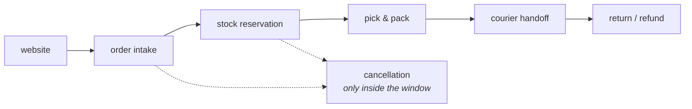

# Agile, Git & AI-Assisted Development Foundations — Study Guide

This is the first module of the programme. It is deliberately technology-neutral: nothing
here is about Java, and everything here is about how a team turns a request into a
reviewed, traceable change. Every module after this one assumes you already work this way.

## 1. Module Map

| # | Note | Covers | Lab |
|---|---|---|---|
| 01 | [Agile & Scrum](agile-and-scrum.md) | Agile values, Scrum roles, events, artifacts, sprint goal, Definition of Done | [Lab 01 — Refine the OrderDesk returns backlog](lab-01.md) |
| 02 | [Git Fundamentals](git-fundamentals.md) | repository states, staging, focused commits, history, branches, merge, recovery | [Lab 02 — Build, branch and recover an OrderDesk repository](lab-02.md) |
| 03 | [Pull Requests & Collaborative Workflow](pull-requests-and-conflicts.md) | remotes, pull requests, review etiquette, merge conflicts | [Lab 03 — Pull requests, review and a rehearsed conflict](lab-03.md) |
| 04 | [AI-Assisted Development](ai-assisted-development.md) | AI failure modes, context boundaries, prompt patterns, verification and evidence | [Lab 04 — Provoke the failure modes, then work the loop](lab-04.md) |

[Agile, Git & AI-Assisted Development Foundations — Appendix](appendix.md) maps the syllabus outline onto these notes and lists the
primary sources.

## 2. The Running Domain — OrderDesk

Every example in this module is about the same product, so the units compose instead of
resetting.

**OrderDesk** is the internal back office a retail client's staff use to run orders that
arrive from the public website. Staff are not customers — they are employees handling the
cases the website could not finish on its own.



What the domain contains, and why each part earns its place in this module:

| Part | Why it is here |
|---|---|
| Order intake | The simplest thing to write a user story about. |
| Stock reservation | Two staff can reserve the same unit — a rule that forces a real acceptance criterion. |
| Partial shipment | An order can ship in two boxes on two days, so "the order is complete" needs defining. |
| Cancellation window | A time-bound rule, so estimates have to account for an edge case nobody mentioned. |
| Returns and refunds | The stakeholder cares most about this and describes it worst. |
| Courier handoff | An external system that is sometimes down, which is where error handling stories come from. |

> **Note.** OrderDesk carries on into Database Foundations and the Java modules. The
> orders you write stories about this week are the rows you will model later.

## 3. How to Use This Handbook

Read this page once before session 1, then come back to sections 4 and 5 whenever your
environment misbehaves.

Each unit is a note plus a lab. The pattern is the same every time:

1. Read the note, or follow it in the session.
2. Work the lab. It is guided and checkable, so you can tell for yourself when it is done.
3. Hand in the short assignment.
4. Take the quiz that closes the unit.

The note is the reference; the lab is where the learning happens. Reading a note and
skipping its lab leaves you unable to do the next lab, because sessions 2 and 3 build on
the same repository.

## 4. Version Matrix

| Component | Version | Notes |
|---|---|---|
| Git | 2.40 or later | Everything in this module works on 2.23+; the output shown was captured on 2.43. |
| Default branch name | `main` | Older material says `master`. If a tutorial you find says `master`, it predates this module. |
| Git hosting | any platform with pull requests | The words differ — GitHub and Azure DevOps say "pull request", GitLab says "merge request". The mechanics are identical. |
| AI coding assistant | the approved assistant, with a working licence | Model versions change during the course. Never assume an answer from one version still holds in the next. |

Two things you will read elsewhere that are out of date here:

- `git checkout` doing two unrelated jobs. This module uses `git switch` for branches and
  `git restore` for files. `git checkout` still works and you will see it in older
  answers; it is not wrong, just ambiguous.
- Advice to `git push --force`. Use `--force-with-lease`. Section 7 of
  [Pull Requests & Collaborative Workflow](pull-requests-and-conflicts.md) says why.

## 5. Environment Setup

Before session 1:

- Git installed, and `git --version` printing 2.40 or later.
- `user.name` and `user.email` configured globally — your commits are traceable to you,
  and that is the whole point of unit 2.
- An account on the class Git hosting platform, with access to the OrderDesk seed
  repository. The trainer supplies the repository and adds you.
- A text editor or IDE you can open a folder in.
- The approved AI coding assistant installed and signed in, with a licence that works.
  Check this before session 4, not during it.

```bash
git --version
git config --global user.name
git config --global user.email
```

If the last two print nothing, set them:

```bash
git config --global user.name "Your Name"
git config --global user.email "your.email@example.com"
```

## 6. How to Study This Module

**Type the commands.** Unit 2 is muscle memory. Copying a command block into a terminal
teaches you nothing; typing it and reading the output teaches you what the output means.

**Read the output before the next step.** Nearly every Git problem trainees hit in this
module was announced by output they skipped past. `git status` is the most useful command
in the module and the least used.

**Break things on purpose.** The labs ask you to create a conflict and to recover from a
mistake. That is not busywork — the first time you see `CONFLICT` should not be the day
it matters.

**When you are stuck:**

1. Run `git status` and read all of it. It usually names the fix.
2. Check the `Common Problems` section of the note for the unit you are in — the
   sub-headings are the symptoms and error messages themselves, so search for what you
   see on screen.
3. Ask a peer. Explaining the state you are in out loud resolves it surprisingly often.
4. Ask the trainer. Bring the output, not a description of the output.

**About the AI assistant.** You may use it throughout this module, and unit 4 is about
using it well. The one rule that applies from day 1: work you cannot explain earns no
credit. If the assistant wrote something you do not understand, you have not finished.

## 7. Glossary

- **Backlog** — the ordered list of everything the team might do next. Ordered, not sorted:
  someone decided what comes first.
- **User story** — a small change described from the point of view of whoever benefits,
  with acceptance criteria that say when it is done.
- **Acceptance criteria** — conditions a reviewer can check, stated before the work starts.
- **Definition of Done** — the standard every item must meet, the same for all items in
  the sprint. Not the same thing as acceptance criteria.
- **Sprint** — a fixed-length period that produces a usable increment.
- **Increment** — the sum of everything finished, in a state that could be released.
- **Repository** — a project plus the whole history of how it got that way.
- **Commit** — one recorded change, with a message explaining why it was made.
- **Branch** — a movable name for a line of work, so unfinished work stays out of `main`.
- **Pull request** — a proposal to merge a branch, and the place the review happens.
- **Merge conflict** — two branches changed the same lines, and Git is asking a human
  which version is correct.
- **Hallucination** — an AI assistant producing something fluent and confident that does
  not exist or is not true.
- **Verification** — evidence that a change does what it claims: a passing test, observed
  behaviour, or a primary source. Not the assistant's own assurance.
