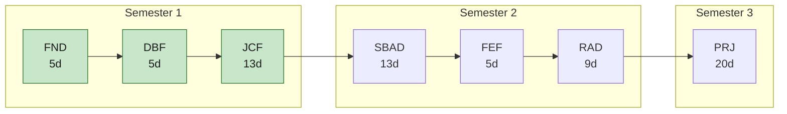

# Training programme

The JS/KS Java Web track, from working practice through to a capstone project.
Each module below is a week or more of teaching material: notes, guided labs, and
the assignment briefs that go with them.

## Learning path

## Modules

| # | Module | Title | Semester | Days | Contents | Status |
|---|---|---|---|---:|---|---|
| 1 | [FND](fnd/index.md) | Agile, Git & AI-Assisted Development Foundations | Semester 1 | 5 | 6 notes · 4 labs · 3 assignments | Available |
| 2 | [DBF](dbf/index.md) | Database Foundations | Semester 1 | 5 | 5 notes · 3 labs · 0 assignments | Available |
| 3 | [JCF](jcf/index.md) | Java Core, JDBC & JPA/Hibernate Persistence | Semester 1 | 13 | 11 notes · 9 labs · 0 assignments | Available |
| 4 | SBAD | Spring Boot API Development | Semester 2 | 13 | — | In preparation |
| 5 | FEF | Frontend Foundations: HTML, CSS, JavaScript & TypeScript | Semester 2 | 5 | — | In preparation |
| 6 | RAD | React Application Development | Semester 2 | 9 | — | In preparation |
| 7 | PRJ | Mock Project (Capstone) | Semester 3 | 20 | — | In preparation |

## What is here, and what is not

Teaching material and assignment briefs are published here. Exam and quiz briefs are
not — those are handed out through Google Classroom when the assessment is sat.
Grading rubrics and answer keys are instructor-only and never leave the source repo.
