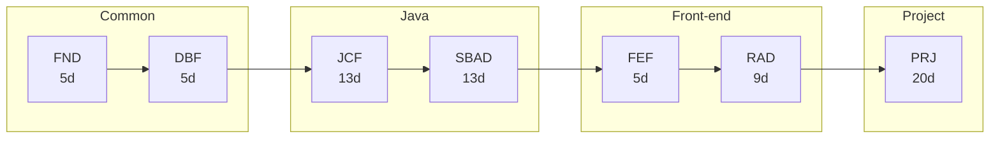

# Training programme

The JS/KS Java Web track, from working practice through to a capstone project.
Each module below is a week or more of teaching material: notes, guided labs, and a
study guide.

## Learning path

## Modules

| # | Module | Title | Track | Days | Contents | Status |
|---|---|---|---|---:|---|---|
| 1 | [FND](fnd/index.md) | Agile, Git & AI-Assisted Development Foundations | Common | 5 | 4 notes · 4 labs | Available |
| 2 | [DBF](dbf/index.md) | Database Foundations | Common | 5 | 3 notes · 3 labs | Available |
| 3 | [JCF](jcf/index.md) | Java Core, JDBC & JPA/Hibernate Persistence | Java | 13 | 9 notes · 9 labs | Available |
| 4 | [SBAD](sbad/index.md) | Spring Boot API Development | Java | 13 | 9 notes · 9 labs | Available |
| 5 | [FEF](fef/index.md) | Frontend Foundations: HTML, CSS, JavaScript & TypeScript | Front-end | 5 | 3 notes · 3 labs | Available |
| 6 | [RAD](rad/index.md) | React Application Development | Front-end | 9 | 6 notes · 6 labs | Available |
| 7 | [PRJ](prj/index.md) | Mock Project (Capstone) | Project | 20 | study guide | Available |

## What is here, and what is not

This site carries teaching material: notes, guided labs and study guides. Assessment
briefs are not published here — assignments, quizzes and exams are graded work, and
they are handed out through Google Classroom when they are set. Grading rubrics and
answer keys are instructor-only and never leave the source repository.
