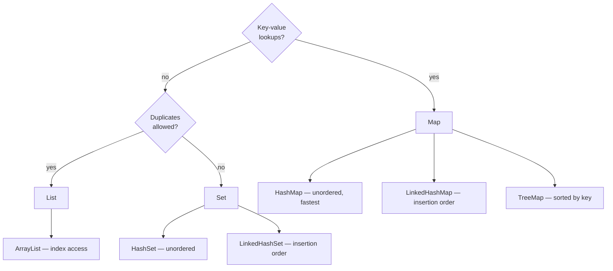

# Collections, Generics, Lambdas & Streams

> Objectives: JCF-K2 · Session 6 · JDK 21 · See [Java Core, JDBC & JPA/Hibernate Persistence — Study Guide](index.md).

## 1. Objectives

After this unit, learners can:

- Choose between `List`, `Set` and `Map` from the access pattern a task needs.
- Explain why hash collections require `equals` and `hashCode` and what breaks without them.
- Read and write generic types, including bounded wildcards on method parameters.
- Write lambdas and method references where they improve clarity.
- Build lookup, grouping, sorting and reporting operations with streams.

## 2. Choosing a Collection



| Need | Use | Cost of the main operation |
|---|---|---|
| Ordered, indexed, duplicates fine | `ArrayList` | `get(i)` O(1), `contains` O(n) |
| Membership test | `HashSet` | `contains` O(1) |
| Lookup by key | `HashMap` | `get` O(1) |
| Keys in sorted order | `TreeMap` | `get` O(log n) |
| Preserve insertion order, no duplicates | `LinkedHashSet` | `contains` O(1) |

```java
// Wrong — contains on a List scans every element. Quadratic inside a loop.
List<String> seen = new ArrayList<>();
for (Order o : orders) {
    if (!seen.contains(o.sku())) { seen.add(o.sku()); }
}

// Right
Set<String> seen = new HashSet<>();
for (Order o : orders) { seen.add(o.sku()); }
```

Declare the interface, construct the implementation:

```java
List<Order> orders = new ArrayList<>();     // not ArrayList<Order> orders
Map<String, Product> bySku = new HashMap<>();
```

## 3. Hashing and Equality

A `HashSet` or `HashMap` finds an object by its hash code first, then confirms with `equals`.
Get either wrong and lookups fail without an error.

```java
Set<Sku> skus = new HashSet<>();
skus.add(new Sku("KB-01"));
skus.contains(new Sku("KB-01"));    // false, if Sku has no hashCode
```

The rule from unit 3, restated with its consequence: **equal objects must have equal hash
codes**, and the fields feeding `hashCode` must not change while the object is in a collection.

```java
// Wrong — mutating a key after insertion strands it
Order order = new Order(...);
Set<Order> pending = new HashSet<>();
pending.add(order);
order.setId(99);                    // hashCode changes; the object is in the wrong bucket
pending.contains(order);            // false — it is in the set, and cannot be found
```

Records generate both correctly, which is a large part of why they are the default for value
types.

## 4. Generics

A generic type carries its element type through the compiler, so mistakes are caught at compile
time rather than as a `ClassCastException` at runtime.

```java
List<Order> orders = new ArrayList<>();
orders.add(new Order(...));
Order first = orders.get(0);        // no cast needed
```

Writing your own is common enough to be worth reading fluently:

```java
public interface Repository<T, ID> {
    Optional<T> findById(ID id);
    List<T> findAll();
    ID save(T entity);
}

public interface OrderRepository extends Repository<Order, Long> {
    List<Order> findByCustomer(long customerId);
}
```

Bounded wildcards appear on parameters and are worth understanding once:

```java
// Accepts List<Order>, List<PriorityOrder>, ... — anything that IS an Order.
static Money sumTotals(List<? extends Order> orders) {
    return orders.stream().map(Order::total).reduce(Money.zero("VND"), Money::plus);
}

// Accepts a list you can put Orders into: List<Order> or List<Object>.
static void collect(List<? super Order> sink, Order order) {
    sink.add(order);
}
```

The mnemonic is PECS: **P**roducer **E**xtends, **C**onsumer **S**uper. A parameter you read
from is `? extends`; one you write to is `? super`.

> **Note.** Generics are erased at runtime: `List<Order>` and `List<String>` are the same class.
> That is why you cannot write `new T[]` and why `instanceof List<Order>` does not compile.

## 5. Lambdas and Method References

A lambda is an implementation of a single-method interface, written inline.

```java
// A verbose anonymous class...
orders.sort(new Comparator<Order>() {
    @Override public int compare(Order a, Order b) {
        return a.placedAt().compareTo(b.placedAt());
    }
});

// ...the same thing as a lambda...
orders.sort((a, b) -> a.placedAt().compareTo(b.placedAt()));

// ...and clearer still
orders.sort(Comparator.comparing(Order::placedAt));
```

The functional interfaces you will meet constantly:

| Interface | Shape | Used by |
|---|---|---|
| `Predicate<T>` | `T → boolean` | `filter` |
| `Function<T,R>` | `T → R` | `map` |
| `Consumer<T>` | `T → void` | `forEach` |
| `Supplier<T>` | `() → T` | `orElseGet` |
| `Comparator<T>` | `(T,T) → int` | `sorted` |

Method references replace a lambda that only forwards:

```java
orders.forEach(o -> System.out.println(o));   // lambda
orders.forEach(System.out::println);          // method reference
orders.stream().map(o -> o.total());          // lambda
orders.stream().map(Order::total);            // method reference
```

## 6. Streams

A stream is a pipeline: a source, zero or more lazy intermediate operations, and one terminal
operation that produces a result.

```java
List<String> activeSkus = products.stream()   // source
        .filter(Product::isActive)            // intermediate — lazy
        .map(Product::sku)                    // intermediate — lazy
        .sorted()                             // intermediate — lazy
        .toList();                            // terminal — runs the pipeline
```

Nothing executes until the terminal operation. A pipeline with no terminal does nothing at all,
silently.

### The operations that matter here

```java
// Filter and collect
List<Order> cancelled = orders.stream()
        .filter(o -> o.status() == OrderStatus.CANCELLED)
        .toList();

// Sum a numeric field — mapToInt gives an IntStream with sum()
int units = order.lines().stream().mapToInt(OrderLine::quantity).sum();

// Reduce over a non-numeric type
Money total = order.lines().stream()
        .map(OrderLine::lineTotal)
        .reduce(Money.zero("VND"), Money::plus);

// Index by a key — the Map from a List
Map<String, Product> bySku = products.stream()
        .collect(Collectors.toMap(Product::sku, p -> p));

// Group
Map<OrderStatus, List<Order>> byStatus = orders.stream()
        .collect(Collectors.groupingBy(Order::status));

// Group and aggregate in one pass
Map<OrderStatus, Long> countByStatus = orders.stream()
        .collect(Collectors.groupingBy(Order::status, Collectors.counting()));

// Sort by several keys
List<Order> sorted = orders.stream()
        .sorted(Comparator.comparing(Order::status)
                          .thenComparing(Order::placedAt, Comparator.reverseOrder()))
        .toList();

// First match, or nothing
Optional<Order> firstCancelled = orders.stream()
        .filter(o -> o.status() == OrderStatus.CANCELLED)
        .findFirst();
```

### Mistakes worth naming

```java
// Wrong — toMap throws IllegalStateException on a duplicate key
Map<String, Product> bySku = products.stream()
        .collect(Collectors.toMap(Product::sku, p -> p));

// Right — say what a collision means
Map<String, Product> bySku = products.stream()
        .collect(Collectors.toMap(Product::sku, p -> p, (a, b) -> a));
```

```java
// Wrong — a side effect inside a stream; works, but not thread-safe and hides the result
List<String> names = new ArrayList<>();
orders.stream().forEach(o -> names.add(o.reference()));

// Right
List<String> names = orders.stream().map(Order::reference).toList();
```

```java
// Wrong — a stream can only be consumed once
Stream<Order> s = orders.stream();
long n = s.count();
List<Order> list = s.toList();     // IllegalStateException: stream has already been operated upon
```

> **Tip.** A loop is not worse than a stream. Use a stream when it makes the *intent* clearer —
> filter, map, group. Use a loop when there is genuine step-by-step logic, or when you need to
> break out early.

## 7. Worked Example — A Report

Top customers by lifetime value, over non-cancelled orders.

```java
public record CustomerValue(long customerId, Money total, long orderCount) {}

public List<CustomerValue> topCustomers(List<Order> orders, int limit) {
    Map<Long, List<Order>> byCustomer = orders.stream()
            .filter(o -> o.status() != OrderStatus.CANCELLED)
            .collect(Collectors.groupingBy(Order::customerId));

    return byCustomer.entrySet().stream()
            .map(e -> new CustomerValue(
                    e.getKey(),
                    e.getValue().stream()
                                .map(Order::total)
                                .reduce(Money.zero("VND"), Money::plus),
                    e.getValue().size()))
            // Highest value first; ties broken by customer id so the order is stable.
            .sorted(Comparator.comparing(CustomerValue::total).reversed()
                              .thenComparing(CustomerValue::customerId))
            .limit(limit)
            .toList();
}
```

The tie-break is not decoration. Without it, two customers with equal totals may swap places
between runs, and a test asserting on the order fails intermittently.

## 8. Common Problems

### `ConcurrentModificationException`

Modifying a collection while iterating it.

```java
// Wrong
for (Order o : orders) { if (o.isCancelled()) orders.remove(o); }

// Right
orders.removeIf(Order::isCancelled);
```

### `UnsupportedOperationException` on `add`

`List.of(...)` and `Arrays.asList(...)` are unmodifiable. Wrap in `new ArrayList<>(...)` when
you need to change it.

### `contains` returns false for an object that is in the set

Missing or inconsistent `equals`/`hashCode`, or a field used in the hash was mutated.

### `IllegalStateException: Duplicate key`

`Collectors.toMap` without a merge function. Decide what a collision means.

### The stream does nothing

No terminal operation. `orders.stream().filter(...)` on its own is a no-op.

### `NullPointerException` inside `groupingBy`

The classifier returned null. `groupingBy` cannot use a null key; filter first or map nulls to
a sentinel.

## 9. Practical Guidelines

- Choose the collection from the access pattern, not from habit.
- Declare the interface type, construct the implementation.
- Use records for map keys so equality is generated and correct.
- Give `Collectors.toMap` a merge function unless you can prove keys are unique.
- Keep streams side-effect free; produce a result rather than filling a list.
- Add a tie-break to every comparator whose output is asserted on.

## 10. Knowledge Check

1. A loop calls `list.contains` on every iteration over 10 000 items. What is the cost, and what
   changes it?
2. `set.contains(x)` is false although `x` was added. Give two distinct causes.
3. What does PECS mean, and which one applies to a parameter you only read from?
4. Rewrite a grouping-then-counting loop as one stream pipeline.
5. Why does `Collectors.toMap` throw on duplicates rather than picking one?

## 11. Further Reading

- [The Java Tutorials: Collections](https://docs.oracle.com/javase/tutorial/collections/)
- [`java.util.stream` package summary](https://docs.oracle.com/en/java/javase/21/docs/api/java.base/java/util/stream/package-summary.html)
- [`Collectors` API](https://docs.oracle.com/en/java/javase/21/docs/api/java.base/java/util/stream/Collectors.html)

---

Next: [Lab 06 — Lookup, grouping, sorting and reporting](lab-06.md), then [JDBC & the Repository Pattern](jdbc-and-repositories.md).
