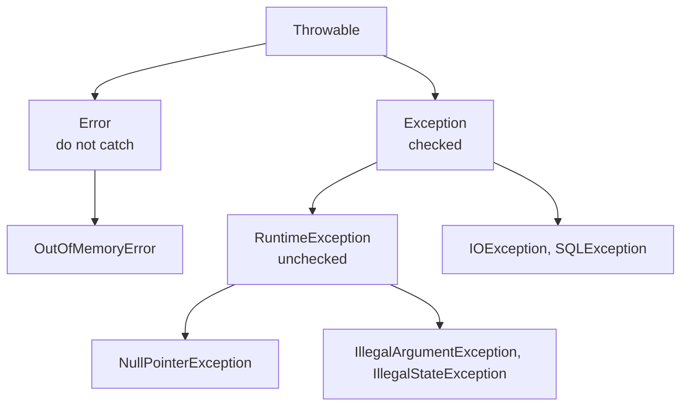

# Exceptions & Unit Testing

> Session 5 · JDK 17, JUnit 5.13 · See [Java Core, JDBC & JPA/Hibernate Persistence — Study Guide](index.md).

## 1. Objectives

By the end of this unit you will be able to:

- Distinguish checked from unchecked exceptions and choose correctly between them.
- Place an exception boundary where it can actually do something about the failure.
- Use try-with-resources so resources close even when something throws.
- Write JUnit 5 tests covering happy paths, edge cases and failures.
- Read a stack trace and identify the originating cause.

## 2. Checked and Unchecked



- **Checked** (`Exception`, not `RuntimeException`): the compiler forces you to catch or declare.
  Use for failures a caller can reasonably recover from — a file is missing, a network call
  failed.
- **Unchecked** (`RuntimeException`): programming errors. A null that should not be null; an
  argument that violates a documented rule.
- **`Error`**: the JVM is in trouble. Do not catch.

The practical rule: throw unchecked when the caller has a bug, checked when the caller has a
decision.

```java
// Unchecked: passing a negative quantity is a bug in the caller.
if (quantity <= 0) {
    throw new IllegalArgumentException("quantity must be positive, was " + quantity);
}

// Checked: a file the caller chose may be missing or unreadable — a real condition
// the caller can decide about (ask for another path, fall back, give up).
public List<Product> load(Path file) throws IOException { ... }
```

## 3. Boundaries

Catch an exception only where you can do something about it. Everywhere else, let it travel.

```java
// Wrong — the failure is swallowed and the method lies about succeeding
public Optional<Order> findById(long id) {
    try {
        return Optional.of(query(id));
    } catch (SQLException e) {
        e.printStackTrace();      // goes to stderr, nobody reads it
        return Optional.empty();  // "not found" and "database is down" now look identical
    }
}

// Right — translate into the domain, preserving the cause
public Optional<Order> findById(long id) {
    try {
        return query(id);
    } catch (SQLException e) {
        throw new RepositoryException("loading order " + id, e);   // cause preserved
    }
}
```

The wrong version is the single most expensive habit in this unit. "Not found" and "the
database is unreachable" are different facts, and collapsing them turns an outage into a
silently empty page.

```java
// Wrong — the cause is lost; the stack trace stops here
catch (SQLException e) {
    throw new RepositoryException("loading order " + id);
}

// Right
catch (SQLException e) {
    throw new RepositoryException("loading order " + id, e);
}
```

> **Note.** An empty `catch` block is always wrong. If a failure is genuinely ignorable, say so
> in a comment explaining why — and then you will usually notice it is not.

## 4. try-with-resources

Anything implementing `AutoCloseable` closes automatically, in reverse order, even when the
body throws.

```java
// Wrong — a return or a throw inside the try leaks the connection
Connection conn = dataSource.getConnection();
PreparedStatement ps = conn.prepareStatement(SQL);
ResultSet rs = ps.executeQuery();
// ... if this throws, nothing is closed, and the pool drains
rs.close(); ps.close(); conn.close();

// Right
try (Connection conn = dataSource.getConnection();
     PreparedStatement ps = conn.prepareStatement(SQL)) {

    ps.setLong(1, orderId);
    try (ResultSet rs = ps.executeQuery()) {
        return rs.next() ? Optional.of(map(rs)) : Optional.empty();
    }
}
```

> **Real-world use.** Connection-pool exhaustion under load is nearly always this. It appears
> as the application hanging after some minutes of traffic, and it is invisible in testing
> because a leak of one connection per request needs traffic to matter.

## 5. JUnit 5

```java
package com.fsa.orderdesk.domain;

import static org.junit.jupiter.api.Assertions.*;

import java.math.BigDecimal;
import org.junit.jupiter.api.DisplayName;
import org.junit.jupiter.api.Nested;
import org.junit.jupiter.api.Test;

class OrderLineTest {

    @Test
    @DisplayName("line total multiplies unit price by quantity")
    void lineTotalMultiplies() {
        OrderLine line = new OrderLine("KB-01", 3, new BigDecimal("150000"));
        assertEquals(new BigDecimal("450000"), line.lineTotal());
    }

    @Nested
    @DisplayName("rejects invalid input")
    class Validation {

        @Test
        void rejectsZeroQuantity() {
            IllegalArgumentException e = assertThrows(
                    IllegalArgumentException.class,
                    () -> new OrderLine("KB-01", 0, BigDecimal.TEN));
            // Assert on the message: it is part of the behaviour a caller relies on.
            assertTrue(e.getMessage().contains("quantity"));
        }

        @Test
        void rejectsNullSku() {
            assertThrows(NullPointerException.class,
                    () -> new OrderLine(null, 1, BigDecimal.TEN));
        }
    }
}
```

Parameterised tests remove copy-paste from edge-case coverage:

```java
@ParameterizedTest
@ValueSource(ints = {0, -1, Integer.MIN_VALUE})
void rejectsNonPositiveQuantity(int quantity) {
    assertThrows(IllegalArgumentException.class,
            () -> new OrderLine("KB-01", quantity, BigDecimal.TEN));
}

@ParameterizedTest
@CsvSource({
    "1, 150000, 150000",
    "3, 150000, 450000",
    "2,  99999, 199998",
})
void computesLineTotal(int qty, String unitPrice, String expected) {
    OrderLine line = new OrderLine("KB-01", qty, new BigDecimal(unitPrice));
    assertEquals(new BigDecimal(expected), line.lineTotal());
}
```

### What to test

Three cases for every rule, and the third is the one people skip:

| Case | Example for `addLine` |
|---|---|
| Happy path | Adding a line to a `PLACED` order works |
| Edge | Adding the first line; adding a duplicate SKU |
| Failure | Adding to a `DISPATCHED` order throws `IllegalStateException` |

```java
@Test
void cannotAddLinesAfterDispatch() {
    Order order = anOrder();
    order.markDispatched();

    IllegalStateException e = assertThrows(IllegalStateException.class,
            () -> order.addLine(aLine()));
    assertTrue(e.getMessage().contains("DISPATCHED"));
}
```

> **Tip.** Name tests as sentences about behaviour — `cannotAddLinesAfterDispatch`, not
> `testAddLine2`. A failing test then reports what is broken, not which method it touched.

## 6. Worked Example — A Tested Service

```java
public final class OrderService {

    private final OrderRepository orders;

    public OrderService(OrderRepository orders) {
        this.orders = Objects.requireNonNull(orders);
    }

    public void cancel(long orderId) {
        Order order = orders.findById(orderId)
                .orElseThrow(() -> new OrderNotFoundException(orderId));
        order.cancel();          // throws IllegalStateException if not cancellable
        orders.save(order);
    }
}
```

```java
class OrderServiceTest {

    private InMemoryOrderRepository repo;
    private OrderService service;

    @BeforeEach
    void setUp() {
        repo = new InMemoryOrderRepository();
        service = new OrderService(repo);
    }

    @Test
    void cancellingAPlacedOrderMarksItCancelled() {
        long id = repo.save(anOrder());
        service.cancel(id);
        assertEquals(OrderStatus.CANCELLED, repo.findById(id).orElseThrow().status());
    }

    @Test
    void cancellingAMissingOrderThrows() {
        assertThrows(OrderNotFoundException.class, () -> service.cancel(9999));
    }

    @Test
    void cancellingADispatchedOrderThrows() {
        Order order = anOrder();
        order.markDispatched();
        long id = repo.save(order);

        assertThrows(IllegalStateException.class, () -> service.cancel(id));
    }
}
```

No database, no mocking framework, and the tests run in milliseconds — because unit 4 made the
repository an interface.

`OrderNotFoundException` here is **unchecked** — it extends `RuntimeException`. Asking for an
order that does not exist is a caller mistake in this service, not a condition every caller
must write a `catch` for; and a checked exception could not be thrown from inside the
`orElseThrow` lambda at all.

## 7. Reading a Stack Trace

```text
Exception in thread "main" com.fsa.orderdesk.RepositoryException: loading order 5001
    at com.fsa.orderdesk.JdbcOrderRepository.findById(JdbcOrderRepository.java:44)
    at com.fsa.orderdesk.OrderService.cancel(OrderService.java:23)
    at com.fsa.orderdesk.App.main(App.java:12)
Caused by: org.postgresql.util.PSQLException: ERROR: column "placed_at" does not exist
    at org.postgresql.core.v3.QueryExecutorImpl.receiveErrorResponse(QueryExecutorImpl.java:2725)
    ... 8 more
```

Read it in this order:

1. **The last `Caused by`** — the real fault. Here: a column name that does not exist.
2. **The topmost frame in your own package** below it — `JdbcOrderRepository.java:44`.
3. **Ignore the framework frames.** They are the path, not the cause.

`... 8 more` means those frames are identical to the enclosing trace. Nothing is hidden.

## 8. Common Problems

### `NullPointerException` with no message from a dependency

Validate constructor arguments with `Objects.requireNonNull(x, "x")`. The failure then names
the field, at construction, instead of surfacing much later.

### The test passes but the code is broken

The test asserts nothing, or asserts on a mock rather than the outcome. Every test needs an
assertion about observable behaviour.

### `assertThrows` passes for the wrong reason

It passes if *any* matching exception is thrown, including one from your test setup. Assert on
the message too.

### Tests pass alone and fail together

Shared mutable state between tests. Create fixtures in `@BeforeEach`, not in a static field.

### `SQLException` is swallowed and the method returns empty

See section 3. "Not found" and "failed" must be different outcomes.

### The connection pool exhausts under load

A resource not closed on the exception path. Use try-with-resources everywhere.

## 9. Practical Guidelines

- Throw unchecked for caller bugs, checked for recoverable conditions.
- Never catch without either handling or re-throwing with the cause attached.
- Wrap every `AutoCloseable` in try-with-resources.
- Name tests as sentences describing behaviour.
- Cover happy path, edge case and failure for every rule.
- Assert on messages when they carry information a caller relies on.

## 10. Knowledge Check

1. Which exception should `OrderLine` throw for `quantity = 0`, and why is the other kind wrong?
2. Show a `catch` that loses the cause, and the corrected version. What is lost in a stack trace?
3. Why do "order not found" and "database unreachable" have to be different outcomes?
4. Give three tests for `Order.cancel` covering happy path, edge case and failure.
5. In the trace above, which line is the real fault, and which is the first line of our code?

## 11. Further Reading

- [The Java Tutorials: Exceptions](https://docs.oracle.com/javase/tutorial/essential/exceptions/)
- [JUnit 5 User Guide](https://junit.org/junit5/docs/current/user-guide/)
- [try-with-resources](https://docs.oracle.com/javase/tutorial/essential/exceptions/tryResourceClose.html)

---

Next: [Lab 05 — Exception boundaries and a test suite](lab-05.md), then [Collections, Generics, Lambdas & Streams](collections-and-streams.md).
