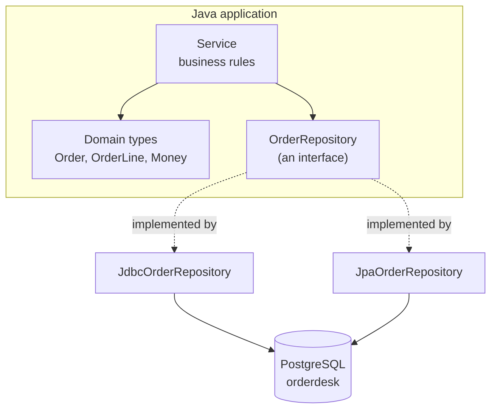

# Java Core, JDBC & JPA/Hibernate Persistence — Study Guide

This is the longest module in the programme, and the one the Java track is built on. It goes
from an empty directory to an application that reads and writes the OrderDesk database you
designed in Database Foundations.

Nothing here is about web frameworks. Spring Boot arrives in the next module and assumes every
idea in this one is already familiar.

## 1. Module Map

| # | Note | Covers | Lab |
|---|---|---|---|
| 01 | [Development Environment & the Java Toolchain](toolchain-and-build.md) | JDK vs JVM, `JAVA_HOME`, Maven lifecycle, `pom.xml`, packaging | [Lab 01 — Configure the toolchain and build a project](lab-01.md) |
| 02 | [Java Syntax, Types & Methods](language-fundamentals.md) | types, strings, control flow, methods, parameter passing, arrays | [Lab 02 — A command-line utility from a specification](lab-02.md) |
| 03 | [Object-Oriented Design & Modern Java Types](objects-and-modern-types.md) | classes, constructors, encapsulation, composition, enums, `equals`/`hashCode`, records | [Lab 03 — Model the OrderDesk domain](lab-03.md) |
| 04 | [Interfaces, Polymorphism & Composition](interfaces-and-polymorphism.md) | interfaces, dispatch, composition over inheritance, abstract classes | [Lab 04 — Interchangeable strategies behind one interface](lab-04.md) |
| 05 | [Exceptions & Unit Testing](exceptions-and-testing.md) | checked vs unchecked, boundaries, try-with-resources, JUnit 5 | [Lab 05 — Exception boundaries and a test suite](lab-05.md) |
| 06 | [Collections, Generics, Lambdas & Streams](collections-and-streams.md) | `List`, `Set`, `Map`, hashing, generics, lambdas, streams | [Lab 06 — Lookup, grouping, sorting and reporting](lab-06.md) |
| 07 | [JDBC & the Repository Pattern](jdbc-and-repositories.md) | `DataSource`, `PreparedStatement`, `ResultSet`, transactions, the repository pattern | [Lab 07 — A JDBC repository with integration tests](lab-07.md) |
| 08 | [JPA & Hibernate Mapping](jpa-and-hibernate.md) | entities, relationships, ownership, the persistence context, repository queries | [Lab 08 — The same repository with JPA](lab-08.md) |
| 09 | [Persistence Performance](persistence-performance.md) | reading SQL logs, N+1, fetch joins, lazy vs eager, measuring query counts | [Lab 09 — Diagnose and fix an N+1](lab-09.md) |

[Java Core, JDBC & JPA/Hibernate — Appendix](appendix.md) maps the syllabus outline onto these notes and lists the
primary sources.

## 2. The Running Domain — OrderDesk, Again

The schema is the OrderDesk order schema you read in Database Foundations — `customer`,
`product`, `orders`, `order_line`, `shipment`, `return_request` — supplied with its seed data in
[`labs/dbf/orderdesk-schema`](https://github.com/phuongbv00/fsa-fr-java-jsks/tree/main/labs/dbf/orderdesk-schema).
You are now writing the application that sits on top of it.



That shape is the point of the module, and it is why units 7 and 8 both exist. `OrderRepository`
is an interface the service depends on. You will implement it twice — once with raw JDBC, once
with JPA — and the service will not know which one it has. Unit 4 is where that idea is taught;
units 7 and 8 are where it pays.

## 3. How to Use This Handbook

Read this page before session 1, then return to section 4 whenever the build misbehaves.

Each unit is a note plus a lab. The long assignment is issued in session 1 and worked across
the whole module — each lab produces a piece of it.

Sessions 7 to 9 need the OrderDesk database running. Rebuild it with
`labs/dbf/orderdesk-schema/rebuild.sh` before session 7; if you cannot, say so in session 6,
not session 7.

## 4. Environment Setup

```bash
java -version      # expect 17.x
javac -version     # expect 17.x — if this differs from java, JAVA_HOME is wrong
mvn -version       # expect 3.9.x, and check the Java version it reports
echo $JAVA_HOME
psql --version     # expect 18.x, from Database Foundations
```

The single most common setup failure is `mvn -version` reporting a different JDK from
`java -version`. Maven uses `JAVA_HOME`; your shell uses whatever is on `PATH`.

```bash
# macOS / Linux
export JAVA_HOME=$(dirname $(dirname $(readlink -f $(which javac))))
echo 'export JAVA_HOME=...' >> ~/.zshrc     # make it stick
```

Create a project and prove the loop works before writing any code:

```bash
mvn -q archetype:generate \
  -DgroupId=com.fsa.orderdesk -DartifactId=orderdesk \
  -DarchetypeArtifactId=maven-archetype-quickstart -DinteractiveMode=false
cd orderdesk && mvn -q clean package && java -cp target/classes com.fsa.orderdesk.App
```

> **Tip.** `mvn clean package` is the loop you will run hundreds of times. If it takes more
> than a few seconds on an empty project, something is downloading — let it finish once, on
> good wifi, before the first session.

## 5. How to Study This Module

- **Compile early and often.** Java tells you about whole classes of mistake at compile time.
  Use that: write three lines, compile, rather than three hundred.
- **Write the test first when the specification is written down.** Units 5 onward supply
  specifications precisely so you can.
- **Read the stack trace from the bottom.** The first line is where it surfaced; the `Caused by`
  at the bottom is usually where it went wrong.
- **Keep the JDBC implementation after unit 8.** Deleting it removes the evidence that the
  interface was worth having.
- **Turn SQL logging on in unit 7 and never turn it off.** Unit 9 is impossible without it, and
  most persistence bugs are visible the moment you can see the statements.

## 6. Glossary

| Term | Meaning here |
|---|---|
| **JDK** | The kit: compiler, tools, and a JVM |
| **JVM** | The runtime that executes bytecode |
| **Artifact** | The jar Maven produces |
| **Lifecycle phase** | A named step Maven runs in order — `compile`, `test`, `package` |
| **POJO** | A plain class with no framework requirements |
| **Record** | A concise immutable class with generated `equals`, `hashCode` and accessors |
| **Checked exception** | One the compiler forces you to handle or declare |
| **Repository** | An interface expressing persistence in domain terms |
| **Entity** | A class JPA maps to a table |
| **Persistence context** | JPA's in-memory set of managed entities for one transaction |
| **Dirty checking** | JPA writing changes to managed entities at flush, with no explicit save |
| **N+1** | One query for a list, then one more per element |

---

Start with [Development Environment & the Java Toolchain](toolchain-and-build.md).
