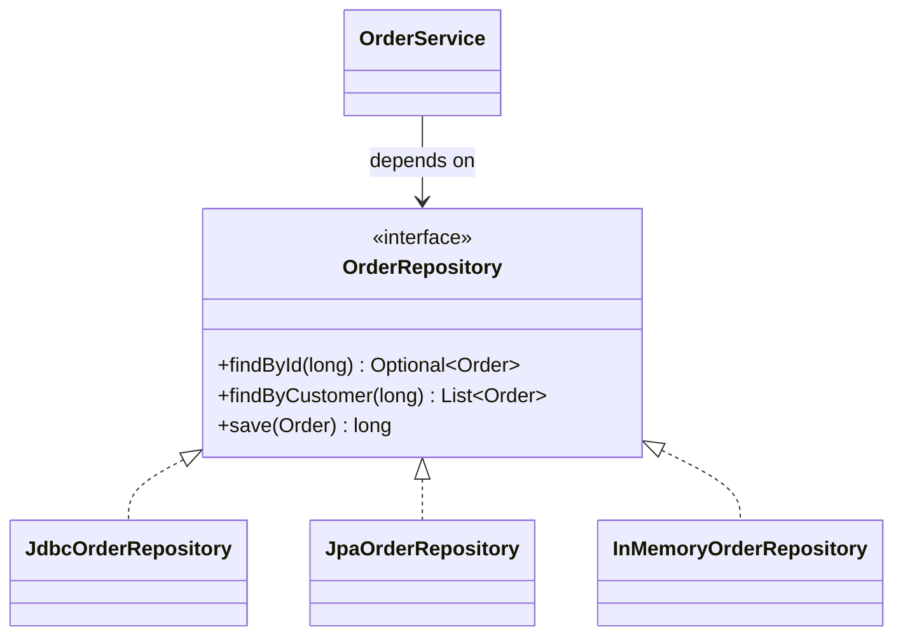

# Interfaces, Polymorphism & Composition

> Session 4 · JDK 21 · See [Java Core, JDBC & JPA/Hibernate Persistence — Study Guide](index.md).

## 1. Objectives

By the end of this unit you will be able to:

- Declare an interface that expresses a capability in domain terms.
- Explain polymorphic dispatch and predict which implementation runs.
- Substitute one implementation for another without changing the calling code.
- Choose between an interface, an abstract class and a concrete class.
- Depend on abstractions so that a collaborator can be replaced in a test.

## 2. An Interface Is a Promise

An interface names what something can do, without saying how. Code written against it works
with every implementation, including ones written later.

```java
package com.fsa.orderdesk.repository;

import com.fsa.orderdesk.domain.Order;
import java.util.List;
import java.util.Optional;

public interface OrderRepository {
    Optional<Order> findById(long orderId);
    List<Order> findByCustomer(long customerId);
    long save(Order order);
}
```

Nothing there mentions SQL, JDBC or JPA. That is deliberate, and it is the shape the whole
module builds toward: in unit 7 you implement this with JDBC, in unit 8 with JPA, and the
service using it does not change.

```java
public final class OrderService {

    private final OrderRepository orders;      // the interface, not an implementation

    public OrderService(OrderRepository orders) {
        this.orders = Objects.requireNonNull(orders);
    }

    public Money customerLifetimeValue(long customerId) {
        return orders.findByCustomer(customerId).stream()
                     .filter(o -> o.status() != OrderStatus.CANCELLED)
                     .map(Order::total)
                     .reduce(Money.zero("VND"), Money::plus);
    }
}
```

> **Note.** The constructor taking the dependency is the entire idea behind Spring's dependency
> injection in the next module. Spring supplies the argument; nothing else changes.

## 3. Polymorphic Dispatch

The variable's type decides what you may call. The object's actual class decides what runs.

```java
OrderRepository repo = new JdbcOrderRepository(dataSource);
repo.findById(5001);       // JdbcOrderRepository.findById runs

repo = new JpaOrderRepository(entityManager);
repo.findById(5001);       // JpaOrderRepository.findById runs — same call site
```



`InMemoryOrderRepository` is the one that makes tests fast:

```java
public final class InMemoryOrderRepository implements OrderRepository {

    private final Map<Long, Order> byId = new HashMap<>();
    private long nextId = 1;

    @Override
    public Optional<Order> findById(long orderId) {
        return Optional.ofNullable(byId.get(orderId));
    }

    @Override
    public List<Order> findByCustomer(long customerId) {
        return byId.values().stream()
                   .filter(o -> o.customerId() == customerId)
                   .toList();
    }

    @Override
    public long save(Order order) {
        long id = nextId++;
        byId.put(id, order);
        return id;
    }
}
```

The service's tests now need no database, no schema and no cleanup. That is not a testing
trick; it is the reason to depend on an interface in the first place.

## 4. Strategy: Behaviour as a Parameter

When several algorithms serve the same purpose, make the algorithm an interface.

```java
public interface DiscountPolicy {
    Money apply(Money subtotal, Order order);

    // A named do-nothing implementation, so callers never handle null.
    DiscountPolicy NONE = (subtotal, order) -> subtotal;
}

public final class BulkDiscount implements DiscountPolicy {

    private final int threshold;
    private final BigDecimal rate;

    public BulkDiscount(int threshold, BigDecimal rate) {
        this.threshold = threshold;
        this.rate = rate;
    }

    @Override
    public Money apply(Money subtotal, Order order) {
        int units = order.lines().stream().mapToInt(OrderLine::quantity).sum();
        if (units < threshold) return subtotal;
        return subtotal.times(BigDecimal.ONE.subtract(rate));
    }
}
```

```java
// Wrong — every new rule edits this method, and it grows forever
Money total(Order order, String customerTier) {
    Money t = order.total();
    if ("gold".equals(customerTier))      t = t.times(new BigDecimal("0.90"));
    else if ("silver".equals(customerTier)) t = t.times(new BigDecimal("0.95"));
    // ...and a bulk rule, and a seasonal rule
    return t;
}

// Right — a new rule is a new class, and this method never changes again
Money total(Order order, DiscountPolicy policy) {
    return policy.apply(order.total(), order);
}
```

> **Real-world use.** The wrong version is where "we cannot change pricing without a release"
> comes from. Every rule is welded into one method that everything depends on.

## 5. Default Methods

An interface may supply an implementation. It exists so an interface can gain a method without
breaking every implementer.

```java
public interface OrderRepository {
    Optional<Order> findById(long orderId);

    // Added later. Existing implementations keep compiling; any of them may
    // override it with something more efficient.
    default boolean exists(long orderId) {
        return findById(orderId).isPresent();
    }
}
```

Use it for convenience built from the other methods. Do not use it to smuggle state or real
logic into an interface — an interface still cannot have fields.

## 6. Interface or Abstract Class?

| | Interface | Abstract class |
|---|---|---|
| A type may have | many | one |
| Can hold state | no | yes |
| Constructor | no | yes |
| Says | "can do this" | "is a kind of this, partly written" |

Default to the interface. Reach for an abstract class only when implementations genuinely share
state and construction, and even then check whether composition would do it better.

```java
// Reasonable: shared, non-trivial mapping state, and never used on its own.
abstract class AbstractJdbcRepository {
    protected final DataSource dataSource;

    protected AbstractJdbcRepository(DataSource dataSource) {
        this.dataSource = Objects.requireNonNull(dataSource);
    }

    protected <T> List<T> query(String sql, RowMapper<T> mapper, Object... params) { ... }
}
```

> **Note.** `sealed` interfaces (Java 17+) let you close the set of implementations, which makes
> a `switch` over them exhaustive. Useful for a fixed set like a result type; wrong for a
> repository, where the point is that anyone can add one.

## 7. Worked Example — Two Shipping Strategies

```java
public interface ShippingPolicy {
    Money cost(Order order);
    LocalDate promise(Instant placedAt);
}

public final class StandardShipping implements ShippingPolicy {
    private static final Money FLAT = Money.of("25000", "VND");

    @Override public Money cost(Order order) {
        // Free over 500,000 — the rule lives with the policy it belongs to.
        return order.total().isGreaterThan(Money.of("500000", "VND")) ? Money.zero("VND") : FLAT;
    }

    @Override public LocalDate promise(Instant placedAt) {
        return LocalDate.ofInstant(placedAt, ZoneId.of("Asia/Ho_Chi_Minh")).plusDays(5);
    }
}

public final class ExpressShipping implements ShippingPolicy {
    @Override public Money cost(Order order) { return Money.of("80000", "VND"); }

    @Override public LocalDate promise(Instant placedAt) {
        return LocalDate.ofInstant(placedAt, ZoneId.of("Asia/Ho_Chi_Minh")).plusDays(1);
    }
}
```

```java
class CheckoutTest {

    @Test
    void expressCostsMoreButArrivesSooner() {
        Order order = anOrderTotalling("600000");

        Checkout standard = new Checkout(new StandardShipping());
        Checkout express  = new Checkout(new ExpressShipping());

        assertEquals(Money.zero("VND"), standard.shippingCost(order));   // free over 500k
        assertTrue(express.promisedDate(order).isBefore(standard.promisedDate(order)));
    }
}
```

`Checkout` is written once. Adding overnight shipping is a new class and one line at the call
site; `Checkout` does not change.

## 8. Common Problems

### `class X is not abstract and does not override abstract method y()`

An unimplemented interface method — usually a typo in the signature. Add `@Override` to every
implementing method and the compiler will point at it.

### The wrong implementation runs

Whatever was actually constructed runs. Print `repo.getClass().getName()` at the point of
confusion; it is nearly always a wiring mistake, not a dispatch one.

### The interface has one implementation and always will

Then it may be premature. The justification is substitutability — a second implementation, or a
test double. `OrderRepository` earns it three times over; a `UserServiceInterface` with one
implementation usually does not.

### `ClassCastException` after downcasting

Casting back to a concrete type to reach a method not on the interface means the interface is
missing something, or the design is leaking. Fix the interface.

### A default method needs a field

Interfaces have no state. That method belongs on an abstract class or a collaborator.

## 9. Practical Guidelines

- Name interfaces for the capability — `OrderRepository`, `DiscountPolicy` — never `IFoo`.
- Take dependencies through the constructor and store them `final`.
- Depend on the interface; construct the implementation at the edge of the application.
- Write an in-memory implementation early; it pays for itself in test speed.
- Use `@Override` on every implementing method.
- Prefer a named no-op implementation over a nullable dependency.

## 10. Knowledge Check

1. `OrderService` holds an `OrderRepository`. Name two things that becomes possible, and say
   what would be lost by holding a `JdbcOrderRepository` instead.
2. What decides which `findById` runs — the variable's type or the object's class? What does the
   other one decide?
3. Rewrite an `if`-chain over customer tiers as a strategy, and say what stops changing.
4. When would you choose an abstract class over an interface? Give a case and a counter-case.
5. Why does `DiscountPolicy.NONE` exist rather than allowing a null policy?

## 11. Further Reading

- [The Java Tutorials: Interfaces](https://docs.oracle.com/javase/tutorial/java/IandI/createinterface.html)
- [JEP 409: Sealed Classes](https://openjdk.org/jeps/409)

---

Next: [Lab 04 — Interchangeable strategies behind one interface](lab-04.md), then [Exceptions & Unit Testing](exceptions-and-testing.md).
