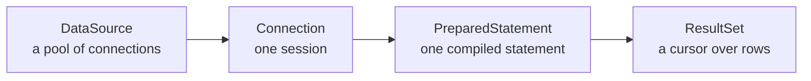

# JDBC & the Repository Pattern

> Session 7 · JDK 17, PostgreSQL 18, driver 42.7 · See [Java Core, JDBC & JPA/Hibernate Persistence — Study Guide](index.md).

## 1. Objectives

By the end of this unit you will be able to:

- Obtain connections from a `DataSource` and release them reliably.
- Use `PreparedStatement` with bound parameters and explain what it prevents.
- Map a `ResultSet` into domain objects without leaking JDBC types outward.
- Control a transaction explicitly across several statements.
- Implement a repository interface against a real database and test it.

## 2. The Shape of JDBC

JDBC is the standard API between Java and a database. Four types do almost everything:



All four are `AutoCloseable`, and all four leak if you do not close them. Unit 5's
try-with-resources is not optional here.

```java
// Wrong — DriverManager opens a fresh TCP connection every call. Fine in a demo,
// fatal under load: connecting costs far more than the query.
Connection conn = DriverManager.getConnection(url, user, password);

// Right — a pool hands back an existing connection
HikariConfig config = new HikariConfig();
config.setJdbcUrl("jdbc:postgresql://localhost:5432/orderdesk");
config.setUsername("orderdesk");
config.setPassword(System.getenv("ORDERDESK_PASSWORD"));   // never a literal
config.setMaximumPoolSize(10);
DataSource dataSource = new HikariDataSource(config);
```

> **Note.** A credential in source code is a credential in Git history forever. Read it from the
> environment, even in exercises.

## 3. `PreparedStatement` and Injection

Never build SQL by concatenating input. Not for convenience, not "because it is only an int".

```java
// Wrong — SQL injection. A customerId of "1 OR 1=1" returns every order.
String sql = "SELECT * FROM orders WHERE customer_id = " + customerId;
try (Statement st = conn.createStatement();
     ResultSet rs = st.executeQuery(sql)) { ... }

// Right — the value can never be parsed as SQL
String sql = "SELECT order_id, customer_id, placed_at, status FROM orders WHERE customer_id = ?";
try (PreparedStatement ps = conn.prepareStatement(sql)) {
    ps.setLong(1, customerId);
    try (ResultSet rs = ps.executeQuery()) { ... }
}
```

The mechanism is worth knowing, because it explains what is and is not protected: the statement
is compiled first, with `?` as placeholders, and values are sent separately. They are never
parsed as SQL.

What it does **not** protect: identifiers. A table or column name cannot be a parameter.

```java
// Wrong — still injectable
String sql = "SELECT * FROM orders ORDER BY " + sortColumn;

// Right — validate against a closed set you control
private static final Set<String> SORTABLE = Set.of("placed_at", "status", "order_id");
if (!SORTABLE.contains(sortColumn)) {
    throw new IllegalArgumentException("not sortable: " + sortColumn);
}
String sql = "SELECT * FROM orders ORDER BY " + sortColumn;
```

Parameter indexes are 1-based, and the type must match the column:

```java
ps.setLong(1, orderId);
ps.setString(2, status.dbValue());
ps.setBigDecimal(3, price);
ps.setObject(4, instant, java.sql.Types.TIMESTAMP_WITH_TIMEZONE);
```

## 4. Reading a `ResultSet`

A `ResultSet` is a cursor. `next()` advances and returns false when exhausted.

```java
private Order mapOrder(ResultSet rs) throws SQLException {
    return new Order(
            rs.getLong("order_id"),
            rs.getLong("customer_id"),
            rs.getObject("placed_at", OffsetDateTime.class).toInstant(),
            OrderStatus.fromDb(rs.getString("status")));
}
```

Read by column *name*, not index: an index breaks silently when the `SELECT` list changes.

Nullable columns need care, because `getLong` returns `0` for `NULL`:

```java
// Wrong — a NULL approved_by becomes staff id 0
long approvedBy = rs.getLong("approved_by");

// Right
Long approvedBy = rs.getObject("approved_by", Long.class);   // null stays null
```

> **Note.** Never return a `ResultSet` from a repository method. It is only valid while its
> statement and connection are open, and by the time the caller has it, try-with-resources has
> closed both. Map inside, return domain objects.

## 5. Transactions

A connection is in auto-commit mode by default: every statement commits on its own. When
several statements must succeed together, turn it off.

```java
public long placeOrder(Order order) {
    try (Connection conn = dataSource.getConnection()) {
        conn.setAutoCommit(false);                 // begin
        try {
            long orderId = insertOrder(conn, order);
            for (OrderLine line : order.lines()) {
                insertLine(conn, orderId, line);
            }
            conn.commit();
            return orderId;
        } catch (SQLException e) {
            conn.rollback();                        // leave nothing half-written
            throw new RepositoryException("placing order for customer "
                    + order.customerId(), e);
        } finally {
            conn.setAutoCommit(true);               // the pool hands this connection on
        }
    } catch (SQLException e) {
        throw new RepositoryException("obtaining a connection", e);
    }
}
```

Three details that are easy to miss and expensive to get wrong. Every statement must use **the
same `Connection`** — a second connection is a second transaction and will not roll back.
`rollback()` belongs in `catch`, not `finally`. And restoring auto-commit matters because the
connection goes back to a pool and the next borrower inherits its state.

Reading back a generated key:

```java
String sql = "INSERT INTO orders (customer_id, status) VALUES (?, ?)";
try (PreparedStatement ps = conn.prepareStatement(sql, Statement.RETURN_GENERATED_KEYS)) {
    ps.setLong(1, order.customerId());
    ps.setString(2, order.status().dbValue());
    ps.executeUpdate();
    try (ResultSet keys = ps.getGeneratedKeys()) {
        if (!keys.next()) throw new RepositoryException("no generated key for orders");
        return keys.getLong(1);
    }
}
```

## 6. Worked Example — `JdbcOrderRepository`

```java
package com.fsa.orderdesk.repository.jdbc;

import com.fsa.orderdesk.domain.*;
import com.fsa.orderdesk.repository.OrderRepository;
import java.sql.*;
import java.time.OffsetDateTime;
import java.util.*;
import javax.sql.DataSource;

public final class JdbcOrderRepository implements OrderRepository {

    private static final String FIND_BY_ID = """
            SELECT order_id, customer_id, placed_at, status
            FROM   orders
            WHERE  order_id = ?
            """;

    private static final String FIND_BY_CUSTOMER = """
            SELECT order_id, customer_id, placed_at, status
            FROM   orders
            WHERE  customer_id = ?
            ORDER  BY placed_at DESC
            """;

    private final DataSource dataSource;

    public JdbcOrderRepository(DataSource dataSource) {
        this.dataSource = Objects.requireNonNull(dataSource, "dataSource");
    }

    @Override
    public Optional<Order> findById(long orderId) {
        try (Connection conn = dataSource.getConnection();
             PreparedStatement ps = conn.prepareStatement(FIND_BY_ID)) {

            ps.setLong(1, orderId);
            try (ResultSet rs = ps.executeQuery()) {
                return rs.next() ? Optional.of(map(rs)) : Optional.empty();
            }
        } catch (SQLException e) {
            // Translate: callers depend on OrderRepository, not on java.sql.
            throw new RepositoryException("finding order " + orderId, e);
        }
    }

    @Override
    public List<Order> findByCustomer(long customerId) {
        try (Connection conn = dataSource.getConnection();
             PreparedStatement ps = conn.prepareStatement(FIND_BY_CUSTOMER)) {

            ps.setLong(1, customerId);
            try (ResultSet rs = ps.executeQuery()) {
                List<Order> orders = new ArrayList<>();
                while (rs.next()) {
                    orders.add(map(rs));
                }
                return orders;
            }
        } catch (SQLException e) {
            throw new RepositoryException("finding orders for customer " + customerId, e);
        }
    }

    private static Order map(ResultSet rs) throws SQLException {
        return new Order(
                rs.getLong("order_id"),
                rs.getLong("customer_id"),
                rs.getObject("placed_at", OffsetDateTime.class).toInstant(),
                OrderStatus.fromDb(rs.getString("status")));
    }
}
```

Note the boundary. `SQLException` never escapes; `RepositoryException` does. The service from
unit 4 compiles against this without knowing JDBC exists.

### Testing it

```java
class JdbcOrderRepositoryIT {

    private static DataSource dataSource;
    private OrderRepository repo;

    @BeforeAll
    static void startDatabase() {
        dataSource = TestDatabase.freshOrderDesk();   // runs labs/dbf/orderdesk-schema/rebuild.sh
    }

    @BeforeEach
    void setUp() {
        repo = new JdbcOrderRepository(dataSource);
    }

    @Test
    void findsASeededOrder() {
        Order order = repo.findById(5001).orElseThrow();
        assertEquals(OrderStatus.PLACED, order.status());
    }

    @Test
    void returnsEmptyForAMissingOrder() {
        assertTrue(repo.findById(999_999).isEmpty());
    }

    @Test
    void placingAnOrderIsAtomic() {
        long before = countRows("orders");
        assertThrows(RepositoryException.class,
                () -> repo.placeOrder(anOrderWithAnInvalidProduct()));
        assertEquals(before, countRows("orders"));    // the rollback actually rolled back
    }
}
```

That last test is the one worth writing. It is the only thing that proves the transaction works;
everything else passes whether or not `rollback()` is ever reached.

## 7. Common Problems

### `SQLException: relation "orders" does not exist`

Connected to the wrong database, or the schema was never loaded. Check the JDBC URL, then run
`labs/dbf/orderdesk-schema/rebuild.sh`.

### The pool hangs after some minutes

Connections not closed on an exception path. Every `Connection`, `PreparedStatement` and
`ResultSet` must be in a try-with-resources.

### `ResultSet is closed`

Used after its statement or connection closed — usually because a `ResultSet` was returned from
a method. Map inside.

### A rollback did not roll anything back

Auto-commit was still on, or the statements used different connections.

### `column index out of range`

Parameter indexes are 1-based, and there must be exactly one `setX` per `?`.

### A `NULL` numeric column reads as `0`

`getLong` cannot express null. Use `getObject(name, Long.class)`.

### `PSQLException: operator does not exist: bigint = character varying`

A `setString` where the column is numeric. Match the setter to the column type.

## 8. Practical Guidelines

- Use a pooled `DataSource`; never `DriverManager` outside a scratch file.
- Every value goes through a `?`; validate identifiers against a closed set.
- Read `ResultSet` columns by name, and map inside the try block.
- One connection per transaction; `rollback()` in `catch`, restore auto-commit in `finally`.
- Translate `SQLException` at the repository boundary, always with the cause.
- Write one test that proves the rollback path, not only the happy path.

## 9. Knowledge Check

1. Why is `PreparedStatement` immune to injection, and what does it still not protect?
2. Give a JDBC sequence that leaks a connection, and the corrected version.
3. Why must all statements in a transaction share one `Connection`?
4. `rs.getLong("approved_by")` returns 0. Give two possible meanings and how to tell them apart.
5. Why must a repository never return a `ResultSet`?

## 10. Further Reading

- [The Java Tutorials: JDBC Basics](https://docs.oracle.com/javase/tutorial/jdbc/basics/)
- [PostgreSQL JDBC driver documentation](https://jdbc.postgresql.org/documentation/)
- [HikariCP](https://github.com/brettwooldridge/HikariCP)

---

Next: [Lab 07 — A JDBC repository with integration tests](lab-07.md), then [JPA & Hibernate Mapping](jpa-and-hibernate.md).
