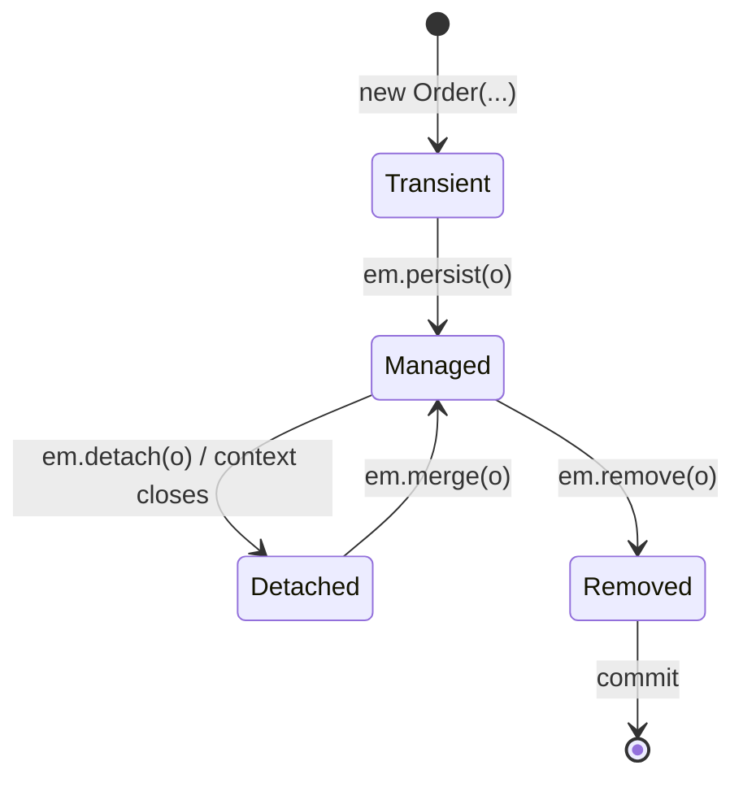

# JPA & Hibernate Mapping

> Session 8 · JDK 21, Jakarta Persistence 3.1, Hibernate 6.4 · See [Java Core, JDBC & JPA/Hibernate Persistence — Study Guide](index.md).

## 1. Objectives

By the end of this unit you will be able to:

- Map a class to a table with `@Entity`, `@Id` and column mappings.
- Map one-to-many and many-to-one relationships and identify the owning side.
- Explain the persistence context and predict when SQL is actually sent.
- Write repository operations with `EntityManager` and JPQL.
- Manage transactions around JPA operations.

## 2. What JPA Changes

JDBC asks you to write the SQL and the mapping. JPA generates both from annotations, and adds
something JDBC has no equivalent of: a **persistence context** that tracks the objects it loaded
and writes back what changed.

```java
// JDBC: an explicit UPDATE
order.cancel();
orderRepository.save(order);      // you wrote the UPDATE

// JPA: the entity is managed, so the change is noticed
Order order = em.find(Order.class, 5001L);
order.cancel();
// no save() call — at commit, JPA compares against the loaded state and issues the UPDATE
```

That is *dirty checking*. It is convenient and it surprises people, because an accidental
change to a managed entity is persisted just as faithfully as an intended one.

## 3. Mapping an Entity

```java
package com.fsa.orderdesk.domain;

import jakarta.persistence.*;
import java.math.BigDecimal;
import java.time.Instant;
import java.util.ArrayList;
import java.util.List;

@Entity
@Table(name = "orders")            // "order" is a reserved word; the table is "orders"
public class Order {

    @Id
    @GeneratedValue(strategy = GenerationType.IDENTITY)
    @Column(name = "order_id")
    private Long id;

    @Column(name = "customer_id", nullable = false)
    private Long customerId;

    @Column(name = "placed_at", nullable = false)
    private Instant placedAt;

    @Enumerated(EnumType.STRING)   // store the name, never the ordinal
    @Column(nullable = false, length = 16)
    private OrderStatus status = OrderStatus.PLACED;

    @OneToMany(mappedBy = "order", cascade = CascadeType.ALL, orphanRemoval = true)
    private List<OrderLine> lines = new ArrayList<>();

    protected Order() { }          // JPA requires a no-arg constructor; keep it non-public

    public Order(Long customerId, Instant placedAt) {
        this.customerId = customerId;
        this.placedAt = placedAt;
    }

    // Keep both sides of the relationship consistent in one place.
    public void addLine(OrderLine line) {
        lines.add(line);
        line.setOrder(this);
    }

    public Long id() { return id; }
    public List<OrderLine> lines() { return List.copyOf(lines); }
}
```

```java
@Entity
@Table(name = "order_line")
public class OrderLine {

    @Id
    @GeneratedValue(strategy = GenerationType.IDENTITY)
    @Column(name = "order_line_id")
    private Long id;

    @ManyToOne(fetch = FetchType.LAZY)      // LAZY by default is the right default
    @JoinColumn(name = "order_id", nullable = false)
    private Order order;

    @Column(name = "product_id", nullable = false)
    private Long productId;

    @Column(nullable = false)
    private int quantity;

    @Column(name = "unit_price", nullable = false, precision = 12, scale = 2)
    private BigDecimal unitPrice;

    protected OrderLine() { }

    void setOrder(Order order) { this.order = order; }
}
```

Two mappings worth arguing about:

```java
// Wrong — ordinal storage. Reorder the enum constants and every stored row now
// means something different, with no error.
@Enumerated(EnumType.ORDINAL)
private OrderStatus status;

// Right
@Enumerated(EnumType.STRING)
private OrderStatus status;
```

```java
// Wrong — EAGER loads the lines on every single order query, forever
@OneToMany(mappedBy = "order", fetch = FetchType.EAGER)

// Right — LAZY, and fetch explicitly where you need them (unit 9)
@OneToMany(mappedBy = "order")
```

## 4. Ownership

In a bidirectional relationship, exactly one side owns the foreign key. The owner is the side
*without* `mappedBy` — here, `OrderLine.order`.

```mermaid
flowchart LR
    O["Order<br/>@OneToMany(mappedBy = order)<br/>inverse side"]
    L["OrderLine<br/>@ManyToOne @JoinColumn(order_id)<br/>OWNING side"]
    L -->|writes order_id| DB[("order_line table")]
    O -.->|writes nothing.-> DB
```

Only changes to the owning side are written. This is the single most common JPA bug:

```java
// Wrong — the inverse side is updated, so no order_id is written and the line is orphaned
order.lines().add(line);

// Right — set the owning side, or use a helper that sets both
line.setOrder(order);

// Best — one method keeps them consistent
order.addLine(line);
```

`cascade = CascadeType.ALL` propagates operations from the order to its lines, so persisting an
order persists its lines. `orphanRemoval = true` deletes a line removed from the collection —
the JPA equivalent of the `ON DELETE CASCADE` you wrote in Database Foundations.

## 5. The Persistence Context

An entity is in one of four states:



- **Transient** — a plain object; JPA does not know it.
- **Managed** — tracked; changes are written at flush.
- **Detached** — was managed; changes are now ignored.
- **Removed** — scheduled for deletion at commit.

The consequence people trip on:

```java
Order order = em.find(Order.class, 5001L);   // managed
order.cancel();                              // persisted at commit
em.getTransaction().commit();

order.addLine(newLine());                    // detached now — silently lost
```

JPA also flushes before a query whose results the pending changes could affect, so statement
order in the SQL log is not always the order you wrote.

## 6. `EntityManager` and JPQL

JPQL queries *entities and fields*, not tables and columns.

```java
public final class JpaOrderRepository implements OrderRepository {

    private final EntityManagerFactory emf;

    public JpaOrderRepository(EntityManagerFactory emf) {
        this.emf = Objects.requireNonNull(emf);
    }

    @Override
    public Optional<Order> findById(long orderId) {
        try (EntityManager em = emf.createEntityManager()) {
            return Optional.ofNullable(em.find(Order.class, orderId));
        }
    }

    @Override
    public List<Order> findByCustomer(long customerId) {
        try (EntityManager em = emf.createEntityManager()) {
            return em.createQuery("""
                            SELECT o FROM Order o
                            WHERE  o.customerId = :customerId
                            ORDER  BY o.placedAt DESC
                            """, Order.class)
                     .setParameter("customerId", customerId)     // never string concatenation
                     .getResultList();
        }
    }

    @Override
    public long save(Order order) {
        try (EntityManager em = emf.createEntityManager()) {
            EntityTransaction tx = em.getTransaction();
            tx.begin();
            try {
                em.persist(order);
                tx.commit();
                return order.id();      // populated by the generated key at flush
            } catch (RuntimeException e) {
                if (tx.isActive()) tx.rollback();
                throw new RepositoryException("saving order for customer "
                        + order.customerId(), e);
            }
        }
    }
}
```

Note `SELECT o FROM Order o` — `Order` is the *entity* name, and it is case-sensitive. The table
is `orders`; JPQL never mentions it.

`getSingleResult` throws when there is no row, which is rarely what a lookup wants:

```java
// Wrong — NoResultException for the ordinary case of "not found"
Order o = em.createQuery(jpql, Order.class).getSingleResult();

// Right
Optional<Order> o = em.createQuery(jpql, Order.class)
                      .getResultStream().findFirst();
```

## 7. Configuration

```xml
<!-- src/main/resources/META-INF/persistence.xml -->
<persistence xmlns="https://jakarta.ee/xml/ns/persistence" version="3.1">
  <persistence-unit name="orderdesk" transaction-type="RESOURCE_LOCAL">
    <properties>
      <property name="jakarta.persistence.jdbc.url"
                value="jdbc:postgresql://localhost:5432/orderdesk"/>
      <property name="jakarta.persistence.jdbc.user" value="orderdesk"/>

      <!-- validate: the schema is owned by your DBF scripts, not by Hibernate.
           Never "update" — it changes production schemas silently. -->
      <property name="hibernate.hbm2ddl.auto" value="validate"/>

      <!-- Turn these on now and leave them on. Unit 9 needs them. -->
      <property name="hibernate.show_sql" value="true"/>
      <property name="hibernate.format_sql" value="true"/>
    </properties>
  </persistence-unit>
</persistence>
```

> **Note.** `hbm2ddl.auto=validate` fails at startup when an entity and the table disagree. That
> is exactly what you want: a mapping error becomes a startup failure rather than a wrong
> column at runtime.

## 8. Common Problems

### The child row has a null foreign key

The inverse side was updated, not the owning side. Use the `addLine` helper.

### `IllegalStateException: Entity must be managed to call remove`

`em.remove` on a detached entity. `em.merge` first, or load it in this context.

### `LazyInitializationException: could not initialize proxy — no Session`

A lazy association touched after the `EntityManager` closed. Fetch it inside, or use a fetch
join (unit 9). Do **not** fix it by switching to `EAGER`.

### `SchemaManagementException: missing column`

`validate` is doing its job. The entity and the table disagree — fix the mapping, or the schema.

### Changes are not saved

Either no transaction, or the entity is detached, or `hbm2ddl` rolled it back. Check the SQL log
first: if there is no `UPDATE`, JPA never saw a change.

### `NonUniqueResultException`

`getSingleResult` on a query returning several rows. Use `getResultList`.

### An enum column stores `0`, `1`, `2`

`EnumType.ORDINAL`. Switch to `STRING` and migrate the data.

## 9. Practical Guidelines

- Give every entity a protected no-arg constructor.
- Use `@Enumerated(EnumType.STRING)` without exception.
- Make associations `LAZY` and fetch explicitly where needed.
- Set the owning side, through a helper that keeps both sides consistent.
- Use `hbm2ddl.auto=validate`; own the schema with SQL scripts.
- Keep `show_sql` on while learning — most JPA bugs are visible in the log.

## 10. Knowledge Check

1. Which side of `Order`/`OrderLine` owns the foreign key, and what happens if you only update
   the other one?
2. What is dirty checking? Give a case where it writes something you did not intend.
3. Why is `EnumType.ORDINAL` dangerous? Describe the failure.
4. `getSingleResult` throws for a missing row. What should a repository return instead?
5. Why is `hbm2ddl.auto=validate` preferable to `update` in this programme?

## 11. Further Reading

- [Jakarta Persistence 3.1 specification](https://jakarta.ee/specifications/persistence/3.1/)
- [Hibernate ORM User Guide](https://docs.jboss.org/hibernate/orm/6.4/userguide/html_single/Hibernate_User_Guide.html)

---

Next: [Lab 08 — The same repository with JPA](lab-08.md), then [Persistence Performance](persistence-performance.md).
