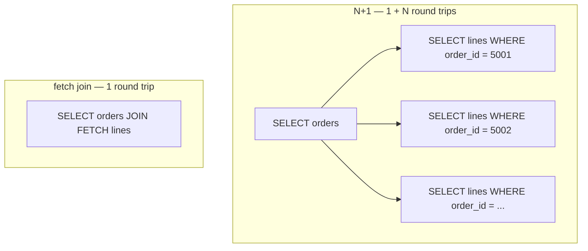

# Persistence Performance

> Session 9 · JDK 17, Hibernate 7.1 · See [Java Core, JDBC & JPA/Hibernate Persistence — Study Guide](index.md).

## 1. Objectives

By the end of this unit you will be able to:

- Read a Hibernate SQL log and count the statements a request issues.
- Recognise the N+1 pattern from a log and name its cause in the mapping.
- Correct N+1 with a fetch join or an entity graph and verify the fix by counting queries.
- Explain lazy and eager loading and the failure each one causes.
- Measure a before-and-after query count as evidence rather than asserting an improvement.

## 2. Make the SQL Visible

You cannot diagnose what you cannot see. Turn logging on before anything else.

```xml
<property name="hibernate.show_sql" value="true"/>
<property name="hibernate.format_sql" value="true"/>
<property name="hibernate.highlight_sql" value="true"/>
```

```properties
# logging.properties — bound parameters, which show_sql alone does not include
org.hibernate.SQL.level=DEBUG
org.hibernate.orm.jdbc.bind.level=TRACE
```

Add a statistics counter, so "how many queries" becomes a number rather than an impression:

```xml
<property name="hibernate.generate_statistics" value="true"/>
```

```java
Statistics stats = emf.unwrap(SessionFactory.class).getStatistics();
stats.clear();

List<Order> orders = repo.findByCustomer(42);
orders.forEach(o -> o.lines().size());       // touch the association

System.out.println("queries: " + stats.getPrepareStatementCount());
```

## 3. The N+1 Problem

The most common persistence defect in the programme, and the one that hides best in testing:
with ten seeded orders it costs eleven fast queries and nobody notices.

```java
List<Order> orders = em.createQuery(
        "SELECT o FROM Order o WHERE o.customerId = :id", Order.class)
        .setParameter("id", customerId)
        .getResultList();                    // 1 query

for (Order order : orders) {
    total = total.add(sumOf(order.lines())); // 1 query per order — the N
}
```

```text
select o.order_id, o.customer_id, o.placed_at, o.status from orders o where o.customer_id=?
select l.order_line_id, l.order_id, ... from order_line l where l.order_id=?   -- order 5001
select l.order_line_id, l.order_id, ... from order_line l where l.order_id=?   -- order 5002
select l.order_line_id, l.order_id, ... from order_line l where l.order_id=?   -- order 5003
... 197 more
```

Two hundred orders becomes 201 round trips. Each is fast; the latency is the sum.



**The cause is not laziness.** Lazy loading is correct. The cause is loading a collection
lazily and then touching it for every element of a list — a decision made at the query, not at
the mapping.

## 4. Fixing It

### Fetch join

Say at the query that you need the association:

```java
List<Order> orders = em.createQuery("""
        SELECT o FROM Order o
        LEFT JOIN FETCH o.lines
        WHERE  o.customerId = :id
        """, Order.class)
        .setParameter("id", customerId)
        .getResultList();                    // 1 query, lines already populated
```

`LEFT JOIN FETCH` keeps orders that have no lines; a plain `JOIN FETCH` drops them. The SQL
behind it fans out — one row per line, the same multiplication you met in Database Foundations
— but Hibernate 6 and later de-duplicate the parent entities for you, so an order with three
lines comes back once. Older material insists on `SELECT DISTINCT o` for this; on Hibernate 5
that was necessary, and today it is harmless but redundant.

> **Note.** You cannot `JOIN FETCH` two collection associations in one query — the result is a
> cartesian product. Fetch one, and use a second query or a batch size for the other.

### Entity graph

Keeps the fetch decision out of the JPQL string, which matters when one query serves several
callers:

```java
EntityGraph<Order> graph = em.createEntityGraph(Order.class);
graph.addAttributeNodes("lines");

List<Order> orders = em.createQuery(
        "SELECT o FROM Order o WHERE o.customerId = :id", Order.class)
        .setParameter("id", customerId)
        .setHint("jakarta.persistence.fetchgraph", graph)
        .getResultList();
```

### Batch fetching

When you genuinely cannot fetch up front, ask Hibernate to load the collections in batches:

```java
@OneToMany(mappedBy = "order")
@BatchSize(size = 25)
private List<OrderLine> lines = new ArrayList<>();
```

201 queries becomes 9: one for the orders, eight `WHERE order_id IN (...)` batches.

### Projections

Often the fix is not to load entities at all. If the screen shows a total, select the total.

```java
public record OrderSummary(Long orderId, Instant placedAt, BigDecimal total) {}

List<OrderSummary> rows = em.createQuery("""
        SELECT new com.fsa.orderdesk.query.OrderSummary(
                   o.id, o.placedAt, SUM(l.quantity * l.unitPrice))
        FROM   Order o JOIN o.lines l
        WHERE  o.customerId = :id
        GROUP  BY o.id, o.placedAt
        """, OrderSummary.class)
        .setParameter("id", customerId)
        .getResultList();
```

One query, no persistence context, nothing to detach. For read-only screens this is usually the
right answer.

## 5. Lazy and Eager

| | Lazy | Eager |
|---|---|---|
| Loads | On first access | With the parent, always |
| Fails as | `LazyInitializationException` | N+1 or a huge join, on every query |
| Fix | Fetch join where needed | None — you cannot opt out per query |

Default to lazy. An eager association is a decision imposed on every query in the application
forever, including the ones that only need the id.

```java
// Wrong — "fixing" LazyInitializationException by making it eager.
// The exception goes away and the whole application gets slower.
@OneToMany(mappedBy = "order", fetch = FetchType.EAGER)

// Right — fetch it in the query that needs it
@OneToMany(mappedBy = "order")
```

`LazyInitializationException` means the association was touched after the persistence context
closed. The fix is to fetch it while the context is open, or to return a projection.

## 6. Worked Example — Diagnose, Fix, Verify

**Symptom.** The customer order history is slow for large customers.

**Step 1 — measure.**

```java
@Test
void orderHistoryIssuesOneQuery() {
    Statistics stats = emf.unwrap(SessionFactory.class).getStatistics();
    stats.clear();

    List<Order> orders = repo.findByCustomer(42);
    orders.forEach(o -> o.lines().size());

    long queries = stats.getPrepareStatementCount();
    System.out.println("queries = " + queries + " for " + orders.size() + " orders");
    assertEquals(1, queries);
}
```

```text
queries = 201 for 200 orders        <-- before
```

**Step 2 — confirm from the log.** One `select ... from orders`, then two hundred
`select ... from order_line where order_id=?`. That is N+1, not a slow query.

**Step 3 — fix at the query.**

```java
@Override
public List<Order> findByCustomer(long customerId) {
    try (EntityManager em = emf.createEntityManager()) {
        return em.createQuery("""
                        SELECT o FROM Order o
                        LEFT JOIN FETCH o.lines
                        WHERE  o.customerId = :customerId
                        ORDER  BY o.placedAt DESC
                        """, Order.class)
                 .setParameter("customerId", customerId)
                 .getResultList();
    }
}
```

**Step 4 — verify.**

```text
queries = 1 for 200 orders          <-- after
```

The test now asserts `1` and will fail if anyone reintroduces the lazy path. That assertion is
the deliverable: an N+1 fix without a query-count test regresses the first time someone edits
the query.

## 7. Common Problems

### `LazyInitializationException: could not initialize proxy`

The context closed before the association was touched. Fetch join, entity graph, or projection
— not `EAGER`.

### The fetch join returns duplicate parents

You are on Hibernate 5 or reading a tutorial written for it. Hibernate 6+ de-duplicates fetch
joins on its own; on the old version, add `DISTINCT`.

### `MultipleBagFetchException: cannot simultaneously fetch multiple bags`

Two `List` collections fetched in one query. Change one to a `Set`, or fetch it separately.

### The query count did not change

The fetch join is in a different method from the one being called, or a second lazy association
is still being touched. Read the log; it names the table.

### Everything is slower after adding `EAGER`

Every query now loads the association, including the ones that never use it.

### `SUM` returns null rather than zero

`SUM` over no rows is null in SQL. Use `COALESCE`, or handle it in the projection.

## 8. Practical Guidelines

- Turn SQL logging on before diagnosing anything.
- Count queries with `Statistics`, not by eye.
- Assert the count in a test, so the fix cannot regress silently.
- Fix N+1 at the query — fetch join, entity graph or batch size — never by making it eager.
- Prefer a projection for read-only screens.
- Seed enough rows that N+1 is visible; ten will not show it.

## 9. Knowledge Check

1. Given a log with one `select from orders` and 200 `select from order_line`, name the defect
   and the line of code that caused it.
2. What does the plain `JOIN FETCH` version lose compared with `LEFT JOIN FETCH`, and why does
   the fan-out of the SQL not produce duplicate orders in the result?
3. Why is switching an association to `EAGER` a bad fix for `LazyInitializationException`?
4. What evidence would you attach to a claim that you fixed an N+1?
5. When is a projection better than fetching entities at all?

## 10. Further Reading

- [Hibernate User Guide: Fetching](https://docs.jboss.org/hibernate/orm/7.1/userguide/html_single/Hibernate_User_Guide.html#fetching)
- [Jakarta Persistence: Entity Graphs](https://jakarta.ee/specifications/persistence/3.2/)
- [Hibernate Statistics](https://docs.jboss.org/hibernate/orm/7.1/javadocs/org/hibernate/stat/Statistics.html)

---

Next: [Lab 09 — Diagnose and fix an N+1](lab-09.md), then [Java Core, JDBC & JPA/Hibernate — Appendix](appendix.md).
