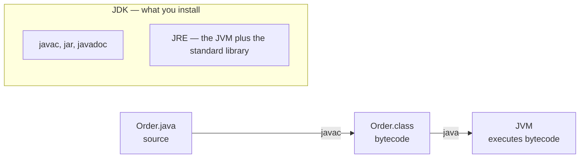

# Development Environment & the Java Toolchain

> Session 1 · JDK 17, Maven 3.9 · See [Java Core, JDBC & JPA/Hibernate Persistence — Study Guide](index.md).

## 1. Objectives

By the end of this unit you will be able to:

- Explain the difference between the JDK, the JRE and the JVM, and say which one runs a jar.
- Set `JAVA_HOME` correctly and diagnose a mismatch between it and `PATH`.
- Describe the Maven project layout and say what each phase of the default lifecycle does.
- Read and edit a `pom.xml`: coordinates, properties, dependencies, plugins.
- Build, test, package and run a project from the command line.

## 2. JDK, JRE, JVM

Three words for three different things, and confusing them is the source of most first-week
setup problems.



- The **JVM** executes bytecode. It is what "runs" your program.
- The **JRE** is the JVM plus the standard library — enough to run, not to compile.
- The **JDK** is the JRE plus the tools: `javac`, `jar`, `javadoc`, `jshell`.

You install a JDK. Since Java 11 there is no separate JRE download; a modern JDK contains
everything.

```bash
java -version     # the runtime on your PATH
javac -version    # the compiler on your PATH
```

If those two disagree, you have two JDKs installed and are compiling with one and running with
the other. Fix it before doing anything else.

## 3. `JAVA_HOME` and the PATH

`JAVA_HOME` points at a JDK directory. Maven, Gradle and most IDEs read it; your shell does not.
This is why `java -version` can be right while `mvn -version` is wrong.

```bash
echo $JAVA_HOME
mvn -version | grep -i "java version"
```

```text
Wrong — the shell and Maven disagree
$ java -version   →  17.0.12
$ mvn -version    →  Java version: 11.0.24

Right — one JDK, everywhere
$ java -version   →  17.0.12
$ mvn -version    →  Java version: 17.0.12
```

Set it permanently rather than per-shell:

```bash
# macOS / Linux, in ~/.zshrc or ~/.bashrc
export JAVA_HOME="$(dirname "$(dirname "$(readlink -f "$(which javac)")")")"
export PATH="$JAVA_HOME/bin:$PATH"
```

> **Note.** On macOS, `/usr/libexec/java_home -V` lists every installed JDK, and
> `export JAVA_HOME=$(/usr/libexec/java_home -v 17)` selects one by version.

## 4. Maven Project Layout

Maven works by convention. Put files where it expects and no configuration is needed.

```text
orderdesk/
├── pom.xml                            the project descriptor
└── src/
    ├── main/
    │   ├── java/com/fsa/orderdesk/    production code
    │   └── resources/                 config, packaged into the jar
    └── test/
        ├── java/com/fsa/orderdesk/    test code, not packaged
        └── resources/                 test-only config
```

Two rules that matter:

- The package declaration must match the directory path. `com.fsa.orderdesk.domain.Order`
  lives at `src/main/java/com/fsa/orderdesk/domain/Order.java`. A mismatch is a compile error
  that reads confusingly.
- Anything under `src/test` is invisible to production code. That is deliberate: it makes it
  impossible to ship a test helper by accident.

## 5. The Build Lifecycle

`mvn <phase>` runs every phase up to and including the one you name. That is the part people
miss — `mvn package` has already compiled and tested.

| Phase | Does | Output |
|---|---|---|
| `validate` | Checks the project is well-formed | — |
| `compile` | Compiles `src/main/java` | `target/classes/` |
| `test` | Compiles and runs `src/test/java` | `target/surefire-reports/` |
| `package` | Assembles the artifact | `target/orderdesk-1.0-SNAPSHOT.jar` |
| `verify` | Runs integration tests and checks | — |
| `install` | Copies the artifact to `~/.m2/repository` | — |

`clean` is not part of that sequence; it deletes `target/`. It is a separate lifecycle, which
is why you write `mvn clean package` rather than `mvn clean,package`.

```bash
mvn clean package                 # the everyday command
mvn test                          # tests only
mvn -DskipTests package           # skip tests: for a hurry, never for a commit
mvn dependency:tree               # what is actually on the classpath, and why
```

> **Tip.** When a build fails and the message is unclear, re-run with `-e` for a stack trace or
> `-X` for debug output. `-X` is verbose but names the plugin and the exact goal that failed.

## 6. Reading a `pom.xml`

```xml
<project xmlns="http://maven.apache.org/POM/4.0.0">
  <modelVersion>4.0.0</modelVersion>

  <!-- Coordinates: groupId:artifactId:version identifies this project everywhere. -->
  <groupId>com.fsa</groupId>
  <artifactId>orderdesk</artifactId>
  <version>1.0-SNAPSHOT</version>

  <properties>
    <!-- One place that decides the language level. Set it; do not rely on a default. -->
    <maven.compiler.release>17</maven.compiler.release>
    <project.build.sourceEncoding>UTF-8</project.build.sourceEncoding>
  </properties>

  <dependencies>
    <dependency>
      <groupId>org.postgresql</groupId>
      <artifactId>postgresql</artifactId>
      <version>42.7.8</version>
      <!-- runtime: needed to run, not to compile. The driver is loaded by name. -->
      <scope>runtime</scope>
    </dependency>
    <dependency>
      <groupId>org.junit.jupiter</groupId>
      <artifactId>junit-jupiter</artifactId>
      <version>5.13.4</version>
      <!-- test: on the test classpath only, never packaged. -->
      <scope>test</scope>
    </dependency>
  </dependencies>

  <build>
    <plugins>
      <plugin>
        <groupId>org.apache.maven.plugins</groupId>
        <artifactId>maven-surefire-plugin</artifactId>
        <version>3.5.3</version>
      </plugin>
    </plugins>
  </build>
</project>
```

Scope is the part worth learning properly:

| Scope | Compile | Test | Packaged |
|---|:--:|:--:|:--:|
| `compile` (default) | yes | yes | yes |
| `provided` | yes | yes | no |
| `runtime` | no | yes | yes |
| `test` | no | yes | no |

```xml
<!-- Wrong — JUnit ships to production, and production code can import assertions -->
<dependency>
  <groupId>org.junit.jupiter</groupId><artifactId>junit-jupiter</artifactId>
  <version>5.13.4</version>
</dependency>

<!-- Right -->
<dependency>
  <groupId>org.junit.jupiter</groupId><artifactId>junit-jupiter</artifactId>
  <version>5.13.4</version><scope>test</scope>
</dependency>
```

> **Note.** `1.0-SNAPSHOT` means "in development". Maven re-checks snapshot dependencies for
> updates; released versions are cached forever. That is why a colleague's fix to a snapshot
> reaches you and a fix to a release does not.

## 7. Worked Example — From Nothing to a Running Jar

```bash
mvn -q archetype:generate \
  -DgroupId=com.fsa.orderdesk -DartifactId=orderdesk \
  -DarchetypeArtifactId=maven-archetype-quickstart \
  -DarchetypeVersion=1.4 -DinteractiveMode=false
cd orderdesk
```

```java
// src/main/java/com/fsa/orderdesk/App.java
package com.fsa.orderdesk;

public class App {
    public static void main(String[] args) {
        System.out.println("OrderDesk " + version());
    }

    // Package-private so the test can reach it without making it public API.
    static String version() {
        return "1.0";
    }
}
```

```java
// src/test/java/com/fsa/orderdesk/AppTest.java
package com.fsa.orderdesk;

import static org.junit.jupiter.api.Assertions.assertEquals;

import org.junit.jupiter.api.Test;

class AppTest {
    @Test
    void reportsItsVersion() {
        assertEquals("1.0", App.version());
    }
}
```

```bash
mvn clean package
java -cp target/classes com.fsa.orderdesk.App          # OrderDesk 1.0
```

Running the jar directly needs a `Main-Class` in its manifest:

```xml
<plugin>
  <groupId>org.apache.maven.plugins</groupId>
  <artifactId>maven-jar-plugin</artifactId>
  <version>3.4.1</version>
  <configuration>
    <archive><manifest><mainClass>com.fsa.orderdesk.App</mainClass></manifest></archive>
  </configuration>
</plugin>
```

```bash
mvn clean package && java -jar target/orderdesk-1.0-SNAPSHOT.jar
```

## 8. Common Problems

### `Error: Could not find or load main class`

The class name after `-cp` must be the fully-qualified name — `com.fsa.orderdesk.App`, not
`App` and not a file path. Check that `target/classes/com/fsa/orderdesk/App.class` exists.

### `no main manifest attribute, in target/orderdesk-1.0-SNAPSHOT.jar`

The jar has no `Main-Class`. Configure `maven-jar-plugin` as above.

### `class file has wrong version 65.0, should be 61.0`

Compiled with a newer JDK than the one running it — here a JDK 17 compiled it and a JDK 17
is running it. Java 17 is class file 61, Java 17 is 65. Align `java`, `javac` and
`maven.compiler.release`; this programme pins all three at 17.

### `package org.junit.jupiter.api does not exist`

Either JUnit is missing from the pom, or the test is under `src/main/java` where `test`-scoped
dependencies are invisible.

### `mvn` downloads the internet on every build

Normal the first time. If it repeats, a dependency is a `SNAPSHOT`, or `~/.m2` is not writable.

### The IDE shows no errors but `mvn` fails

The IDE is compiling with its own settings. Maven is the source of truth — if it fails, it is
broken. Re-import the project from the `pom.xml`.

## 9. Practical Guidelines

- Set `maven.compiler.release` explicitly; never rely on the default.
- Give every dependency the narrowest scope that works.
- Run `mvn clean package` before every commit, not `mvn compile`.
- Keep `target/` out of Git.
- When the IDE and Maven disagree, believe Maven.
- Pin plugin versions — an unpinned plugin makes your build depend on the day it ran.

## 10. Knowledge Check

1. `java -version` says 17 and `mvn -version` says 11. What is wrong, and how do you fix it?
2. What does `mvn package` do that `mvn compile` does not? Name every phase in between.
3. Why is the PostgreSQL driver `runtime` scope and JUnit `test` scope?
4. A class declares `package com.fsa.orderdesk.domain;`. Where must the file live, and what
   happens if it does not?
5. `java -jar app.jar` fails with "no main manifest attribute". What is missing and where?

## 11. Further Reading

- [Maven: Introduction to the Build Lifecycle](https://maven.apache.org/guides/introduction/introduction-to-the-lifecycle.html)
- [Maven: Dependency Scopes](https://maven.apache.org/guides/introduction/introduction-to-dependency-mechanism.html)
- [JDK 17 documentation](https://docs.oracle.com/en/java/javase/17/)

---

Next: [Lab 01 — Configure the toolchain and build a project](lab-01.md), then [Java Syntax, Types & Methods](language-fundamentals.md).
