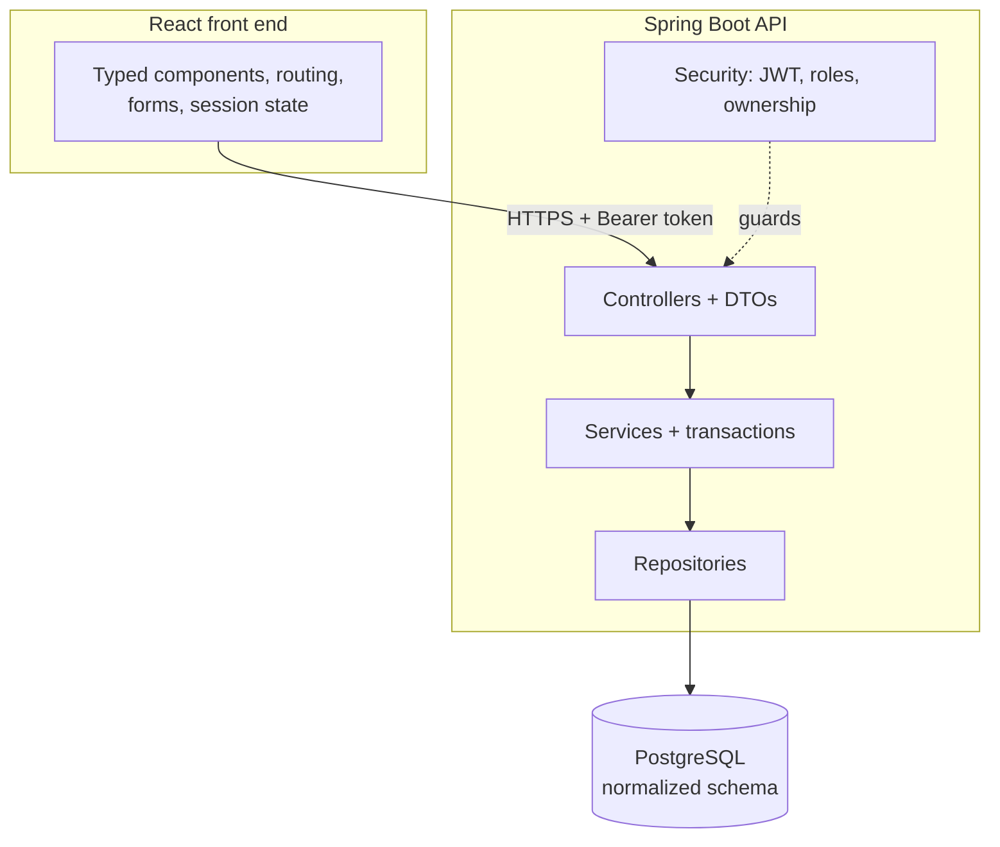

# Mock Project (Capstone) — Study Guide

Four weeks, one team, one product. Everything the programme has taught is used here at once, and
nothing new is taught: the capstone is where you find out what you actually know.

There are no lecture notes and no labs in this module. There is a brief, three sprints, and a
defence.

## 1. Module Map

| Unit | What happens | Length |
|---|---|---|
| 1 | Kickoff, team formation, scope, backlog, architecture | 1 day |
| 2 | Sprint 1 — a vertical slice, end to end | 5 days |
| 3 | Sprint 2 — core features and one controlled change request | 5 days |
| 4 | Sprint 3 — hardening, security, integration, documentation | 5 days |
| 5 | Guided revision — evidence review and gap closing | 2 days |
| 6 | Final review — individual defence and live demonstration | 2 days |

[Mock Project (Capstone) — Appendix](appendix.md) holds the checklists, the evidence list and the primary sources.

## 2. What You Are Building

A working product, chosen from the briefs issued at kickoff, on the stack this programme has
taught. The scope is deliberately small; the standard is not.



Nothing in that diagram is new. Every box is a module you have already completed.

## 3. The Vertical Slice

Sprint 1 delivers **one feature, complete, through every layer** — not a finished database, not
a set of unconnected screens.

```text
Wrong — horizontal. Nothing works until the last day.
  Sprint 1: all the tables
  Sprint 2: all the endpoints
  Sprint 3: all the screens

Right — vertical. Something works on day five, and every risk surfaces early.
  Sprint 1: one feature, from the schema through the API to the screen, tested
  Sprint 2: the next features, on proven foundations
  Sprint 3: hardening
```

The horizontal plan is the most common way a capstone fails. It hides integration problems until
there is no time left to solve them, and it produces nothing demonstrable at the first review.

> **Note.** "Complete" for the slice means: schema, endpoint, authorization, validation, error
> handling, screen with all four states, and tests. A slice missing its failure paths is not a
> slice.

## 4. How the Sprints Run

Each sprint is one week and follows Scrum as taught in Foundations:

| Event | When | Produces |
|---|---|---|
| Sprint planning | Day 1 | A sprint goal and a committed backlog |
| Daily scrum | Every morning, 15 min | A replanned day, and blockers named |
| Sprint review | Last day | A demonstration against acceptance criteria |
| Retrospective | Last day | One change the team will actually make |

The Product Owner and Scrum Master roles rotate between sprints, so nobody holds one for the
whole project and at least three members have held one by the end. Work rotates too: everyone
touches every layer. Rotation is not ceremony: the defence in unit 6 asks what you did, and
"I only wrote the front end" is a weak answer.

**Every change goes through a pull request**, reviewed by a teammate who did not write it. That
is the traceability the final review inspects, and it is why the Git and review work in
Foundations mattered.

## 5. The Change Request

Part-way through sprint 2 your scope will change. That is deliberate — it is what happens on
real projects, and handling it is part of what you are here to practise.

What to do: assess the impact, renegotiate the scope rather than silently absorbing it, update
your estimates and backlog, and write down the decision. Quietly working late to absorb a change
is the wrong answer. The thing worth getting good at is the conversation, not the heroics.

## 6. Evidence

The final review examines evidence, not claims. Collect it as you go; reconstructing it in
unit 5 does not work.

| Evidence | Where it lives |
|---|---|
| Scope, users, success criteria | `docs/product.md` |
| User stories with acceptance criteria | The backlog tool |
| Architecture and its trade-offs | `docs/architecture.md` |
| Data model and its justification | `docs/data-model.md` |
| API contract | OpenAPI, published by the running service |
| Change request and the decision | `docs/decisions.md` |
| Test results | CI output, committed |
| Setup that works from nothing | `README.md` |
| Individual contribution | Git history and reviewed pull requests |

## 7. How You Are Assessed

The final review has two parts, and both are individual:

- **Part A — technical defence.** You explain architecture, trade-offs, your own contributions
  and someone else's code. A team that split so completely that nobody can explain the whole
  loses marks here.
- **Part B — live demonstration and a bounded observed change.** You demonstrate the product
  against its acceptance criteria, then make a small change while being watched.

Part B is why the reproducible setup matters. A product that only runs on one laptop cannot be
demonstrated.

> **Tip.** Rehearse the demonstration on a machine that has never run the project, from a fresh
> clone, following your own README. This finds the missing step every time.

## 8. Working Agreement

Agree these on day one and write them down:

- Definition of Done — the same one for every story, and it includes review and tests.
- Branch naming and pull request expectations.
- How long a review may wait before it blocks someone.
- What "blocked" means and when to escalate.
- When the daily scrum is, and what happens if someone misses it.

## 9. How to Work in This Module

- **Integrate daily.** A branch that has not merged for three days is a merge conflict growing.
- **Demonstrate at every review**, even when it is unfinished. A review with nothing to show is
  a week you cannot get back.
- **Write the acceptance criteria before the code.** They are what the demonstration is judged
  against.
- **Keep the README true.** Every setup step you discover goes in it the day you discover it.
- **Review properly.** Waving a pull request through costs you twice — the defect ships, and
  the review that should have caught it is on your name.
- **Ask early.** A blocker raised on day one costs an hour; on day four it costs the sprint.

## 10. Glossary

| Term | Meaning here |
|---|---|
| **Vertical slice** | One feature working through every layer |
| **Definition of Done** | The conditions every story must meet, agreed once |
| **Acceptance criteria** | Checkable conditions for one story |
| **Change request** | A trainer-issued scope change, to be negotiated |
| **Traceability** | Being able to show who did what, from the Git history |
| **Bounded observed change** | A small change made live during the defence |

---

The capstone brief, deliverables and rubric are issued at kickoff. Checklists are in
[Mock Project (Capstone) — Appendix](appendix.md).
