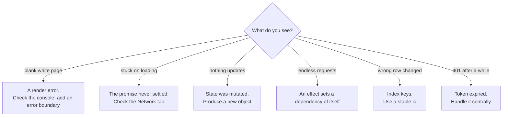

# React Application Development — Appendix

> See [React Application Development — Study Guide](index.md).

## 1. Syllabus Map

| # | Syllabus item | Covered in |
|---|---|---|
| 1 | React, JSX, Components & State | [React, JSX, Components & State](components-and-state.md) |
| 2 | Effects, Data Fetching & Custom Hooks | [Effects, Data Fetching & Custom Hooks](effects-and-data-fetching.md) |
| 3 | Routing & Shared Layouts | [Routing & Shared Layouts](routing-and-layouts.md) |
| 4 | Forms, Validation & Mutations | [Forms, Validation & Mutations](forms-and-mutations.md) |
| 5 | Authentication, Authorization & Shared State | [Authentication, Authorization & Shared State](auth-and-shared-state.md) |
| 6 | Testing, Error Boundaries & Production Build | [Testing, Error Boundaries & the Production Build](testing-and-production.md) |

## 2. Objective Coverage

| Code | Objective | Taught in | Practised in |
|---|---|---|---|
| RAD-K1 | Component and state design | Notes 01, 02 | Labs 01, 02 |
| RAD-K2 | Navigation and data workflows | Notes 03, 04 | Labs 03, 04 |
| RAD-K3 | Client authentication and delivery | Notes 05, 06 | Labs 05, 06 |

## 3. Hook Rules

- Call hooks only at the top level of a component or another hook.
- Never inside a condition, a loop, or after an early return.
- Custom hook names start with `use`.
- Every value from the component used inside an effect goes in its dependencies.

## 4. State Decision Table

| Question | Answer |
|---|---|
| Can it be computed from props or other state? | Derive it, do not store it |
| Do two siblings need it? | Lift it to their common ancestor |
| Does the whole tree need it? | Context — sparingly |
| Should it survive a reload or be shareable? | Put it in the URL |
| Does it come from the server? | A custom hook that fetches it |

## 5. The Four States, Again

```tsx
if (loading) return <p role="status">Loading…</p>;
if (error)   return <p role="alert">{error} <button onClick={reload}>Retry</button></p>;
if (items.length === 0) return <p>Nothing matches these filters.</p>;
return <Table items={items} />;
```

## 6. Testing Query Reference

| Query | Waits | Fails when absent | Use for |
|---|:--:|:--:|---|
| `getBy*` | no | yes | Something already rendered |
| `queryBy*` | no | no | Asserting absence |
| `findBy*` | yes | yes | Something that arrives asynchronously |

Prefer `getByRole('button', { name })` and `getByLabelText('Status')` over class selectors —
they fail when the accessibility is broken, which is a bug worth failing on.

## 7. Diagnosing a Broken Screen



## 8. Primary Sources

- [React documentation](https://react.dev/)
- [React Router](https://reactrouter.com/)
- [Vite guide](https://vite.dev/guide/)
- [Vitest](https://vitest.dev/)
- [Testing Library](https://testing-library.com/docs/react-testing-library/intro/)

---

Back to [React Application Development — Study Guide](index.md).
