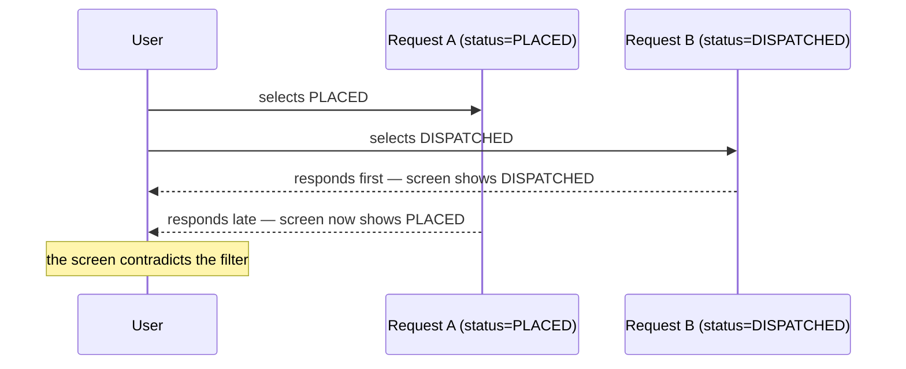

# Effects, Data Fetching & Custom Hooks

> Session 2 · React 19 · See [React Application Development — Study Guide](index.md).

## 1. Objectives

By the end of this unit you will be able to:

- Use `useEffect` for work that reaches outside React, with a correct dependency array.
- Clean up an effect and explain what happens without cleanup.
- Fetch typed data and represent loading, empty, success and error.
- Extract a custom hook and reuse it.
- Recognise a request race and cancel the stale one.

## 2. What an Effect Is For

An effect synchronises a component with something outside React: a network request, a
subscription, a timer, the document title.

**It is not for computing values.** That is derived state, from unit 1.

```tsx
// Wrong — an effect to compute something. An extra render, and a chance to be stale.
const [total, setTotal] = useState(0);
useEffect(() => { setTotal(orders.reduce((s, o) => s + o.total, 0)); }, [orders]);

// Right
const total = orders.reduce((s, o) => s + o.total, 0);
```

```tsx
useEffect(() => {
    document.title = `Orders (${orders.length})`;
}, [orders.length]);
```

## 3. The Dependency Array

```tsx
useEffect(() => { ... });                 // after every render — almost always wrong
useEffect(() => { ... }, []);             // once, after the first render
useEffect(() => { ... }, [orderId]);      // whenever orderId changes
```

Every value from the component used inside the effect must be listed.

```tsx
// Wrong — an empty array with a dependency inside. Change the filter and nothing refetches.
useEffect(() => { load(status); }, []);

// Right
useEffect(() => { load(status); }, [status]);
```

```tsx
// Wrong — an object literal is a new reference every render, so this loops forever
useEffect(() => { load(query); }, [{ status }]);

// Right — depend on the primitive
useEffect(() => { load(status); }, [status]);
```

The infinite loop has a signature: the Network tab fills with identical requests. It is always
an effect that sets state which changes a dependency of that same effect.

> **Tip.** Enable the `react-hooks/exhaustive-deps` lint rule and believe it. When it wants a
> dependency you think is wrong, the fix is usually to move the value out of the component or
> into a `useCallback` — not to silence the rule.

## 4. Cleanup

An effect may return a cleanup function. React runs it before the next effect and on unmount.

```tsx
useEffect(() => {
    const id = setInterval(() => refresh(), 30_000);
    return () => clearInterval(id);       // without this, intervals accumulate on every render
}, [refresh]);
```

In React's development Strict Mode every effect runs, cleans up, and runs again — deliberately,
to surface missing cleanup. Two requests in development and one in production is not a bug; a
missing cleanup is.

## 5. Fetching, with All Four States

```tsx
export function OrdersPage() {
    const [orders, setOrders] = useState<Order[]>([]);
    const [loading, setLoading] = useState(true);
    const [error, setError] = useState<string | null>(null);
    const [status, setStatus] = useState<OrderStatus | ''>('');

    useEffect(() => {
        const controller = new AbortController();
        setLoading(true);
        setError(null);

        fetchOrders({ status: status || undefined }, controller.signal)
            .then(page => setOrders(page.content))
            .catch(e => {
                // An aborted request is not an error the user should see.
                if (e.name !== 'AbortError') setError(messageFor(e));
            })
            .finally(() => {
                // The aborted request settles AFTER the next effect has set loading to
                // true. If it flipped loading back, stale rows would show as "loaded".
                if (!controller.signal.aborted) setLoading(false);
            });

        // Cancels the previous request when `status` changes again quickly.
        return () => controller.abort();
    }, [status]);

    if (loading) return <p role="status">Loading orders…</p>;
    if (error)   return <p role="alert">{error}</p>;
    if (orders.length === 0) return <p>No orders match these filters.</p>;
    return <OrdersTable orders={orders} />;
}
```

The `AbortController` fixes a real race:



Without cancellation the slower, older response wins because it arrived last.

## 6. Custom Hooks

A custom hook is a function starting with `use` that calls other hooks. It extracts stateful
logic so several components can share it.

```tsx
// src/hooks/useOrders.ts
import { useEffect, useState } from 'react';

interface UseOrdersResult {
    orders: Order[];
    loading: boolean;
    error: string | null;
    reload: () => void;
}

export function useOrders(query: OrderQuery): UseOrdersResult {
    const [orders, setOrders] = useState<Order[]>([]);
    const [loading, setLoading] = useState(true);
    const [error, setError] = useState<string | null>(null);
    const [reloadToken, setReloadToken] = useState(0);

    // Serialised so the effect depends on the value, not on an object identity
    // that changes every render.
    const key = JSON.stringify(query);

    useEffect(() => {
        const controller = new AbortController();
        setLoading(true);
        setError(null);

        fetchOrders(JSON.parse(key), controller.signal)
            .then(page => setOrders(page.content))
            .catch(e => { if (e.name !== 'AbortError') setError(messageFor(e)); })
            .finally(() => { if (!controller.signal.aborted) setLoading(false); });

        return () => controller.abort();
    }, [key, reloadToken]);

    return { orders, loading, error, reload: () => setReloadToken(t => t + 1) };
}
```

```tsx
export function OrdersPage() {
    const [status, setStatus] = useState<OrderStatus | ''>('');
    const { orders, loading, error, reload } = useOrders({ status: status || undefined });

    if (loading) return <p role="status">Loading orders…</p>;
    if (error) return <p role="alert">{error} <button onClick={reload}>Retry</button></p>;
    if (orders.length === 0) return <p>No orders match these filters.</p>;
    return <OrdersTable orders={orders} onCancelled={reload} />;
}
```

The page is now about what it shows. The fetching, cancelling and state juggling live in one
tested place.

> **Note.** Hooks may only be called at the top level of a component or another hook — never
> inside a condition, a loop or a nested function. React identifies hooks by call order.

```tsx
// Wrong — the hook count changes between renders
if (orderId) {
    const { orders } = useOrders({ orderId });
}

// Right — call it unconditionally and handle the absence inside
const { orders } = useOrders(orderId ? { orderId } : { skip: true });
```

## 7. Worked Example — A Detail Page

```tsx
export function useOrder(orderId: number) {
    const [order, setOrder] = useState<Order | null>(null);
    const [loading, setLoading] = useState(true);
    const [error, setError] = useState<string | null>(null);

    useEffect(() => {
        const controller = new AbortController();
        setLoading(true);
        setError(null);
        setOrder(null);        // clear the previous order, or it flashes on screen

        fetchOrder(orderId, controller.signal)
            .then(setOrder)
            .catch(e => { if (e.name !== 'AbortError') setError(messageFor(e)); })
            .finally(() => { if (!controller.signal.aborted) setLoading(false); });

        return () => controller.abort();
    }, [orderId]);

    return { order, loading, error };
}
```

```tsx
export function OrderDetailPage({ orderId }: { orderId: number }) {
    const { order, loading, error } = useOrder(orderId);

    if (loading) return <p role="status">Loading order {orderId}…</p>;
    if (error)   return <p role="alert">{error}</p>;
    if (!order)  return <p>Order {orderId} was not found.</p>;

    return (
        <article>
            <h2>Order {order.id}</h2>
            <p><StatusBadge status={order.status} /> · {formatDate(order.placedAt)}</p>
            <OrderLines lines={order.lines} />
        </article>
    );
}
```

`setOrder(null)` on each change matters: without it, navigating from order 1 to order 2 shows
order 1's data under order 2's heading until the request returns.

## 8. Common Problems

### Requests fire endlessly

An effect sets state that is in its own dependency array, or a dependency is an object literal.
Depend on primitives.

### The data does not refresh when a filter changes

The dependency array is `[]` but the effect uses the filter.

### Two requests in development, one in production

Strict Mode double-invoking effects. Expected — but make sure cleanup exists.

### The screen shows data for the previous selection

A race. Cancel with `AbortController`, clear the old value while loading — and make sure the
cancelled request's `finally` does not set `loading` back to false.

### `Rendered fewer hooks than expected`

A hook inside a condition or an early return.

### `Cannot perform a React state update on an unmounted component`

State set after unmount. Cleanup should have cancelled the work.

## 9. Practical Guidelines

- Effects are for reaching outside React; compute derived values in render.
- List every dependency, and depend on primitives rather than objects.
- Return a cleanup from any effect that starts something.
- Cancel in-flight requests with `AbortController`, and ignore `AbortError`.
- Extract repeated fetch-and-state logic into a custom hook.
- Call hooks unconditionally, at the top level.

## 10. Knowledge Check

1. Give one thing an effect is for and one thing it is not, with an example of each.
2. An effect requests endlessly. Name two causes and their fixes.
3. Why does an effect run twice in development, and what should you check when it does?
4. Describe the race `AbortController` prevents here, step by step.
5. Why must hooks be called unconditionally?

## 11. Further Reading

- [React: Synchronizing with Effects](https://react.dev/learn/synchronizing-with-effects)
- [React: You Might Not Need an Effect](https://react.dev/learn/you-might-not-need-an-effect)
- [React: Reusing Logic with Custom Hooks](https://react.dev/learn/reusing-logic-with-custom-hooks)

---

Next: [Lab 02 — Effects, fetching and a custom hook](lab-02.md), then [Routing & Shared Layouts](routing-and-layouts.md).
