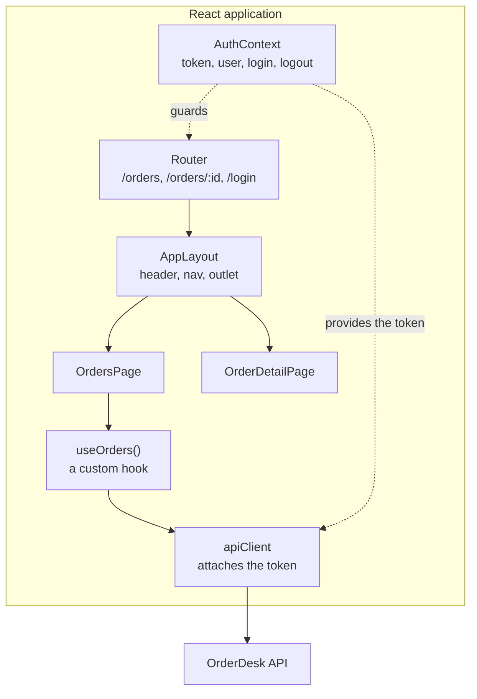

# React Application Development — Study Guide

This module builds the OrderDesk back office as a React application against the Spring Boot API
you wrote. Everything from Frontend Foundations still applies: React changes how the DOM gets
updated, not what good HTML, CSS or typed API access look like.

## 1. Module Map

| # | Note | Covers | Lab |
|---|---|---|---|
| 01 | [React, JSX, Components & State](components-and-state.md) | Vite and TypeScript, JSX, typed props, composition, local and derived state, lists and keys | [Lab 01 — Components, props and state](lab-01.md) |
| 02 | [Effects, Data Fetching & Custom Hooks](effects-and-data-fetching.md) | `useEffect`, dependencies, cleanup, typed API calls, the four states, custom hooks | [Lab 02 — Effects, fetching and a custom hook](lab-02.md) |
| 03 | [Routing & Shared Layouts](routing-and-layouts.md) | routes, list and detail, parameters, navigation, shared layouts, not-found | [Lab 03 — Routing, layouts and URL state](lab-03.md) |
| 04 | [Forms, Validation & Mutations](forms-and-mutations.md) | controlled inputs, typed form state, client validation, POST and PUT, server errors | [Lab 04 — Forms, validation and mutations](lab-04.md) |
| 05 | [Authentication, Authorization & Shared State](auth-and-shared-state.md) | context, session state, login, token attachment, expiry, protected routes | [Lab 05 — Session state and protected routes](lab-05.md) |
| 06 | [Testing, Error Boundaries & the Production Build](testing-and-production.md) | component tests, error boundaries, environment configuration, the production build | [Lab 06 — Tests, an error boundary and a production build](lab-06.md) |

[React Application Development — Appendix](appendix.md) maps the syllabus outline onto these notes and lists the
primary sources.

## 2. The Running Domain — OrderDesk, in React



The four states from Frontend Foundations do not go away. React makes them easier to represent
and just as easy to forget.

## 3. How to Use This Handbook

Read this page before session 1. Each unit is a note plus a lab, and the labs build one
application incrementally — do not start each lab from a fresh project.

The long assignment is issued in session 1 and completed in unit 7.

## 4. Environment Setup

```bash
node --version     # expect 20.x or 22.x LTS

npm create vite@latest orderdesk-web -- --template react-ts
cd orderdesk-web && npm install
npm install react-router-dom
npm install -D vitest @testing-library/react @testing-library/user-event jsdom
npm run dev        # http://localhost:5173
```

The API must be running, and its CORS configuration must allow `http://localhost:5173`:

```bash
cd ../orderdesk-api && docker compose up -d
curl -s localhost:8080/actuator/health
```

> **Tip.** Install React DevTools. Being able to see a component's props and state, and why it
> re-rendered, turns most of this module's confusing moments into obvious ones.

## 5. How to Study This Module

- **Think in state, not in DOM updates.** You never write "change this cell". You change state
  and describe what the screen looks like for that state.
- **Read the React error messages.** They are unusually good: they name the component, the hook
  and often the fix.
- **Keep the Network tab open.** A component that renders twice and fetches twice is visible
  there long before it is visible in the code.
- **Do not reach for a state library.** Everything in this module fits in `useState`, `useEffect`
  and one context. Adding Redux here hides what you are supposed to be learning.
- **Type the props.** A component whose props are `any` gives up the reason to use TypeScript.

## 6. Glossary

| Term | Meaning here |
|---|---|
| **Component** | A function returning JSX |
| **Props** | Inputs to a component, read-only |
| **State** | Data owned by a component that can change over time |
| **Derived state** | A value computed from props or state — not stored |
| **Hook** | A function starting with `use` that gives a component memory or effects |
| **Effect** | Code that runs after render to reach outside React |
| **Key** | The stable identity of a list item |
| **Lifting state up** | Moving state to the closest common ancestor |
| **Context** | A way to pass a value to a whole subtree without threading props |
| **Controlled input** | An input whose value comes from state |

---

Start with [React, JSX, Components & State](components-and-state.md).
