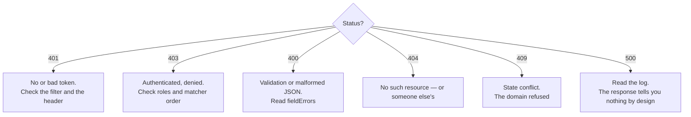

# Spring Boot API Development — Appendix

> See [Spring Boot API Development — Study Guide](index.md).

## 1. Syllabus Map

| # | Syllabus item | Covered in |
|---|---|---|
| 1 | IoC Container, Beans, DI & Configuration | [Spring Boot IoC, Beans, Dependency Injection & Configuration](ioc-beans-and-configuration.md) |
| 2 | REST Controllers, DTOs & HTTP Semantics | [REST Controllers, DTOs & HTTP Semantics](rest-controllers-and-dtos.md) |
| 3 | Spring Data JPA | [Spring Data JPA](spring-data-jpa.md) |
| 4 | Service Layer, Transactions & Locking | [Service Layer, Transactions & Locking](services-and-transactions.md) |
| 5 | Validation & Error Contracts | [Validation & Error Contracts](validation-and-error-contracts.md) |
| 6 | Authentication with Spring Security & JWT | [Authentication with Spring Security & JWT](authentication-and-jwt.md) |
| 7 | Authorization, CORS & OpenAPI | [Authorization, CORS & OpenAPI](authorization-cors-and-openapi.md) |
| 8 | Testing Spring Applications | [Testing Spring Applications](testing-spring-applications.md) |
| 9 | Containerization, Configuration & Observability | [Containerization, Configuration & Observability](containerization-and-observability.md) |

## 2. Objective Coverage

| Code | Objective | Taught in | Practised in |
|---|---|---|---|
| SBAD-K1 | Spring application architecture | Notes 01, 02 | Labs 01, 02 |
| SBAD-K2 | Data integrity and error handling | Notes 03–05 | Labs 03–05 |
| SBAD-K3 | API security | Notes 06, 07 | Labs 06, 07 |
| SBAD-K4 | Quality and delivery | Notes 08, 09 | Labs 08, 09 |

## 3. Status Code Reference

| Code | Use for |
|---|---|
| 200 | A read or update returning a body |
| 201 | Created — include `Location` |
| 204 | Success with no body |
| 400 | Malformed or invalid input |
| 401 | Not authenticated |
| 403 | Authenticated but not permitted |
| 404 | No such resource — also for someone else's resource |
| 409 | Conflicts with current state |
| 422 | Well-formed but semantically invalid |
| 500 | Our fault. Log it, reveal nothing |

## 4. Annotation Reference

| Annotation | Where | Does |
|---|---|---|
| `@SpringBootApplication` | main class | Enables scanning and auto-configuration |
| `@RestController` | controller | Handles HTTP, returns bodies |
| `@Service` | service | Business logic bean |
| `@Transactional` | service method | Transaction boundary |
| `@ConfigurationProperties` | record | Typed configuration binding |
| `@Valid` | parameter, nested field | Runs Bean Validation, cascades |
| `@RestControllerAdvice` | advice class | One error contract for the API |
| `@PreAuthorize` | service or controller method | Expression-based authorization |
| `@AuthenticationPrincipal` | parameter | The authenticated user |
| `@WebMvcTest` / `@DataJpaTest` | test class | Slice tests |
| `@SpringBootTest` | test class | Full context |

## 5. Security Checklist

- [ ] Passwords hashed with BCrypt, cost ≥ 10
- [ ] JWT secret from the environment, ≥ 32 bytes, never defaulted
- [ ] Every token has a short expiry
- [ ] Rules ordered specific to general, ending `anyRequest().authenticated()`
- [ ] Identity from the token, never from a request parameter
- [ ] Ownership checked on every user-owned resource
- [ ] 404, not 403, for another user's resource
- [ ] CORS origins listed explicitly; no `*` with credentials
- [ ] The catch-all handler logs the detail and returns none of it
- [ ] Actuator exposes only named endpoints; `show-details: when-authorized`
- [ ] No credential in any tracked file, image layer or log line

## 6. Diagnosing a Failing Request

## 7. Primary Sources

- [Spring Boot reference](https://docs.spring.io/spring-boot/index.html)
- [Spring Framework: Web MVC](https://docs.spring.io/spring-framework/reference/web/webmvc.html)
- [Spring Data JPA reference](https://docs.spring.io/spring-data/jpa/reference/)
- [Spring Security reference](https://docs.spring.io/spring-security/reference/)
- [Testcontainers for Java](https://java.testcontainers.org/)
- [OWASP API Security Top 10](https://owasp.org/API-Security/editions/2023/en/0x11-t10/)

---

Back to [Spring Boot API Development — Study Guide](index.md).
