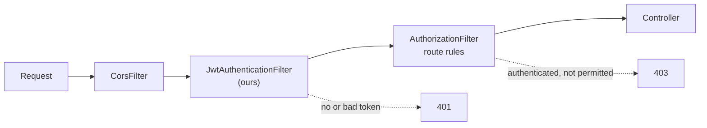

# Authentication with Spring Security & JWT

> Objectives: SBAD-K3 · Session 6 · Spring Boot 3.3, Spring Security 6.3 · See [Spring Boot API Development — Study Guide](index.md).

## 1. Objectives

After this unit, learners can:

- Describe the security filter chain and where authentication happens.
- Store users in the database with correctly hashed passwords.
- Issue a signed JWT on successful login and verify it on later requests.
- Configure a stateless chain and say why sessions are absent.
- Recognise the common token mistakes: no expiry, weak secret, secrets in source.

## 2. The Filter Chain

Spring Security is a chain of servlet filters in front of your controllers. A request that fails
authentication never reaches one.



The distinction the chain makes, and which is worth being precise about:

- **401 Unauthorized** — we do not know who you are. No token, malformed, expired.
- **403 Forbidden** — we know who you are, and you may not do this.

## 3. Storing Users

```java
@Entity
@Table(name = "app_user")
public class AppUser {

    @Id
    @GeneratedValue(strategy = GenerationType.IDENTITY)
    private Long id;

    @Column(nullable = false, unique = true)
    private String email;

    // The hash, never the password. Name it so nobody is tempted.
    @Column(name = "password_hash", nullable = false)
    private String passwordHash;

    @ElementCollection(fetch = FetchType.EAGER)      // small, always needed
    @CollectionTable(name = "app_user_role")
    @Column(name = "role")
    private Set<String> roles = new HashSet<>();
}
```

```java
// Wrong — every one of these is a real breach pattern
private String password;                       // plaintext
passwordHash = md5(password);                  // fast hash, trivially cracked
passwordHash = sha256(password);               // fast hash, no salt

// Right — BCrypt: salted, deliberately slow, and the salt travels in the hash
@Bean
public PasswordEncoder passwordEncoder() {
    return new BCryptPasswordEncoder(12);      // cost factor: higher is slower
}
```

BCrypt embeds its own random salt, so two users with the same password get different hashes.
That is why you never store a salt column and never compare hashes for equality — use `matches`.

```java
@Service
public class UserDetailsServiceImpl implements UserDetailsService {

    private final AppUserRepository users;

    public UserDetailsServiceImpl(AppUserRepository users) { this.users = users; }

    @Override
    public UserDetails loadUserByUsername(String email) {
        AppUser user = users.findByEmail(email)
                // Deliberately vague: a distinct "no such user" message tells an
                // attacker which addresses are registered.
                .orElseThrow(() -> new UsernameNotFoundException("bad credentials"));

        return User.withUsername(user.getEmail())
                   .password(user.getPasswordHash())
                   .authorities(user.getRoles().stream().map(SimpleGrantedAuthority::new).toList())
                   .build();
    }
}
```

## 4. Issuing a Token

A JWT has three base64url parts: header, claims, signature. It is **signed, not encrypted** —
anyone holding it can read the claims.

```text
eyJhbGciOiJIUzI1NiJ9.eyJzdWIiOiJtYWlAZXhhbXBsZS5jb20iLCJleHAiOjE3ODg4Mzg4MDB9.4f...
└──── header ────┘ └──────────── claims ────────────┘ └── signature ──┘
```

```java
@Service
public class JwtService {

    private final SecretKey key;
    private final Duration ttl;

    public JwtService(JwtProperties properties) {
        // From configuration, which reads it from the environment. Never a literal.
        this.key = Keys.hmacShaKeyFor(properties.secret().getBytes(StandardCharsets.UTF_8));
        this.ttl = properties.ttl();
    }

    public String issue(UserDetails user) {
        Instant now = Instant.now();
        return Jwts.builder()
                .subject(user.getUsername())
                .claim("roles", user.getAuthorities().stream()
                        .map(GrantedAuthority::getAuthority).toList())
                .issuedAt(Date.from(now))
                .expiration(Date.from(now.plus(ttl)))      // never omit this
                .signWith(key)
                .compact();
    }

    public Optional<Jws<Claims>> verify(String token) {
        try {
            return Optional.of(Jwts.parser().verifyWith(key).build().parseSignedClaims(token));
        } catch (JwtException e) {
            // Expired, tampered, or malformed. All are "not authenticated".
            return Optional.empty();
        }
    }
}
```

```java
@ConfigurationProperties(prefix = "orderdesk.jwt")
@Validated
public record JwtProperties(
        @NotBlank @Size(min = 32, message = "the secret must be at least 32 bytes")
        String secret,
        @NotNull Duration ttl) {}
```

```yaml
orderdesk:
  jwt:
    secret: ${JWT_SECRET}      # no default — startup fails without it
    ttl: PT30M
```

Three mistakes, each of which has caused real breaches:

```java
// Wrong — no expiry. The token is valid forever, including after dismissal.
.signWith(key).compact();

// Wrong — a secret in source, therefore in Git history forever.
Keys.hmacShaKeyFor("my-secret-key".getBytes());

// Wrong — trusting the token's own algorithm claim allows alg=none forgery.
Jwts.parser().build().parseSignedClaims(token);
```

> **Note.** Never put anything secret in the claims. They are base64, not encryption — paste a
> token into <https://jwt.io> and read them. Claims are for identity, not for data.

## 5. Verifying on Every Request

```java
@Component
public class JwtAuthenticationFilter extends OncePerRequestFilter {

    private final JwtService jwt;
    private final UserDetailsService users;

    public JwtAuthenticationFilter(JwtService jwt, UserDetailsService users) {
        this.jwt = jwt;
        this.users = users;
    }

    @Override
    protected void doFilterInternal(HttpServletRequest request, HttpServletResponse response,
                                    FilterChain chain) throws ServletException, IOException {

        String header = request.getHeader(HttpHeaders.AUTHORIZATION);
        if (header != null && header.startsWith("Bearer ")) {
            jwt.verify(header.substring(7)).ifPresent(claims -> {
                UserDetails user = users.loadUserByUsername(claims.getPayload().getSubject());
                var authentication = new UsernamePasswordAuthenticationToken(
                        user, null, user.getAuthorities());
                SecurityContextHolder.getContext().setAuthentication(authentication);
            });
        }
        // Always continue. An unauthenticated request is rejected later, by the
        // authorization rules — not here, where we do not know what it wanted.
        chain.doFilter(request, response);
    }
}
```

## 6. Wiring the Chain

```java
@Configuration
@EnableWebSecurity
public class SecurityConfiguration {

    private final JwtAuthenticationFilter jwtFilter;

    public SecurityConfiguration(JwtAuthenticationFilter jwtFilter) {
        this.jwtFilter = jwtFilter;
    }

    @Bean
    public SecurityFilterChain filterChain(HttpSecurity http) throws Exception {
        return http
            // No cookies, no sessions, so no CSRF vector. Disabling it on a
            // cookie-authenticated API would be a serious mistake.
            .csrf(AbstractHttpConfigurer::disable)
            .sessionManagement(s -> s.sessionCreationPolicy(SessionCreationPolicy.STATELESS))
            .authorizeHttpRequests(auth -> auth
                .requestMatchers("/api/auth/**").permitAll()
                .requestMatchers("/actuator/health").permitAll()
                .anyRequest().authenticated())          // deny by default
            .addFilterBefore(jwtFilter, UsernamePasswordAuthenticationFilter.class)
            .build();
    }
}
```

`anyRequest().authenticated()` last is the important line: a new endpoint is protected the
moment it exists. An allowlist that ends `.anyRequest().permitAll()` protects nothing.

## 7. Worked Example — Logging In

```java
@RestController
@RequestMapping("/api/auth")
public class AuthController {

    private final AuthenticationManager authenticationManager;
    private final JwtService jwt;

    public AuthController(AuthenticationManager authenticationManager, JwtService jwt) {
        this.authenticationManager = authenticationManager;
        this.jwt = jwt;
    }

    @PostMapping("/login")
    public LoginResponse login(@Valid @RequestBody LoginRequest request) {
        try {
            Authentication authentication = authenticationManager.authenticate(
                    new UsernamePasswordAuthenticationToken(request.email(), request.password()));
            return new LoginResponse(jwt.issue((UserDetails) authentication.getPrincipal()));
        } catch (AuthenticationException e) {
            // One message for a wrong email and a wrong password alike.
            throw new InvalidCredentialsException();
        }
    }
}

public record LoginRequest(@NotBlank @Email String email, @NotBlank String password) {}
public record LoginResponse(String accessToken) {}
```

```bash
TOKEN=$(curl -s -X POST localhost:8080/api/auth/login \
  -H 'Content-Type: application/json' \
  -d '{"email":"mai@example.com","password":"correct-horse"}' | jq -r .accessToken)

curl -i localhost:8080/api/orders -H "Authorization: Bearer $TOKEN"     # 200
curl -i localhost:8080/api/orders                                       # 401
curl -i localhost:8080/api/orders -H "Authorization: Bearer nonsense"   # 401
```

## 8. Common Problems

### Every request returns 401 with a valid token

The filter is not in the chain, or runs after authorization, or the header is missing the
`Bearer ` prefix.

### 403 where 401 was expected

The request is authenticated but the rule denies it. Check the authorities on the token.

### `WeakKeyException: The signing key's size is not secure enough`

HS256 needs at least 256 bits. Use a secret of 32 bytes or more.

### The token still works after logout

JWTs are stateless and cannot be revoked. Keep the TTL short, and maintain a deny-list if you
need immediate revocation.

### Login succeeds with a wrong password

`matches` is not being used, or hashes are compared with `equals`.

### The secret is in `application.yml`

And therefore in Git. Move it to an environment variable now, and rotate it.

## 9. Practical Guidelines

- BCrypt with a cost of at least 10; never MD5, SHA-256 or plaintext.
- Every token has an expiry; keep it short.
- The signing secret comes from the environment and is at least 32 bytes.
- Verify with an explicitly configured key; never trust the token's own algorithm.
- End the rules with `anyRequest().authenticated()`.
- Give the same response for an unknown user and a wrong password.

## 10. Knowledge Check

1. What distinguishes 401 from 403, and which does an expired token produce?
2. Why is a JWT unsafe to carry secrets, given it is signed?
3. Why does BCrypt need no salt column, and why must you use `matches` rather than `equals`?
4. What breaks if `.anyRequest().authenticated()` is replaced with `.permitAll()`?
5. A user is dismissed and their account disabled. Why does their token still work, and what
   are two mitigations?

## 11. Further Reading

- [Spring Security: Architecture](https://docs.spring.io/spring-security/reference/servlet/architecture.html)
- [Spring Security: Password Storage](https://docs.spring.io/spring-security/reference/features/authentication/password-storage.html)
- [RFC 7519: JSON Web Token](https://www.rfc-editor.org/rfc/rfc7519)
- [OWASP: JWT Cheat Sheet](https://cheatsheetseries.owasp.org/cheatsheets/JSON_Web_Token_for_Java_Cheat_Sheet.html)

---

Next: [Lab 06 — Authentication with JWT](lab-06.md), then [Authorization, CORS & OpenAPI](authorization-cors-and-openapi.md).
