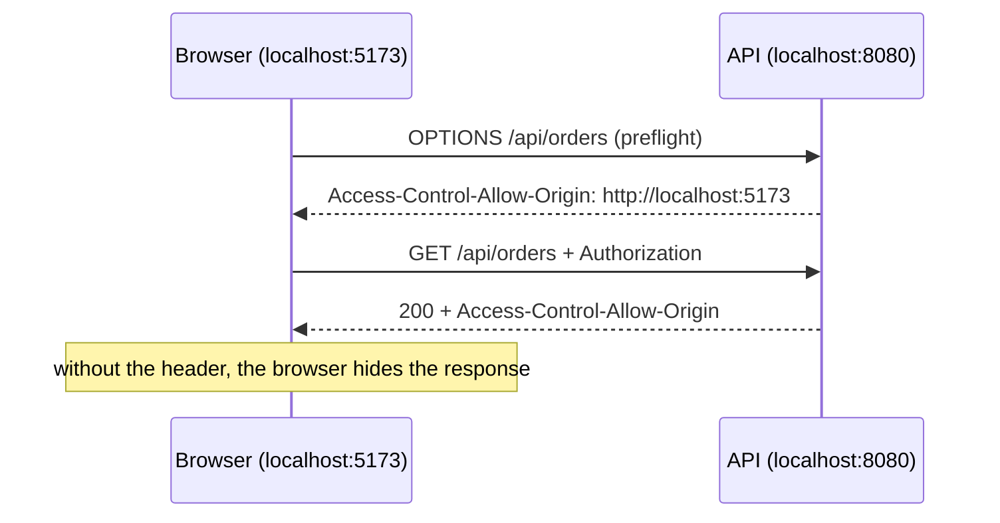

# Authorization, CORS & OpenAPI

> Session 7 · Spring Boot 3.3, springdoc 2.6 · See [Spring Boot API Development — Study Guide](index.md).

## 1. Objectives

By the end of this unit you will be able to:

- Restrict endpoints by role at the route level and at the method level.
- Enforce an ownership rule, so a user cannot read another user's data.
- Configure CORS deliberately and explain what it does and does not protect.
- Publish an OpenAPI contract and keep it accurate.
- Recognise the configuration risks: permissive CORS, missing ownership checks, leaked internals.

## 2. Roles and Authorities

Authentication established *who*. Authorization decides *what they may do*.

```java
@Bean
public SecurityFilterChain filterChain(HttpSecurity http) throws Exception {
    return http
        .csrf(AbstractHttpConfigurer::disable)
        .sessionManagement(s -> s.sessionCreationPolicy(SessionCreationPolicy.STATELESS))
        .authorizeHttpRequests(auth -> auth
            .requestMatchers("/api/auth/**").permitAll()
            .requestMatchers(HttpMethod.GET, "/api/products/**").permitAll()
            .requestMatchers("/api/admin/**").hasRole("ADMIN")
            .requestMatchers(HttpMethod.POST, "/api/orders/*/cancellation")
                .hasAnyRole("STAFF", "ADMIN")
            .anyRequest().authenticated())
        .addFilterBefore(jwtFilter, UsernamePasswordAuthenticationFilter.class)
        .build();
}
```

Rules are evaluated **in order**, first match wins. A broad rule placed early silently disables
the specific ones after it:

```java
// Wrong — everything matches the first rule; the admin rule is dead code
.requestMatchers("/api/**").authenticated()
.requestMatchers("/api/admin/**").hasRole("ADMIN")

// Right — specific first
.requestMatchers("/api/admin/**").hasRole("ADMIN")
.requestMatchers("/api/**").authenticated()
```

`hasRole("ADMIN")` looks for the authority `ROLE_ADMIN`. The prefix is added for you, so store
roles as `ROLE_ADMIN` and never write `hasRole("ROLE_ADMIN")`.

Method security expresses rules that URLs cannot:

```java
@Configuration
@EnableMethodSecurity
public class MethodSecurityConfiguration {}
```

```java
@PreAuthorize("hasRole('ADMIN')")
public void deleteProduct(long productId) { ... }

@PreAuthorize("hasRole('STAFF') or #customerId == authentication.principal.customerId")
public List<Order> ordersFor(long customerId) { ... }
```

## 3. Ownership

Role checks are not enough. Every authenticated customer has `ROLE_CUSTOMER`, and that is
exactly what makes this the most commonly missed vulnerability in the module.

```java
// Wrong — any authenticated user can read any order by guessing an id.
// This is IDOR: insecure direct object reference.
@GetMapping("/api/orders/{orderId}")
public OrderResponse findOne(@PathVariable long orderId) {
    return service.findById(orderId).map(OrderResponse::from).orElseThrow();
}
```

```java
// Right — the identity comes from the token, never from the request
@GetMapping("/api/orders/{orderId}")
public OrderResponse findOne(@PathVariable long orderId,
                             @AuthenticationPrincipal AppUserDetails principal) {
    return service.findByIdForUser(orderId, principal.userId())
                  .map(OrderResponse::from)
                  .orElseThrow(() -> new OrderNotFoundException(orderId));
}
```

```java
@Transactional(readOnly = true)
public Optional<Order> findByIdForUser(long orderId, long userId) {
    return orders.findById(orderId)
                 // 404 rather than 403: do not confirm that someone else's order exists.
                 .filter(o -> o.customerId() == userId || currentUserIsStaff());
}
```

```java
// Wrong — the client supplies the identity, so it can supply anyone's
@GetMapping("/api/orders")
public List<OrderResponse> list(@RequestParam long customerId) { ... }

// Right
@GetMapping("/api/orders")
public Page<OrderResponse> list(@AuthenticationPrincipal AppUserDetails principal,
                                Pageable pageable) {
    return service.listFor(principal.userId(), pageable).map(OrderResponse::from);
}
```

> **Real-world use. ** IDOR is consistently near the top of the OWASP list. It is easy to miss
> because every test passes: you are logged in as the owner of everything you test with.

## 4. CORS

A browser blocks a page on one origin from reading a response from another. CORS is the server
saying which origins may.



```java
@Bean
public CorsConfigurationSource corsConfigurationSource() {
    CorsConfiguration config = new CorsConfiguration();
    config.setAllowedOrigins(List.of("http://localhost:5173", "https://orderdesk.example"));
    config.setAllowedMethods(List.of("GET", "POST", "PUT", "PATCH", "DELETE", "OPTIONS"));
    config.setAllowedHeaders(List.of("Authorization", "Content-Type"));
    config.setAllowCredentials(true);
    config.setMaxAge(Duration.ofHours(1));

    UrlBasedCorsConfigurationSource source = new UrlBasedCorsConfigurationSource();
    source.registerCorsConfiguration("/api/**", config);
    return source;
}
```

```java
// Wrong — and the combination is rejected by browsers anyway
config.setAllowedOrigins(List.of("*"));
config.setAllowCredentials(true);

// Wrong — allows any origin, defeating the point
config.setAllowedOriginPatterns(List.of("*"));
```

Two things CORS is not. It is **not** authorization — `curl` and Postman ignore it entirely, so
it protects nothing outside a browser. And it is **not** CSRF protection, though the two are
often confused: this API is stateless and bearer-token authenticated, so there is no ambient
credential for CSRF to abuse.

## 5. OpenAPI

```xml
<dependency>
  <groupId>org.springdoc</groupId>
  <artifactId>springdoc-openapi-starter-webmvc-ui</artifactId>
  <version>2.6.0</version>
</dependency>
```

The specification appears at `/v3/api-docs` and a UI at `/swagger-ui.html`, generated from your
controllers — so it cannot drift from the code the way a hand-written document does.

```java
@Configuration
public class OpenApiConfiguration {

    @Bean
    public OpenAPI orderDeskApi() {
        final String scheme = "bearer-jwt";
        return new OpenAPI()
                .info(new Info().title("OrderDesk API").version("1.0")
                        .description("Back-office order management"))
                .addSecurityItem(new SecurityRequirement().addList(scheme))
                .components(new Components().addSecuritySchemes(scheme,
                        new SecurityScheme()
                                .type(SecurityScheme.Type.HTTP)
                                .scheme("bearer")
                                .bearerFormat("JWT")));
    }
}
```

```java
@Operation(summary = "Cancel an order",
           description = "Only orders that are PLACED or PICKING may be cancelled.")
@ApiResponses({
    @ApiResponse(responseCode = "204", description = "Cancelled"),
    @ApiResponse(responseCode = "404", description = "No such order",
                 content = @Content(schema = @Schema(implementation = ApiError.class))),
    @ApiResponse(responseCode = "409", description = "Already dispatched",
                 content = @Content(schema = @Schema(implementation = ApiError.class)))
})
@PostMapping("/{orderId}/cancellation")
public ResponseEntity<Void> cancel(@PathVariable long orderId) { ... }
```

Documenting the failure responses matters as much as the success one: it is what lets a front
end handle 409 differently from 404.

> **Tip.** Do not expose `/swagger-ui.html` publicly in production without thought. It is a map
> of your API. Restrict it by role, or disable it outside `local`.

## 6. Worked Example — A Secured Endpoint

```java
@RestController
@RequestMapping("/api/orders")
@Tag(name = "Orders")
public class OrderController {

    private final OrderService service;

    public OrderController(OrderService service) { this.service = service; }

    @Operation(summary = "List the caller's orders")
    @GetMapping
    public Page<OrderSummaryResponse> list(@AuthenticationPrincipal AppUserDetails principal,
                                           @PageableDefault(size = 20) Pageable pageable) {
        return service.listFor(principal.userId(), pageable).map(OrderSummaryResponse::from);
    }

    @Operation(summary = "Read one order")
    @GetMapping("/{orderId}")
    public OrderResponse findOne(@PathVariable long orderId,
                                 @AuthenticationPrincipal AppUserDetails principal) {
        return service.findByIdForUser(orderId, principal.userId())
                      .map(OrderResponse::from)
                      .orElseThrow(() -> new OrderNotFoundException(orderId));
    }

    @Operation(summary = "Cancel any order (staff only)")
    @PreAuthorize("hasAnyRole('STAFF', 'ADMIN')")
    @PostMapping("/{orderId}/cancellation")
    public ResponseEntity<Void> cancel(@PathVariable long orderId) {
        service.cancel(orderId);
        return ResponseEntity.noContent().build();
    }
}
```

Three levels at once: `list` is scoped to the caller, `findOne` checks ownership, `cancel`
requires a role.

## 7. Common Problems

### A rule is ignored

An earlier, broader matcher matched first. Order specific to general.

### `hasRole("ROLE_ADMIN")` never matches

`hasRole` adds the prefix. Write `hasRole("ADMIN")`.

### `@PreAuthorize` does nothing

`@EnableMethodSecurity` is missing, or the call is a self-invocation — same proxy limitation as
`@Transactional`.

### CORS errors in the browser but curl works

Correct and expected: CORS is browser-enforced. Add the origin to the configuration.

### CORS fails after adding Spring Security

The security chain must be aware of CORS. Add `.cors(Customizer.withDefaults())` to the chain.

### Swagger UI returns 401

`/v3/api-docs/**` and `/swagger-ui/**` are not permitted in the rules.

### One user can read another's data

No ownership check. A role is not an owner.

## 8. Practical Guidelines

- Order matchers specific to general, ending with `anyRequest().authenticated()`.
- Take the caller's identity from the token, never from a parameter or the body.
- Check ownership on every resource that belongs to a user.
- Return 404, not 403, for someone else's resource.
- List CORS origins explicitly; never `*` with credentials.
- Document failure responses, and restrict Swagger UI outside `local`.

## 9. Knowledge Check

1. Why does putting `/api/**` before `/api/admin/**` break the admin rule?
2. What is IDOR, and which endpoint in section 3 has it? Give the fix.
3. Why 404 rather than 403 for an order belonging to someone else?
4. Does CORS stop a `curl` request from another machine? Explain.
5. `@PreAuthorize` is ignored on a method called from within the same service. Why?

## 10. Further Reading

- [Spring Security: Authorization](https://docs.spring.io/spring-security/reference/servlet/authorization/index.html)
- [Spring Framework: CORS](https://docs.spring.io/spring-framework/reference/web/webmvc-cors.html)
- [OWASP: Broken Access Control](https://owasp.org/Top10/A01_2021-Broken_Access_Control/)
- [springdoc-openapi](https://springdoc.org/)

---

Next: [Lab 07 — Authorization, ownership, CORS and a published contract](lab-07.md), then [Testing Spring Applications](testing-spring-applications.md).
