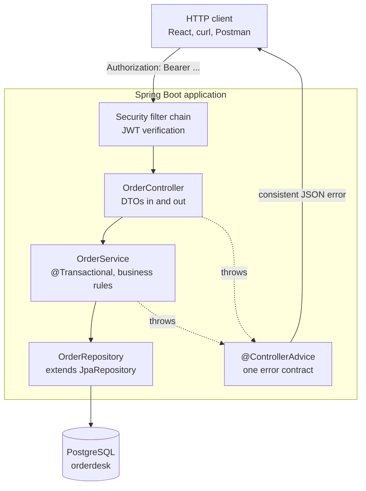

# Spring Boot API Development — Study Guide

This module turns the domain and persistence code from Java Core into an HTTP API that other
systems can call. Nothing here replaces what you learned there: the repositories, entities and
domain rules stay, and Spring supplies the wiring, the web layer, the transactions and the
security around them.

By the end you will have an API that a React application can consume, which is what the
Front-end track does next.

## 1. Module Map

| # | Note | Covers | Lab |
|---|---|---|---|
| 01 | [Spring Boot IoC, Beans, Dependency Injection & Configuration](ioc-beans-and-configuration.md) | the `ApplicationContext`, beans, constructor injection, profiles, externalized configuration | [Lab 01 — Bootstrap the API and wire it with configuration](lab-01.md) |
| 02 | [REST Controllers, DTOs & HTTP Semantics](rest-controllers-and-dtos.md) | resource URIs, methods, status codes, request and response binding, DTO boundaries, pagination | [Lab 02 — REST endpoints with a DTO boundary](lab-02.md) |
| 03 | [Spring Data JPA](spring-data-jpa.md) | repositories, derived and explicit queries, projections, pagination, mapping boundaries | [Lab 03 — Repositories, queries and projections](lab-03.md) |
| 04 | [Service Layer, Transactions & Locking](services-and-transactions.md) | business logic placement, `@Transactional`, rollback rules, invariants, locking | [Lab 04 — Services, transactions and an invariant](lab-04.md) |
| 05 | [Validation & Error Contracts](validation-and-error-contracts.md) | Bean Validation, `@ControllerAdvice`, one consistent error body | [Lab 05 — Validation and one error contract](lab-05.md) |
| 06 | [Authentication with Spring Security & JWT](authentication-and-jwt.md) | the filter chain, database-backed users, password hashing, JWT issue and verify | [Lab 06 — Authentication with JWT](lab-06.md) |
| 07 | [Authorization, CORS & OpenAPI](authorization-cors-and-openapi.md) | roles, route and method security, ownership checks, CORS, an OpenAPI contract | [Lab 07 — Authorization, ownership, CORS and a published contract](lab-07.md) |
| 08 | [Testing Spring Applications](testing-spring-applications.md) | slice tests, `@SpringBootTest`, Testcontainers, negative security paths | [Lab 08 — A test suite with real security paths](lab-08.md) |
| 09 | [Containerization, Configuration & Observability](containerization-and-observability.md) | Docker, Compose with a database, externalized configuration, health and metrics | [Lab 09 — Containerize, configure and observe](lab-09.md) |

[Spring Boot API Development — Appendix](appendix.md) maps the syllabus outline onto these notes and lists the
primary sources.

## 2. The Running Domain — OrderDesk as an API

Same schema, same domain objects. What changes is who calls them.



Two boundaries do most of the work in this module, and confusing them causes most of its bugs:

- **The DTO boundary** at the controller. Entities never leave the service layer. A JPA entity
  serialized straight to JSON leaks your schema, triggers lazy loading outside a transaction,
  and makes every column an API field you can never remove.
- **The transaction boundary** at the service. Not the controller, not the repository. A method
  that must be all-or-nothing is one `@Transactional` service method.

## 3. How to Use This Handbook

Read this page before session 1, then return to section 4 when the application will not start.

Each unit is a note plus a lab, and the labs build one API incrementally — lab 09 containerizes
what labs 01 to 08 built. Do not start each lab from a fresh project.

The long assignment is issued in session 1 and completed in unit 10.

## 4. Environment Setup

```bash
java -version      # expect 17.x
mvn -version       # expect 3.9.x, reporting Java 17
docker --version   # expect 27.x or later
docker compose version
psql --version     # expect 18.x
```

Generate the project from Spring Initializr rather than by hand:

```bash
curl https://start.spring.io/starter.zip \
  -d dependencies=web,data-jpa,validation,security,postgresql,actuator \
  -d javaVersion=17 -d bootVersion=4.1.1 -d type=maven-project \
  -d groupId=com.fsa -d artifactId=orderdesk-api \
  -d packageName=com.fsa.orderdesk -o orderdesk-api.zip
unzip orderdesk-api.zip -d orderdesk-api && cd orderdesk-api
./mvnw spring-boot:run
```

The application will fail to start until a database is configured. That is expected, and unit 1
explains the message.

> **Tip.** Use the Maven wrapper `./mvnw` that Initializr generates, not your own `mvn`. It
> pins the Maven version for everyone on the project.

Spring Boot 4 split its starters by module: `web` on Initializr becomes
`spring-boot-starter-webmvc`, and every starter you pick gets a matching `*-test` twin
(`spring-boot-starter-webmvc-test`, `spring-boot-starter-data-jpa-test`,
`spring-boot-starter-security-test`) at `test` scope. If you add a starter by hand later, add
its `-test` twin too, or the slice annotations in unit 8 will not be on the classpath.
JSON is Jackson 3 (`tools.jackson.*`), and tests run on JUnit 6 — the Jupiter API you know.

## 5. How to Study This Module

- **Read the startup log.** Spring tells you which beans it created and which it could not. Most
  "it does not work" questions in this module are answered in the first fifty lines.
- **Curl every endpoint you write.** A controller that compiles is not a controller that works;
  check the status code and the body shape, not just that a response arrived.
- **Keep SQL logging on.** Everything from Java Core unit 9 still applies, and Spring Data makes
  N+1 easier to create by accident.
- **Never trust a happy path alone.** Most of the difficulty in this module is in the failure
  paths: a wrong password, an expired token, another user's order, a validation error. Try each
  of them by hand before you call something finished.
- **Externalize configuration from day one.** A password in `application.yml` is the same
  mistake as a password in source.

## 6. Glossary

| Term | Meaning here |
|---|---|
| **IoC container** | The `ApplicationContext`: it constructs objects and supplies their dependencies |
| **Bean** | An object the container manages |
| **Component scan** | Finding annotated classes to register as beans |
| **Auto-configuration** | Spring Boot configuring beans based on what is on the classpath |
| **Starter** | A dependency bringing a coherent set of libraries |
| **DTO** | A type that exists to cross the API boundary |
| **Slice test** | A test loading part of the context — `@WebMvcTest`, `@DataJpaTest` |
| **Filter chain** | The ordered filters every request passes through before a controller |
| **JWT** | A signed token carrying identity claims |
| **Actuator** | Spring Boot's operational endpoints — health, metrics, info |

---

Start with [Spring Boot IoC, Beans, Dependency Injection & Configuration](ioc-beans-and-configuration.md).
