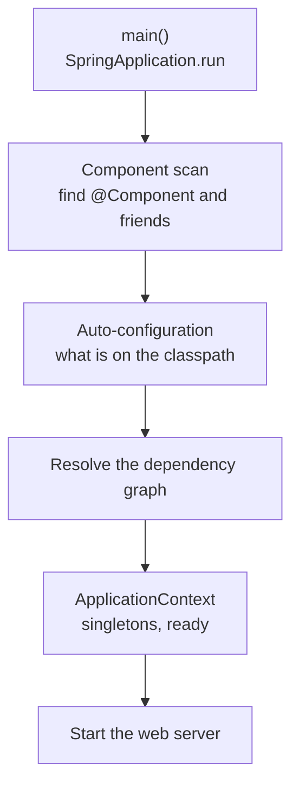

# Spring Boot IoC, Beans, Dependency Injection & Configuration

> Objectives: SBAD-K1 · Session 1 · Spring Boot 3.3, JDK 21 · See [Spring Boot API Development — Study Guide](index.md).

## 1. Objectives

After this unit, learners can:

- Explain the `ApplicationContext` as an IoC container and what it does at startup.
- Register beans by component scan and by `@Bean` method, and say when each is right.
- Use constructor injection and argue against field injection.
- Externalize configuration and bind it to a typed class.
- Use profiles to vary configuration without changing code.

## 2. Inversion of Control

In Java Core you wrote this by hand:

```java
DataSource dataSource = new HikariDataSource(config);
OrderRepository repository = new JdbcOrderRepository(dataSource);
OrderService service = new OrderService(repository);
```

Every object knew how to build its dependencies. That is fine for three objects and unworkable
for a hundred: the wiring code becomes the largest thing in the application, and changing one
constructor changes it everywhere.

Inversion of control turns it around. You declare what you need; the container constructs and
supplies it.

```java
@Service
public class OrderService {

    private final OrderRepository orders;

    // No annotation needed: a single constructor is used for injection.
    public OrderService(OrderRepository orders) {
        this.orders = orders;
    }
}
```

Nothing constructs `OrderService`. Spring does, and it finds an `OrderRepository` to pass in.

> **Note.** This is exactly the design from Java Core unit 4 — depend on an interface, take it
> through the constructor. Spring did not introduce that idea; it automates the wiring for it.

## 3. The `ApplicationContext`

At startup Spring builds a registry of beans and their dependencies.



Component scan starts at the package of your `@SpringBootApplication` class and searches
downward. That is why package layout matters:

```text
com.fsa.orderdesk            <- OrderDeskApplication lives here
├── api                      <- scanned
├── domain                   <- scanned
├── repository               <- scanned
└── service                  <- scanned

com.fsa.util                 <- NOT scanned: outside the root package
```

The stereotype annotations are the same thing with different labels:

| Annotation | Means |
|---|---|
| `@Component` | A bean. The generic form |
| `@Service` | A bean holding business logic |
| `@Repository` | A bean doing persistence; also translates persistence exceptions |
| `@RestController` | A bean handling HTTP and returning bodies |
| `@Configuration` | A class declaring `@Bean` methods |

Use `@Bean` when you do not own the class:

```java
@Configuration
public class ClockConfiguration {

    // Injecting a Clock rather than calling Instant.now() makes time testable.
    @Bean
    public Clock clock() {
        return Clock.system(ZoneId.of("Asia/Ho_Chi_Minh"));
    }
}
```

## 4. Constructor Injection

Three ways exist. Use the first.

```java
// Right — constructor injection
@Service
public class OrderService {
    private final OrderRepository orders;
    private final Clock clock;

    public OrderService(OrderRepository orders, Clock clock) {
        this.orders = orders;
        this.clock = clock;
    }
}

// Wrong — field injection
@Service
public class OrderService {
    @Autowired private OrderRepository orders;    // cannot be final
}
```

Field injection fails on four counts, and they are worth knowing because the argument comes up:

1. The field cannot be `final`, so the object is mutable after construction.
2. The class cannot be constructed in a plain unit test without reflection.
3. Its dependencies are invisible from the outside — the constructor no longer documents them.
4. A circular dependency is discovered at runtime instead of at startup.

`@Autowired` on a single constructor is redundant since Spring 4.3. Omit it.

> **Tip.** When a class needs five dependencies, constructor injection makes that obvious and
> uncomfortable, which is the point. Field injection hides it.

## 5. Externalized Configuration

Configuration lives outside the code, and secrets live outside the file.

```yaml
# src/main/resources/application.yml
spring:
  application:
    name: orderdesk-api
  datasource:
    url: jdbc:postgresql://localhost:5432/orderdesk
    username: ${DB_USERNAME:orderdesk}
    password: ${DB_PASSWORD}          # no default: fail fast if it is absent
  jpa:
    hibernate:
      ddl-auto: validate               # the schema is owned by SQL scripts
    properties:
      hibernate:
        format_sql: true

orderdesk:
  shipping:
    free-threshold: 500000
    standard-cost: 25000
```

`${DB_PASSWORD}` with no default is deliberate. A default password is a password that reaches
production.

Bind related properties to a typed class rather than scattering `@Value`:

```java
@ConfigurationProperties(prefix = "orderdesk.shipping")
@Validated
public record ShippingProperties(
        @NotNull @Positive BigDecimal freeThreshold,
        @NotNull @Positive BigDecimal standardCost) {}
```

```java
@SpringBootApplication
@EnableConfigurationProperties(ShippingProperties.class)
public class OrderDeskApplication {
    public static void main(String[] args) {
        SpringApplication.run(OrderDeskApplication.class, args);
    }
}
```

With `@Validated`, a missing or negative value fails at **startup**, naming the property — not
at 3am when the first order crosses the threshold.

```java
// Wrong — scattered, untyped, and unvalidated
@Value("${orderdesk.shipping.free-threshold}")
private BigDecimal freeThreshold;

// Right — one typed, validated object, injected like any other bean
public Checkout(ShippingProperties shipping) { this.shipping = shipping; }
```

## 6. Profiles

A profile names a set of configuration active in one environment.

```yaml
# application.yml — shared
orderdesk:
  shipping:
    free-threshold: 500000

---
spring:
  config:
    activate:
      on-profile: local
  jpa:
    show-sql: true

---
spring:
  config:
    activate:
      on-profile: prod
  jpa:
    show-sql: false
```

```bash
SPRING_PROFILES_ACTIVE=local ./mvnw spring-boot:run
```

Profiles can also select beans, which is how you swap an implementation without an `if`:

```java
@Configuration
public class PaymentConfiguration {

    @Bean
    @Profile("!prod")                 // any profile except prod
    public PaymentGateway stubGateway() {
        return new AlwaysApprovesGateway();
    }

    @Bean
    @Profile("prod")
    public PaymentGateway realGateway(PaymentProperties props) {
        return new HttpPaymentGateway(props);
    }
}
```

> **Note.** Resist a profile per developer. Profiles multiply the number of configurations
> nobody tests. `local`, `test` and `prod` is usually the whole list.

## 7. Worked Example — Wiring OrderDesk

```java
@SpringBootApplication
@EnableConfigurationProperties(ShippingProperties.class)
public class OrderDeskApplication {
    public static void main(String[] args) {
        SpringApplication.run(OrderDeskApplication.class, args);
    }
}
```

```java
@Service
public class OrderService {

    private static final Logger log = LoggerFactory.getLogger(OrderService.class);

    private final OrderRepository orders;
    private final ShippingProperties shipping;
    private final Clock clock;

    public OrderService(OrderRepository orders, ShippingProperties shipping, Clock clock) {
        this.orders = orders;
        this.shipping = shipping;
        this.clock = clock;
    }

    public Money shippingCost(Order order) {
        return order.total().amount().compareTo(shipping.freeThreshold()) >= 0
                ? Money.zero("VND")
                : new Money(shipping.standardCost(), "VND");
    }
}
```

No `new`, no `DataSource` construction, no configuration parsing. Startup proves the wiring:

```text
Started OrderDeskApplication in 2.416 seconds (process running for 2.7)
```

If a dependency is missing, startup fails and names it — which is the whole benefit over
discovering it on the first request.

## 8. Common Problems

### `Parameter 0 of constructor in ... required a bean of type 'X' that could not be found`

Either `X` is not annotated, or it is outside the scanned package tree. Read the "Action"
section Spring prints; it is usually right.

### `Field injection is not recommended` in the IDE

It is not just style. See section 4.

### `The dependencies of some of the beans form a cycle`

A depends on B and B on A. Extract the shared part into C. `@Lazy` will silence it and preserve
the design problem.

### `Failed to configure a DataSource: 'url' attribute is not specified`

`spring-boot-starter-data-jpa` is present but no datasource is configured. Set
`spring.datasource.url`, or remove the dependency if you did not mean to include it.

### `Could not resolve placeholder 'DB_PASSWORD'`

An environment variable with no default is absent. That is the intended behaviour — supply it.

### Two beans of the same type

`expected single matching bean but found 2`. Mark one `@Primary`, or inject by name with
`@Qualifier`.

## 9. Practical Guidelines

- Constructor injection, `final` fields, no `@Autowired` on a single constructor.
- Put your application class at the root of the package tree.
- Group configuration into `@ConfigurationProperties` records, and validate them.
- Never give a secret a default value.
- Use `@Bean` for types you do not own; `@Service` and friends for types you do.
- Inject a `Clock` rather than calling `Instant.now()`, so time is testable.

## 10. Knowledge Check

1. What does the `ApplicationContext` do between `main` and the first HTTP request?
2. Give three concrete problems with field injection that constructor injection avoids.
3. Why does `${DB_PASSWORD}` deliberately have no default?
4. A `@Service` in `com.fsa.util` is not found. Why, and what are two fixes?
5. When is `@Bean` correct rather than `@Service`?

## 11. Further Reading

- [Spring Framework: The IoC Container](https://docs.spring.io/spring-framework/reference/core/beans.html)
- [Spring Boot: Externalized Configuration](https://docs.spring.io/spring-boot/reference/features/external-config.html)
- [Spring Boot: Profiles](https://docs.spring.io/spring-boot/reference/features/profiles.html)

---

Next: [Lab 01 — Bootstrap the API and wire it with configuration](lab-01.md), then [REST Controllers, DTOs & HTTP Semantics](rest-controllers-and-dtos.md).
