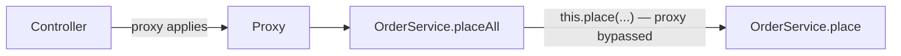
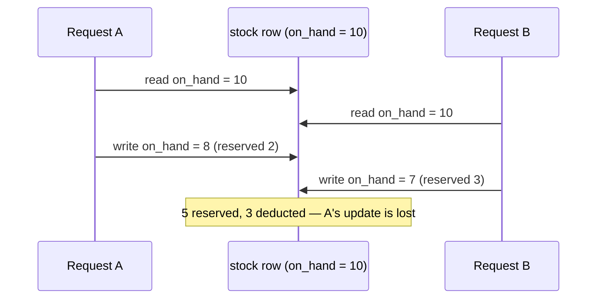

# Service Layer, Transactions & Locking

> Objectives: SBAD-K2 · Session 4 · Spring Boot 3.3 · See [Spring Boot API Development — Study Guide](index.md).

## 1. Objectives

After this unit, learners can:

- Place business logic in a service rather than in a controller or a repository.
- Apply `@Transactional` at the right boundary and explain why it is that one.
- Predict which exceptions roll back a transaction by default and change it deliberately.
- Enforce an invariant that spans several rows.
- Choose optimistic or pessimistic locking for a concurrent update.

## 2. Where Logic Belongs

Three layers, three jobs. Putting logic in the wrong one is the most common structural mistake
in this module.

| Layer | Does | Does not |
|---|---|---|
| Controller | Binds HTTP, maps DTOs, returns status codes | Contain business rules |
| Service | Business rules, transaction boundaries, orchestration | Know about HTTP |
| Repository | Persistence | Contain business rules |

```java
// Wrong — the rule lives in the controller, so it is untestable without HTTP
// and unavailable to any other caller.
@PostMapping("/api/orders/{id}/cancellation")
public ResponseEntity<Void> cancel(@PathVariable long id) {
    Order order = repository.findById(id).orElseThrow();
    if (order.getStatus() == OrderStatus.DISPATCHED) {
        return ResponseEntity.status(409).build();
    }
    order.setStatus(OrderStatus.CANCELLED);
    repository.save(order);
    return ResponseEntity.noContent().build();
}

// Right
@PostMapping("/api/orders/{id}/cancellation")
public ResponseEntity<Void> cancel(@PathVariable long id) {
    service.cancel(id);
    return ResponseEntity.noContent().build();
}
```

```java
@Service
public class OrderService {

    private final OrderRepository orders;

    public OrderService(OrderRepository orders) { this.orders = orders; }

    @Transactional
    public void cancel(long orderId) {
        Order order = orders.findById(orderId)
                            .orElseThrow(() -> new OrderNotFoundException(orderId));
        order.cancel();          // the rule lives on the domain object, from Java Core unit 3
        // no save() — the entity is managed, and dirty checking writes the change
    }
}
```

The controller now has no business knowledge, and `cancel` can be called from a scheduled job or
a message consumer without a fake HTTP request.

## 3. `@Transactional`

The annotation opens a transaction on entry and commits on normal return.

```java
@Transactional
public Order place(long customerId, List<NewLine> lines) {
    Order order = new Order(customerId, Instant.now(clock));
    for (NewLine line : lines) {
        Product product = products.findBySku(line.sku())
                .orElseThrow(() -> new UnknownSkuException(line.sku()));
        order.addLine(new OrderLine(product.id(), line.quantity(), product.unitPrice()));
    }
    return orders.save(order);          // order and every line commit together, or none do
}
```

**Put it on the service, not the controller and not the repository.** A repository method is a
single statement — too small a unit to be atomic in any useful sense. A controller boundary
holds the transaction open across DTO mapping and serialization.

Use `readOnly = true` for queries: it disables dirty checking and states intent.

```java
@Transactional(readOnly = true)
public Page<OrderResponse> list(Pageable pageable) { ... }
```

### Self-invocation does not work

This surprises everyone once. `@Transactional` is implemented with a proxy, so a call from
inside the same object does not go through it.

```java
@Service
public class OrderService {

    public void placeAll(List<NewOrder> requests) {
        for (NewOrder r : requests) {
            place(r);        // NOT transactional — an internal call bypasses the proxy
        }
    }

    @Transactional
    public void place(NewOrder request) { ... }
}
```



Move the annotated method to another bean, or annotate the outer method.

## 4. Rollback Rules

By default, Spring rolls back on `RuntimeException` and `Error`, and **commits** on a checked
exception. That default surprises people, so make it explicit when it matters.

```java
// Wrong — a checked exception commits the partial work
@Transactional
public void place(NewOrder request) throws InventoryException {
    orders.save(order);
    inventory.reserve(order);      // throws InventoryException — the order is committed anyway
}

// Right
@Transactional(rollbackFor = InventoryException.class)
public void place(NewOrder request) throws InventoryException { ... }
```

Catching an exception inside the transaction and not rethrowing also commits — the transaction
never learns anything went wrong.

```java
// Wrong — swallowed; the half-written state commits
@Transactional
public void place(NewOrder request) {
    try {
        inventory.reserve(order);
    } catch (InventoryException e) {
        log.warn("reservation failed", e);
    }
}
```

## 5. Invariants Across Rows

Some rules cannot live on one entity: "an order's reserved stock may not exceed what is on
hand" spans two tables.

```java
@Transactional
public void reserve(long orderId) {
    Order order = orders.findById(orderId)
                        .orElseThrow(() -> new OrderNotFoundException(orderId));

    for (OrderLine line : order.lines()) {
        Stock stock = stockRepository.findByProductIdForUpdate(line.productId())
                .orElseThrow(() -> new OutOfStockException(line.productId()));

        if (stock.available() < line.quantity()) {
            // Throwing unrolls everything reserved so far in this transaction.
            throw new InsufficientStockException(line.productId(),
                    line.quantity(), stock.available());
        }
        stock.reserve(line.quantity());
    }
    order.markReserved();
}
```

The invariant holds because the whole loop is one transaction: a failure on the fourth line
releases the first three.

> **Note.** Where the rule can be expressed as a database constraint, prefer that — it holds
> against every writer, including a script. Database Foundations covered `CHECK` and `UNIQUE`;
> a service-level invariant is for what a constraint cannot express.

## 6. Locking

Two transactions reading, deciding and writing the same row will lose an update — the anomaly
demonstrated in Database Foundations, now in application code.



### Optimistic

A version column. Whoever commits second fails and retries. Right when conflicts are rare.

```java
@Entity
public class Stock {
    @Id private Long id;
    @Version private long version;      // Hibernate manages this
    private int onHand;
}
```

The `UPDATE` becomes `... WHERE id = ? AND version = ?`. If it affects no rows, Spring throws
`OptimisticLockingFailureException`.

```java
@Transactional
public void reserveWithRetry(long orderId) {
    for (int attempt = 1; attempt <= 3; attempt++) {
        try {
            reserve(orderId);
            return;
        } catch (OptimisticLockingFailureException e) {
            if (attempt == 3) throw e;      // give up, and say so
        }
    }
}
```

### Pessimistic

Lock the row on read. Right when conflicts are common and retrying is expensive.

```java
public interface StockRepository extends JpaRepository<Stock, Long> {

    @Lock(LockModeType.PESSIMISTIC_WRITE)      // SELECT ... FOR UPDATE
    @Query("SELECT s FROM Stock s WHERE s.productId = :productId")
    Optional<Stock> findByProductIdForUpdate(@Param("productId") long productId);
}
```

| | Optimistic | Pessimistic |
|---|---|---|
| Cost when uncontended | none | a lock held for the transaction |
| On conflict | fails at commit, retry | the second waits |
| Risk | retry storms | deadlock, lock timeouts |
| Use when | conflicts are rare | conflicts are common |

Always lock rows in a consistent order. Two transactions locking A then B, and B then A,
deadlock.

## 7. Worked Example

```java
@Service
public class OrderService {

    private final OrderRepository orders;
    private final ProductRepository products;
    private final StockRepository stock;
    private final Clock clock;

    public OrderService(OrderRepository orders, ProductRepository products,
                        StockRepository stock, Clock clock) {
        this.orders = orders;
        this.products = products;
        this.stock = stock;
        this.clock = clock;
    }

    @Transactional
    public Order place(long customerId, List<NewLine> requested) {
        if (requested.isEmpty()) {
            throw new EmptyOrderException();          // an order of nothing is not an order
        }
        Order order = new Order(customerId, Instant.now(clock));

        for (NewLine line : requested) {
            Product product = products.findBySku(line.sku())
                    .orElseThrow(() -> new UnknownSkuException(line.sku()));
            if (!product.isActive()) {
                throw new InactiveProductException(line.sku());
            }
            Stock s = stock.findByProductIdForUpdate(product.id())
                    .orElseThrow(() -> new OutOfStockException(line.sku()));
            if (s.available() < line.quantity()) {
                throw new InsufficientStockException(line.sku(), line.quantity(), s.available());
            }
            s.reserve(line.quantity());
            order.addLine(new OrderLine(product.id(), line.quantity(), product.unitPrice()));
        }
        return orders.save(order);
    }

    @Transactional(readOnly = true)
    public Optional<Order> findById(long orderId) {
        return orders.findById(orderId);
    }
}
```

Every throw unrolls the whole method. There is no state in which some stock is reserved and no
order exists.

## 8. Common Problems

### `@Transactional` appears to do nothing

Self-invocation, or the method is not public, or the class is not a Spring bean.

### A checked exception left half-written state

The default rolls back only on unchecked. Use `rollbackFor`.

### `LazyInitializationException` in the controller

The transaction ended at the service boundary. Map to DTOs inside it.

### `OptimisticLockingFailureException` under load

Two writers hit one row. Retry with a bounded loop, or switch to pessimistic locking.

### `CannotAcquireLockException` / deadlock

Rows locked in different orders by different transactions. Impose one order.

### `TransactionRequiredException` on an update query

A `@Modifying` query without a transaction.

## 9. Practical Guidelines

- Business rules in the service or on the domain object, never in the controller.
- `@Transactional` on service methods; `readOnly = true` for queries.
- Never call an annotated method from within the same bean.
- Set `rollbackFor` when a checked exception must roll back.
- Prefer a database constraint where one can express the rule.
- Lock in a consistent order, and bound every retry loop.

## 10. Knowledge Check

1. Why does the transaction boundary belong on the service rather than the controller?
2. `placeAll` loops calling `this.place(...)`, which is `@Transactional`. What actually happens?
3. Which exceptions roll back by default? Give a case where the default is wrong.
4. Contrast optimistic and pessimistic locking, and give a case for each.
5. A service catches an exception, logs it, and returns normally. What is the state of the
   transaction?

## 11. Further Reading

- [Spring: Transaction Management](https://docs.spring.io/spring-framework/reference/data-access/transaction.html)
- [Spring Data JPA: Locking](https://docs.spring.io/spring-data/jpa/reference/jpa/locking.html)

---

Next: [Lab 04 — Services, transactions and an invariant](lab-04.md), then [Validation & Error Contracts](validation-and-error-contracts.md).
