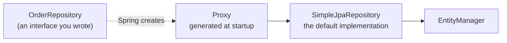

# Spring Data JPA

> Objectives: SBAD-K2 · Session 3 · Spring Boot 3.3, Hibernate 6.4 · See [Spring Boot API Development — Study Guide](index.md).

## 1. Objectives

After this unit, learners can:

- Declare a repository interface and explain where the implementation comes from.
- Write derived query methods and know when to switch to `@Query`.
- Return a `Page` and a projection rather than whole entity lists.
- Keep the mapping boundary at the service layer.
- Recognise an N+1 introduced by a derived query and fix it.

## 2. Repositories Without Implementations

In Java Core you wrote `JdbcOrderRepository` and `JpaOrderRepository` by hand. Spring Data
writes them for you from the interface.

```java
public interface OrderRepository extends JpaRepository<Order, Long> {
}
```

`JpaRepository` supplies `findById`, `findAll`, `save`, `deleteById`, `count` and about fifteen
more. There is no implementation class in your source tree — Spring creates a proxy at startup.



> **Note.** This is the interface from Java Core unit 4 with the implementation removed rather
> than the idea removed. Your service still depends on an interface, and still does not know
> what backs it.

## 3. Derived Queries

Spring parses the method name into a query. The vocabulary is small and worth learning exactly.

```java
public interface OrderRepository extends JpaRepository<Order, Long> {

    List<Order> findByCustomerId(long customerId);

    List<Order> findByStatus(OrderStatus status);

    List<Order> findByCustomerIdAndStatus(long customerId, OrderStatus status);

    List<Order> findByPlacedAtBetween(Instant from, Instant to);

    List<Order> findByStatusOrderByPlacedAtDesc(OrderStatus status);

    Optional<Order> findFirstByCustomerIdOrderByPlacedAtDesc(long customerId);

    long countByStatus(OrderStatus status);

    boolean existsByCustomerIdAndStatus(long customerId, OrderStatus status);
}
```

| Keyword | Becomes |
|---|---|
| `And`, `Or` | `AND`, `OR` |
| `Between`, `LessThan`, `GreaterThanEqual` | range comparisons |
| `IsNull`, `IsNotNull` | `IS NULL` |
| `Like`, `Containing`, `StartingWith` | `LIKE` |
| `In` | `IN (...)` |
| `OrderBy...Desc` | `ORDER BY ... DESC` |
| `First`, `Top10` | `LIMIT` |

Property names must match the entity's fields. `findByCustomerId` needs a `customerId` field —
a typo becomes a startup failure, which is the good case.

```text
Wrong — property does not exist
No property 'custmerId' found for type 'Order'

Right
findByCustomerId(long customerId)
```

Method names stop being readable quickly. This is the signal to write the query:

```java
// Wrong — nobody can read this, and one more condition makes it worse
List<Order> findByCustomerIdAndStatusNotAndPlacedAtBetweenOrderByPlacedAtDesc(...);

// Right
@Query("""
        SELECT o FROM Order o
        WHERE  o.customerId = :customerId
          AND  o.status <> :excluded
          AND  o.placedAt BETWEEN :from AND :to
        ORDER  BY o.placedAt DESC
        """)
List<Order> findHistory(@Param("customerId") long customerId,
                        @Param("excluded") OrderStatus excluded,
                        @Param("from") Instant from,
                        @Param("to") Instant to);
```

## 4. `@Query`

JPQL by default; native SQL when you need engine-specific features.

```java
// JPQL — entities and fields, portable
@Query("SELECT o FROM Order o WHERE o.customerId = :id")
List<Order> byCustomer(@Param("id") long id);

// Native — tables and columns, when you need something JPQL cannot express
@Query(value = "SELECT * FROM orders WHERE status = :status", nativeQuery = true)
List<Order> byStatusNative(@Param("status") String status);

// Modifying — requires both annotations, and a transaction
@Modifying
@Transactional
@Query("UPDATE Order o SET o.status = :status WHERE o.id = :id")
int updateStatus(@Param("id") long id, @Param("status") OrderStatus status);
```

Two traps. A `@Modifying` query bypasses the persistence context, so entities already loaded
still hold the old value — clear the context or reload. And never concatenate into a query
string: `@Param` is the injection defence here, exactly as `?` was in JDBC.

```java
// Wrong — injection, in JPQL just as in SQL
@Query("SELECT o FROM Order o WHERE o.status = '" + status + "'")

// Right
@Query("SELECT o FROM Order o WHERE o.status = :status")
```

## 5. Pagination and Projections

Add a `Pageable` parameter and return a `Page`:

```java
Page<Order> findByStatus(OrderStatus status, Pageable pageable);
```

```java
Pageable page = PageRequest.of(0, 20,
        Sort.by(Sort.Direction.DESC, "placedAt").and(Sort.by("id")));
Page<Order> orders = repository.findByStatus(OrderStatus.PLACED, page);
```

`Page` runs a second `count` query to populate `totalElements`. When you do not need the total,
`Slice` skips it.

Projections avoid loading entities you will not use:

```java
// Interface projection — Spring generates the implementation
public interface OrderSummary {
    Long getId();
    Instant getPlacedAt();
    String getStatus();
}

Page<OrderSummary> findByCustomerId(long customerId, Pageable pageable);
```

```java
// Record projection — explicit, and my preference for anything non-trivial
public record OrderTotal(Long orderId, Instant placedAt, BigDecimal total) {}

@Query("""
        SELECT new com.fsa.orderdesk.query.OrderTotal(o.id, o.placedAt,
                                                      SUM(l.quantity * l.unitPrice))
        FROM   Order o JOIN o.lines l
        WHERE  o.customerId = :customerId
        GROUP  BY o.id, o.placedAt
        """)
List<OrderTotal> totalsFor(@Param("customerId") long customerId);
```

## 6. The Mapping Boundary

Spring Data returns entities. They must not reach the controller — unit 2's rule, restated
because Spring Data makes it easy to break.

```java
// Wrong — the repository's entities go straight out
@GetMapping("/api/orders")
public List<Order> list() { return repository.findAll(); }

// Right — the service maps, inside its transaction
@Service
public class OrderService {

    private final OrderRepository repository;

    public OrderService(OrderRepository repository) { this.repository = repository; }

    @Transactional(readOnly = true)
    public Page<OrderResponse> list(Pageable pageable) {
        return repository.findAll(pageable).map(OrderResponse::from);
    }
}
```

`readOnly = true` matters: it tells Hibernate not to dirty-check, which is both faster and a
statement of intent.

## 7. Worked Example — And an N+1 to Avoid

```java
public interface OrderRepository extends JpaRepository<Order, Long> {

    Page<Order> findByCustomerId(long customerId, Pageable pageable);

    // Same query, with the lines fetched. Note the separate countQuery: a
    // fetch-joined count is invalid, and Spring cannot derive one.
    @Query(value = """
            SELECT DISTINCT o FROM Order o
            LEFT JOIN FETCH o.lines
            WHERE  o.customerId = :customerId
            """,
           countQuery = "SELECT COUNT(o) FROM Order o WHERE o.customerId = :customerId")
    Page<Order> findByCustomerIdWithLines(@Param("customerId") long customerId, Pageable pageable);
}
```

```java
@Transactional(readOnly = true)
public Page<OrderResponse> history(long customerId, Pageable pageable) {
    // Uses the fetch-joined query: OrderResponse.from touches order.lines().
    return repository.findByCustomerIdWithLines(customerId, pageable)
                     .map(OrderResponse::from);
}
```

```java
@Test
void historyIssuesOneQueryPerPage() {
    statistics.clear();
    service.history(42, PageRequest.of(0, 20));
    // 1 for the page, 1 for the count. Not 22.
    assertEquals(2, statistics.getPrepareStatementCount());
}
```

The mapping is the trap. `findByCustomerId` looks identical at the call site and produces 21
queries because `OrderResponse.from` touches the lazy collection.

## 8. Common Problems

### `No property 'x' found for type 'Order'`

A typo in a derived method name, or a field that does not exist. Startup fails, which is the
best time to find out.

### `InvalidDataAccessApiUsageException: Executing an update/delete query`

A `@Modifying` query without a transaction. Add `@Transactional`, on the service by preference.

### An entity still holds the old value after a `@Modifying` update

The query bypassed the persistence context. Reload, or add
`@Modifying(clearAutomatically = true)`.

### `Page` returns the wrong total with a fetch join

Provide an explicit `countQuery`.

### `LazyInitializationException` in the controller

An entity escaped the service, or mapping happened outside the transaction. Map inside a
`@Transactional` method.

### A list endpoint issues one query per row

A derived query plus a mapper that touches an association. Use a fetch join, or a projection.

## 9. Practical Guidelines

- Extend `JpaRepository`; write no implementation.
- Use derived queries while the name stays readable; switch to `@Query` when it does not.
- Always `@Param`, never concatenation.
- Return `Page` from list endpoints, with a unique tie-break in the sort.
- Map to DTOs in a `@Transactional(readOnly = true)` service method.
- Assert query counts in a test for any endpoint that maps an association.

## 10. Knowledge Check

1. Where is the implementation of `OrderRepository`, and when is it created?
2. `findByCustomerIdAndStatusNotAndPlacedAtBetween` — what is wrong with it, and what replaces it?
3. Why does a `@Modifying` query leave loaded entities stale?
4. Why does a fetch-joined `Page` need an explicit `countQuery`?
5. Two service methods differ only in the repository method they call; one issues 2 queries and
   the other 22. Explain.

## 11. Further Reading

- [Spring Data JPA reference](https://docs.spring.io/spring-data/jpa/reference/)
- [Query methods](https://docs.spring.io/spring-data/jpa/reference/jpa/query-methods.html)
- [Projections](https://docs.spring.io/spring-data/jpa/reference/repositories/projections.html)

---

Next: [Lab 03 — Repositories, queries and projections](lab-03.md), then [Service Layer, Transactions & Locking](services-and-transactions.md).
