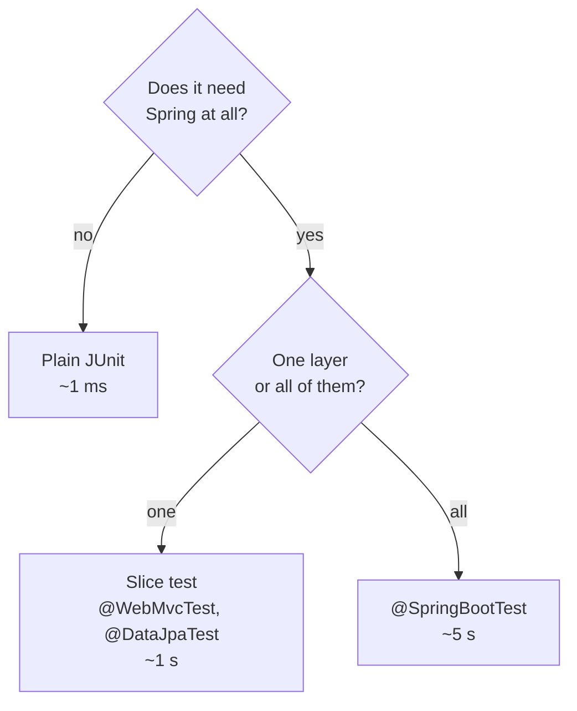

# Testing Spring Applications

> Session 8 · Spring Boot 4.1, JUnit 6, Testcontainers 2 · See [Spring Boot API Development — Study Guide](index.md).

## 1. Objectives

By the end of this unit you will be able to:

- Choose between a plain unit test, a slice test and a full context test.
- Test a controller with `@WebMvcTest` and a mocked service.
- Test repositories against a real database with Testcontainers.
- Write end-to-end tests including negative security paths.
- Keep the suite fast by loading the smallest context that answers the question.

## 2. Choose the Smallest Test



| Test | Loads | Use for |
|---|---|---|
| Plain JUnit | nothing | Domain objects, pure logic |
| `@WebMvcTest` | web layer only | Controllers: binding, status, validation |
| `@DataJpaTest` | JPA layer only | Repositories, queries, mappings |
| `@SpringBootTest` | everything | Wiring, security, end-to-end flows |

Most of the suite should be the first row. A service whose dependencies are interfaces needs no
Spring at all — the point of Java Core unit 4, again.

```java
class OrderServiceTest {

    private final InMemoryOrderRepository orders = new InMemoryOrderRepository();
    private final OrderService service =
            new OrderService(orders, Clock.fixed(FIXED, ZoneOffset.UTC));

    @Test
    void cancellingADispatchedOrderIsRejected() {
        long id = orders.save(dispatchedOrder());
        assertThrows(IllegalStateException.class, () -> service.cancel(id));
    }
}
```

A fixed `Clock` is why the service took one in unit 1: time-dependent assertions become
deterministic.

## 3. Controller Slice Tests

`@WebMvcTest` loads controllers, the error advice, converters and security — and nothing else.
Collaborators are mocked.

```java
@WebMvcTest(OrderController.class)
class OrderControllerTest {

    @Autowired private MockMvc mvc;
    @MockitoBean private OrderService service;

    // The slice loads SecurityFilterChain beans and every Filter — including our
    // JwtAuthenticationFilter — but no @Service. Mock what the filter needs, or the
    // context fails with "required a bean of type JwtService".
    @MockitoBean private JwtService jwt;
    @MockitoBean private UserDetailsService users;

    @Test
    void returnsAnOrder() throws Exception {
        when(service.findByIdFor(eq(5001L), any())).thenReturn(Optional.of(anOrder()));

        mvc.perform(get("/api/orders/5001").with(user(principal(42))))
           .andExpect(status().isOk())
           .andExpect(jsonPath("$.id").value(5001))
           .andExpect(jsonPath("$.status").value("PLACED"));
    }

    @Test
    void returns404WhenMissing() throws Exception {
        when(service.findByIdFor(anyLong(), any())).thenReturn(Optional.empty());

        mvc.perform(get("/api/orders/9999").with(user(principal(42))))
           .andExpect(status().isNotFound())
           .andExpect(jsonPath("$.message").exists());     // the ApiError contract
    }

    @Test
    void rejectsAnInvalidBodyWithFieldErrors() throws Exception {
        mvc.perform(post("/api/orders").with(user(principal(42)))
                .contentType(MediaType.APPLICATION_JSON)
                .content("""
                        {"customerId": null, "lines": [{"sku": "bad", "quantity": 0}]}
                        """))
           .andExpect(status().isBadRequest())
           .andExpect(jsonPath("$.fieldErrors[*].field",
                   hasItems("customerId", "lines[0].sku", "lines[0].quantity")));
    }
}
```

That third test is worth the effort: it pins the error contract from unit 5, so a change to the
advice cannot silently break every client.

## 4. Repository Tests

`@DataJpaTest` loads JPA only, and by default swaps in an in-memory database — which is exactly
what you do not want, because H2 is not PostgreSQL. Test against the real engine.

```java
@DataJpaTest
@AutoConfigureTestDatabase(replace = AutoConfigureTestDatabase.Replace.NONE)
@Testcontainers
class OrderRepositoryTest {

    @Container
    @ServiceConnection                       // Boot wires the datasource to this container
    static PostgreSQLContainer<?> postgres =
            new PostgreSQLContainer<>("postgres:18-alpine")
                    .withInitScript("schema.sql");   // labs/dbf/orderdesk-schema, copied to src/test/resources

    @Autowired private OrderRepository repository;
    @Autowired private TestEntityManager em;

    @Test
    void findsByCustomerOrderedByDateDescending() {
        em.persist(orderFor(42, "2026-01-01T00:00:00Z"));
        em.persist(orderFor(42, "2026-03-01T00:00:00Z"));
        em.flush();

        List<Order> found = repository.findByCustomerIdOrderByPlacedAtDesc(42);

        assertThat(found).hasSize(2);
        assertThat(found.get(0).placedAt()).isAfter(found.get(1).placedAt());
    }
}
```

> **Note.** Reusing the supplied `schema.sql` as the init script means the tests validate the
> same DDL you ship. An H2 dialect difference — an unsupported type, a different `CHECK` syntax —
> would otherwise be discovered in production.

## 5. Full Context and Security

```java
@SpringBootTest(webEnvironment = SpringBootTest.WebEnvironment.RANDOM_PORT)
@Testcontainers
@AutoConfigureMockMvc
class OrderApiIT {

    @Container
    @ServiceConnection
    static PostgreSQLContainer<?> postgres = new PostgreSQLContainer<>("postgres:18-alpine");

    @Autowired private MockMvc mvc;
    @Autowired private JsonMapper json;        // Jackson 3: tools.jackson.databind.json.JsonMapper

    @Test
    void unauthenticatedRequestsAreRejected() throws Exception {
        mvc.perform(get("/api/orders")).andExpect(status().isUnauthorized());
    }

    @Test
    void aCustomerCannotReadAnotherCustomersOrder() throws Exception {
        long otherOrder = seedOrderFor(customer(99));
        String token = login("mai@example.com", "correct-horse");   // customer 42

        // 404, not 403: the response must not confirm the order exists.
        mvc.perform(get("/api/orders/" + otherOrder).header("Authorization", "Bearer " + token))
           .andExpect(status().isNotFound());
    }

    @Test
    void aCustomerCannotCancelAnyOrder() throws Exception {
        String token = login("mai@example.com", "correct-horse");
        mvc.perform(post("/api/orders/" + seedOrderFor(customer(42)) + "/cancellation")
                        .header("Authorization", "Bearer " + token))
           .andExpect(status().isForbidden());
    }

    @Test
    void anExpiredTokenIsRejected() throws Exception {
        mvc.perform(get("/api/orders").header("Authorization", "Bearer " + expiredToken()))
           .andExpect(status().isUnauthorized());
    }

    @Test
    void placingAnOrderPersistsItAndReturns201() throws Exception {
        String token = login("mai@example.com", "correct-horse");

        mvc.perform(post("/api/orders").header("Authorization", "Bearer " + token)
                        .contentType(MediaType.APPLICATION_JSON)
                        .content(json.writeValueAsString(aCreateRequest())))
           .andExpect(status().isCreated())
           .andExpect(header().exists("Location"))
           .andExpect(jsonPath("$.id").isNumber());
    }
}
```

**The negative security tests are the point of this section.** A suite that only tests the happy
path passes just as well against an API with no authorization at all.

## 6. Keeping It Fast

Every distinct Spring context is built once and cached. Vary the configuration between test
classes and you build several.

```java
// Wrong — a unique property per class, so no context is ever reused
@SpringBootTest(properties = "orderdesk.shipping.free-threshold=1")

// Right — one shared configuration, and one static container for the whole suite
@SpringBootTest
```

```java
// A single container for every test class that extends this.
public abstract class AbstractIntegrationTest {

    static final PostgreSQLContainer<?> POSTGRES =
            new PostgreSQLContainer<>("postgres:18-alpine");

    static { POSTGRES.start(); }        // started once, never stopped: the JVM ends with it

    @DynamicPropertySource
    static void datasource(DynamicPropertyRegistry registry) {
        registry.add("spring.datasource.url", POSTGRES::getJdbcUrl);
        registry.add("spring.datasource.username", POSTGRES::getUsername);
        registry.add("spring.datasource.password", POSTGRES::getPassword);
    }
}
```

Isolate by transaction rather than by rebuilding data:

```java
@Transactional        // each test rolls back, so tests cannot see each other's writes
class OrderServiceIT extends AbstractIntegrationTest { ... }
```

## 7. Common Problems

### `@MockBean` cannot be resolved

Removed in Spring Boot 4. Use `@MockitoBean` (from `org.springframework.test.context.bean.override.mockito`).

### `@WebMvcTest` / `@DataJpaTest` cannot be resolved

Boot 4 moved the slice annotations into per-module test starters. Add
`spring-boot-starter-webmvc-test` or `spring-boot-starter-data-jpa-test` at `test` scope.

### `@WebMvcTest` fails with "no qualifying bean of type OrderService"

Slice tests load no services. Add `@MockitoBean` — and the same for `JwtService` and
`UserDetailsService`, which the security filter drags in.

### Everything returns 401 in a `@WebMvcTest`

Security is loaded in the web slice. Use `.with(user(...))` or `@WithMockUser`.

### Tests pass alone and fail together

Shared state. Add `@Transactional`, or reset between tests.

### The suite takes minutes

Too many distinct contexts, or a container per class. Share both.

### `@DataJpaTest` passes but production fails

H2 replaced PostgreSQL. Add `@AutoConfigureTestDatabase(replace = NONE)` and a container.

## 8. Practical Guidelines

- Plain JUnit for anything not needing Spring; that is most of the suite.
- `@WebMvcTest` for controllers, with the service mocked.
- Real PostgreSQL via Testcontainers for repositories — never H2.
- Test at least four negative security paths: no token, expired token, wrong role, another
  user's resource.
- One shared context and one shared container.
- Assert the error contract, not just the status code.

## 9. Knowledge Check

1. Which test type for: `Money.plus`; a controller's validation; a derived query; an
   authorization rule?
2. Why is `@DataJpaTest` with H2 dangerous when production is PostgreSQL?
3. Name four negative security tests every secured API should have.
4. Why does varying `properties` per test class slow the suite?
5. A `@WebMvcTest` fails with 401 for an endpoint that works in the browser. Why?

## 10. Further Reading

- [Spring Boot: Testing](https://docs.spring.io/spring-boot/reference/testing/index.html)
- [Testcontainers for Java](https://java.testcontainers.org/)
- [Spring Security: Testing](https://docs.spring.io/spring-security/reference/servlet/test/index.html)

---

Next: [Lab 08 — A test suite with real security paths](lab-08.md), then [Containerization, Configuration & Observability](containerization-and-observability.md).
