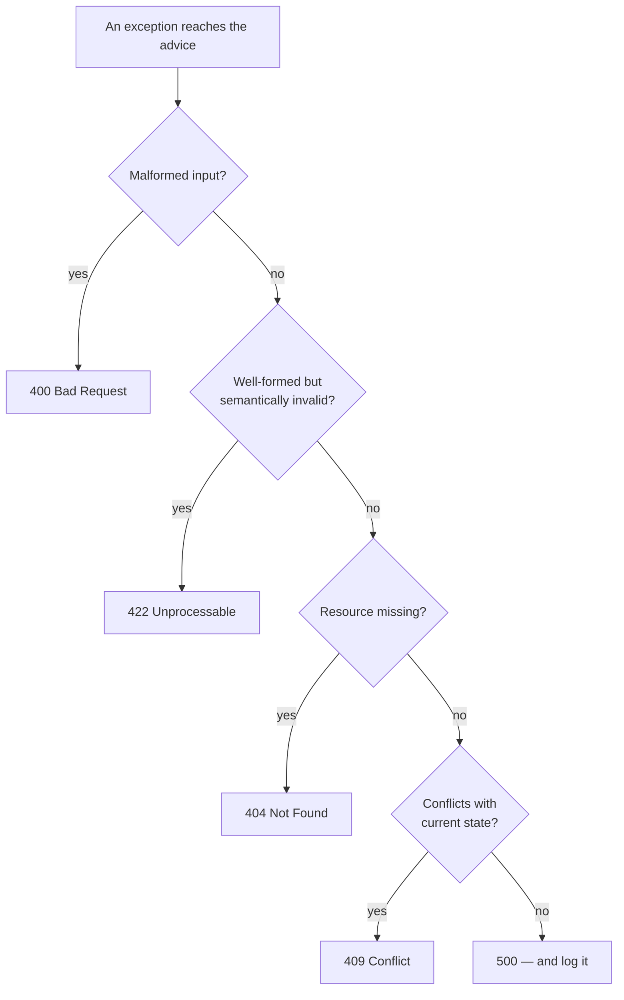

# Validation & Error Contracts

> Session 5 · Spring Boot 3.3, Jakarta Validation 3.0 · See [Spring Boot API Development — Study Guide](index.md).

## 1. Objectives

By the end of this unit you will be able to:

- Validate request bodies declaratively with Bean Validation.
- Validate nested objects and collections.
- Write a `@ControllerAdvice` producing one error body for the whole API.
- Map domain exceptions to correct status codes in one place.
- Return field-level errors a client can display next to the input.

## 2. Bean Validation

Constraints go on the request DTO, and `@Valid` on the parameter turns them on.

```java
public record CreateOrderRequest(

        @NotNull(message = "customerId is required")
        Long customerId,

        @NotEmpty(message = "an order must have at least one line")
        @Valid                                  // cascade into each element
        List<CreateOrderLineRequest> lines) {}

public record CreateOrderLineRequest(

        @NotBlank(message = "sku is required")
        @Pattern(regexp = "[A-Z]{2}-\\d{2}", message = "sku must look like KB-01")
        String sku,

        @Positive(message = "quantity must be greater than zero")
        @Max(value = 999, message = "quantity may not exceed 999")
        int quantity) {}
```

```java
@PostMapping
public ResponseEntity<OrderResponse> create(@Valid @RequestBody CreateOrderRequest request) { ... }
```

Without `@Valid` on the parameter the annotations are inert. That is the most common reason
"validation does not work".

The constraints worth knowing:

| Constraint | Rejects |
|---|---|
| `@NotNull` | null |
| `@NotEmpty` | null, empty string or collection |
| `@NotBlank` | null, empty, whitespace-only |
| `@Size(min, max)` | out-of-range length |
| `@Positive`, `@PositiveOrZero` | non-positive numbers |
| `@Min`, `@Max` | out-of-range values |
| `@Email` | malformed addresses |
| `@Pattern(regexp)` | non-matching strings |
| `@Past`, `@Future` | dates on the wrong side of now |

```java
// Wrong — @NotEmpty on a nested list checks the list, not its elements
@NotEmpty List<CreateOrderLineRequest> lines

// Right — @Valid cascades, so each element's constraints run too
@NotEmpty @Valid List<CreateOrderLineRequest> lines
```

> **Note.** Bean Validation is for shape: is this input well-formed? "Does this SKU exist" is a
> business rule and belongs in the service — it needs a database.

## 3. What Happens on Failure

A failed `@Valid` throws `MethodArgumentNotValidException`, which Spring turns into a `400` with
a large, framework-shaped body that leaks class names. Replace it.

## 4. One Error Contract

Every error from the API should have the same shape, whatever caused it. Clients parse one
structure; support reads one format.

```java
public record ApiError(
        Instant timestamp,
        int status,
        String error,
        String message,
        String path,
        List<FieldError> fieldErrors) {

    public record FieldError(String field, String message, Object rejectedValue) {}
}
```

```java
@RestControllerAdvice
public class ApiExceptionHandler {

    private static final Logger log = LoggerFactory.getLogger(ApiExceptionHandler.class);

    @ExceptionHandler(MethodArgumentNotValidException.class)
    public ResponseEntity<ApiError> onValidation(MethodArgumentNotValidException e,
                                                 HttpServletRequest request) {
        List<ApiError.FieldError> fields = e.getBindingResult().getFieldErrors().stream()
                .map(f -> new ApiError.FieldError(
                        f.getField(), f.getDefaultMessage(), f.getRejectedValue()))
                .toList();

        return build(HttpStatus.BAD_REQUEST, "Validation failed", request, fields);
    }

    @ExceptionHandler(OrderNotFoundException.class)
    public ResponseEntity<ApiError> onNotFound(OrderNotFoundException e,
                                               HttpServletRequest request) {
        return build(HttpStatus.NOT_FOUND, e.getMessage(), request, List.of());
    }

    @ExceptionHandler({InsufficientStockException.class, IllegalStateException.class})
    public ResponseEntity<ApiError> onConflict(RuntimeException e, HttpServletRequest request) {
        return build(HttpStatus.CONFLICT, e.getMessage(), request, List.of());
    }

    @ExceptionHandler(UnknownSkuException.class)
    public ResponseEntity<ApiError> onUnprocessable(UnknownSkuException e,
                                                    HttpServletRequest request) {
        return build(HttpStatus.UNPROCESSABLE_ENTITY, e.getMessage(), request, List.of());
    }

    // The catch-all. Logs the detail, returns none of it.
    @ExceptionHandler(Exception.class)
    public ResponseEntity<ApiError> onUnexpected(Exception e, HttpServletRequest request) {
        log.error("unhandled exception on {}", request.getRequestURI(), e);
        return build(HttpStatus.INTERNAL_SERVER_ERROR,
                     "An unexpected error occurred", request, List.of());
    }

    private ResponseEntity<ApiError> build(HttpStatus status, String message,
                                           HttpServletRequest request,
                                           List<ApiError.FieldError> fields) {
        return ResponseEntity.status(status).body(new ApiError(
                Instant.now(), status.value(), status.getReasonPhrase(),
                message, request.getRequestURI(), fields));
    }
}
```

The catch-all is the security-relevant one:

```java
// Wrong — the stack trace, class names and often SQL go to the client
return ResponseEntity.status(500).body(e.getMessage());

// Right — log everything, return nothing
log.error("unhandled exception on {}", request.getRequestURI(), e);
return build(HttpStatus.INTERNAL_SERVER_ERROR, "An unexpected error occurred", request, List.of());
```

## 5. The Result

```bash
curl -i -X POST localhost:8080/api/orders \
  -H 'Content-Type: application/json' \
  -d '{"customerId": null, "lines": [{"sku": "bad", "quantity": 0}]}'
```

```text
HTTP/1.1 400 Bad Request
Content-Type: application/json
```

```json
{
  "timestamp": "2026-09-08T09:41:02Z",
  "status": 400,
  "error": "Bad Request",
  "message": "Validation failed",
  "path": "/api/orders",
  "fieldErrors": [
    {"field": "customerId", "message": "customerId is required", "rejectedValue": null},
    {"field": "lines[0].sku", "message": "sku must look like KB-01", "rejectedValue": "bad"},
    {"field": "lines[0].quantity", "message": "quantity must be greater than zero",
     "rejectedValue": 0}
  ]
}
```

`lines[0].sku` is what makes this useful: a front end can put the message next to the field.
That path comes from the cascading `@Valid`.

> **Tip.** Never put a rejected password or token in `rejectedValue`. Exclude sensitive fields
> explicitly — it is a log and a response at once.

## 6. Which Status for Which Failure



| Exception | Status | Because |
|---|---|---|
| `MethodArgumentNotValidException` | 400 | The body does not satisfy its constraints |
| `HttpMessageNotReadableException` | 400 | Malformed JSON |
| `UnknownSkuException` | 422 | Well-formed, but refers to nothing |
| `OrderNotFoundException` | 404 | The addressed resource does not exist |
| `InsufficientStockException` | 409 | Conflicts with current state |
| `IllegalStateException` from the domain | 409 | A state-machine violation |
| anything else | 500 | Our fault; log it, tell them nothing |

## 7. Custom Constraints

When a rule repeats, make it an annotation.

```java
@Documented
@Constraint(validatedBy = SkuValidator.class)
@Target({ElementType.FIELD, ElementType.PARAMETER, ElementType.RECORD_COMPONENT})
@Retention(RetentionPolicy.RUNTIME)
public @interface ValidSku {
    String message() default "must look like KB-01";
    Class<?>[] groups() default {};
    Class<? extends Payload>[] payload() default {};
}

public class SkuValidator implements ConstraintValidator<ValidSku, String> {
    private static final Pattern PATTERN = Pattern.compile("[A-Z]{2}-\\d{2}");

    @Override
    public boolean isValid(String value, ConstraintValidatorContext context) {
        // null is @NotNull's job, not ours. Two constraints, two responsibilities.
        return value == null || PATTERN.matcher(value).matches();
    }
}
```

## 8. Common Problems

### Validation annotations are ignored

`@Valid` missing on the controller parameter.

### Nested objects are not validated

`@Valid` missing on the nested field or collection.

### Everything returns 500

No handler for that exception type, so the catch-all runs. Add one, or check that the advice is
component-scanned.

### `@ControllerAdvice` never runs

The class is outside the scanned packages, or the exception was already caught in the
controller.

### The error body leaks internals

Returning `e.getMessage()` from the catch-all. Log it; return a fixed message.

### A validation message shows a message key rather than text

The `message` attribute references a bundle key that is not defined.

## 9. Practical Guidelines

- `@Valid` on every request body, and on nested fields you want cascaded.
- Validate shape with Bean Validation; validate business rules in the service.
- One `ApiError` shape for the whole API, including field-level errors.
- Map every domain exception explicitly; keep a catch-all that reveals nothing.
- Log the detail server-side, always with the request path.
- Never echo a sensitive field back as `rejectedValue`.

## 10. Knowledge Check

1. Constraints on a nested DTO do not run. Give the two most likely causes.
2. Why is "quantity must be positive" a Bean Validation concern and "this SKU exists" not?
3. What is wrong with returning `e.getMessage()` from the catch-all handler?
4. Which status: malformed JSON; a well-formed order for a SKU that does not exist; cancelling
   an already-dispatched order?
5. Why should a custom validator return true for null?

## 11. Further Reading

- [Jakarta Bean Validation 3.0](https://jakarta.ee/specifications/bean-validation/3.0/)
- [Spring: Error Handling for REST](https://docs.spring.io/spring-framework/reference/web/webmvc/mvc-ann-rest-exceptions.html)
- [RFC 9457: Problem Details for HTTP APIs](https://www.rfc-editor.org/rfc/rfc9457)

---

Next: [Lab 05 — Validation and one error contract](lab-05.md), then [Authentication with Spring Security & JWT](authentication-and-jwt.md).
